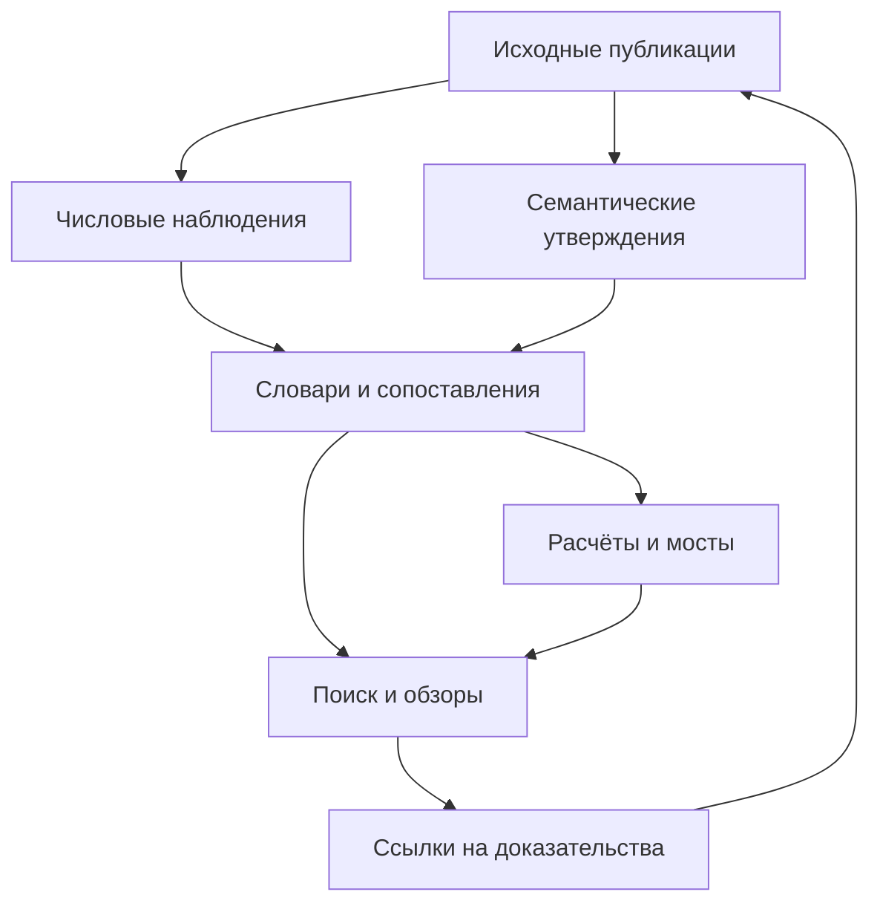

# Tabularium: числовые показатели, семантические наблюдения и воспроизводимая аналитика

Дата: 30 сентября 2026 года. Статус: архитектурное исследование и рекомендуемый проект внедрения, **не утверждённая спецификация и не выполненная миграция**.

Основание: запрос из `Вставленный текст.txt`, уточнения в чате, накопленные исследования Tabularium, действующий репозиторий и четыре приложенных SEC HTML. Пожелания пользователя отдельно сохранены в `Tabularium_User_Requirements_2026-09-30.md`, включая полный исходный текст.

## 1. Рекомендация

**Tabularium стоит развивать как один репозиторий с несколькими ясно различимыми слоями: исходные публикации; извлечённые наблюдения; словари и правила сопоставления; воспроизводимые расчёты; автоматически собираемые представления.** Числа и семантика должны пользоваться общей моделью источников, идентичности, времени и происхождения, но иметь разные типы записей.

Рекомендуемая технологическая основа: **JSONL для массовых записей, JSON Schema для структуры, ограниченный YAML/JSON для небольших справочников и правил, Python для проверки и расчётов, Parquet/DuckDB для быстрых запросов**. Исходные MD, HTML/iXBRL, XLSX и другие форматы сохраняются. XBRL используется там, где его действительно публикует источник; превращать весь корпус в собственную XBRL-таксономию на первом этапе не нужно.

Дополнительное уточнение пользователя в ходе работы принято как важный принцип: ценность числового слоя — возможность строить временные ряды и агрегаты; семантический слой прежде всего хранит утверждения и события. Поэтому **наличие числа само по себе не определяет тип экономического объекта**. В модель добавлены профиль временного ряда и правила перехода между событиями и измеряемыми величинами (§8.3, §16).

Рабочее название нового слоя — `fragments/`. Между `fragments` и `flakes` я рекомендую первое: оно понятнее обозначает адресуемые фрагменты источников. Название можно изменить без пересмотра модели.

У этой архитектуры три практически важных свойства:

1. Новый вопрос обычно требует нового запроса, сопоставления или формулы, а не повторного чтения сотен отчётов.
2. Любое число и любое утверждение можно вернуть к точной версии документа и конкретному месту в нём.
3. Ошибка извлечения, изменение методики и изменение самой публикации исправляются разными операциями; одно не маскируется под другое.

Сложность здесь главным образом **в определении смысла и совместимости наблюдений**, а не в выборе между JSON и XML. Поэтому сначала нужны проверяемая модель и разнородный пилот, затем массовая обработка.

## 2. Как читать это исследование

Разделы 3–5 описывают изученную основу и её ограничения; 6–15 — модель данных; 16–21 — расчёты, агрегаты и декомпозиции; 22–26 — семантику и типы источников; 27–34 — физическое устройство и регулярную работу; 35–39 — внедрение, проверки и решения. В конце приведены источники и технические примеры.

Английские имена используются там, где они могут стать полями машинного контракта. Основные соответствия:

| Термин | Смысл в этом документе |
|---|---|
| Observation | Конкретное наблюдение из конкретного места источника |
| Assertion | Утверждение, сделанное источником; его истинность не гарантируется фактом публикации |
| Construct / concept | Определённый смысл показателя; здесь это близкие термины, не две обязательные отдельные таблицы |
| Binding / mapping | Явное сопоставление исходного наблюдения с общим понятием и измерениями |
| Dimensions | Разрезы: сегмент, продукт, отрасль, стадия качества и т. п. |
| Perimeter | Какие юридические лица, бизнесы или активы охвачены величиной |
| Derivation | Конкретный воспроизводимый расчёт по сохранённым входам |
| Provenance / lineage | Происхождение записи и цепочка её источников/преобразований |
| Locator | Точный адрес свидетельства внутри определённой версии файла |
| Vintage | Версия раскрытия: что было опубликовано и доступно на определённый момент |
| Grain | Что именно представляет одна точка данных и какими измерениями она определяется |
| Coverage | Охват обработки или доступных данных; эти два вида охвата учитываются раздельно |

В документе различаются:

| Обозначение | Что означает |
|---|---|
| Наблюдение о текущем корпусе | Подтверждено прочитанными файлами или инвентаризацией выбранной ревизии |
| Предложение | Мой рекомендуемый вариант будущего устройства |
| Иллюстрация | Искусственные числа/идентификаторы для объяснения; не данные компаний |
| Ограничение | Что нельзя установить имеющимися материалами или одной автоматической проверкой |

Уточнение пользователя «жёстко определённого пока особо нету» принято буквально: прежние исследования рассматриваются как наработки, а не как запрет менять направление. Текущие README/AGENTS нужны, чтобы знать фактическое устройство и безопасно спроектировать переход, а не чтобы законсервировать нынешнюю архитектуру.

## 3. Что действительно изучено

### 3.1. Зафиксированный срез репозитория

Для исследования использован `ForestTiger-GH/tabularium`, ветка `main`, commit [`eb9318959e937b17f012885f61df458ef27e7374`](https://github.com/ForestTiger-GH/tabularium/commit/eb9318959e937b17f012885f61df458ef27e7374), сообщение `Rename OTP Bank arrivals`, время commit 2026-09-28 22:28:23 UTC. Это зафиксированный срез, а не обещание, что после него репозиторий не менялся.

Инвентаризация полного дерева этого среза дала:

| Объект подсчёта | Количество |
|---|---:|
| Файлы во всём дереве | 810 |
| Файлы под `scrolls/` после исключения README, AGENTS и `.gitkeep` | 713 |
| Из них Markdown | 540 |
| HTML | 141 |
| XLSX | 28 |
| YAML-описания мостов | 4 |
| Содержательные файлы в `_mw/research/` | 18 |
| Входящие файлы OTP в `_mw/_arrivals/` | 11 |

Это **счёт файлов**, не число независимых отчётов, компаний или выпусков. В частности, YAML-мост — не локально сохранённая финансовая отчётность. Несколько файлов могут относиться к одному выпуску.

Прочитаны корневые правила, правила мирового финансового корпуса, исследовательского workspace и банковских мостов; проверено устройство действующего генератора корпоративного реестра. Изучены ключевые положения тематических исследований, перечисленных ниже, и реальные фрагменты российских и иностранных отчётов. **Полная содержательная проверка всех 540 MD в эту работу не входила.**

### 3.2. Где находятся предыдущие исследования

Накопленный MADAR Workspace данного проекта находится внутри Tabularium: `_mw/`. Тематические материалы обнаружены в `_mw/research/01-base-ideas/`. Отдельный репозиторий `madar-workspace` для этой работы не понадобился.

Ниже — карта использованных предшественников. Ссылки закреплены на изученной ревизии. Выводы в третьем столбце — результат настоящего исследования, а не заявление, что эти идеи уже внедрены.

| Материал | Что в нём полезно | Как используется / уточняется сейчас |
|---|---|---|
| [Банковский количественный слой](https://github.com/ForestTiger-GH/tabularium/blob/eb9318959e937b17f012885f61df458ef27e7374/_mw/research/01-base-ideas/tabularium_banking_quantitative_layer.md) | Семейства показателей, ROE/ROA/CIR/CoR, разные средние, различия МСФО–РСБУ | Берём как заготовку методик, но каждую формулу определяем заново через точные входы и знаменатели |
| [Архитектура наблюдений](https://github.com/ForestTiger-GH/tabularium/blob/eb9318959e937b17f012885f61df458ef27e7374/_mw/research/01-base-ideas/tabularium_ifrs_observation_architecture.md) | Пакет одного документа, атомарные значения, происхождение, сборка длинной таблицы | Сохраняем; расширяем на семантику, нативные форматы и независимые версии сопоставлений |
| [Представление исходной отчётности](https://github.com/ForestTiger-GH/tabularium/blob/eb9318959e937b17f012885f61df458ef27e7374/_mw/research/01-base-ideas/tabularium_ifrs_raw_representation_architecture.md) | Разные MD-профили, двойной locator, хеши, отсутствие необходимости переписывать весь MD | Используем адаптеры существующих файлов и внешние карты блоков |
| [Нормализация терминов МСФО](https://github.com/ForestTiger-GH/tabularium/blob/eb9318959e937b17f012885f61df458ef27e7374/_mw/research/01-base-ideas/tabularium_ifrs_naming_semantic_normalization_research.md) | Concept + dimensions, определения вместо списка синонимов, типы соответствия | Расширяем на стандарты и отрасли; RU и EN становятся обязательными для общего словаря |
| [Семантические наблюдения](https://github.com/ForestTiger-GH/tabularium/blob/eb9318959e937b17f012885f61df458ef27e7374/_mw/research/01-base-ideas/tabularium_semantic_observations.md) | Корпоративные события, modality, source assertion, планы и реализации | Сохраняем основу; добавляем полярность, говорящего, даты знания, дедупликацию событий и проверку пропусков |
| [Cognitive Database](https://github.com/ForestTiger-GH/tabularium/blob/eb9318959e937b17f012885f61df458ef27e7374/_mw/research/01-base-ideas/tabularium_cognitive_database_research.md) | Вычислимое происхождение, граф как представление, временные версии, пересобираемые индексы | Берём реляционное ядро; графовую СУБД и векторную инфраструктуру откладываем до реальной потребности |
| [Публичные данные ЦБ и МСФО](https://github.com/ForestTiger-GH/tabularium/blob/eb9318959e937b17f012885f61df458ef27e7374/_mw/research/01-base-ideas/tabularium_public_cbr_ifrs_chat_2026-09-23.md) | Периметры, базы оценки, остаток моста, невозможность восстановить совместное распределение из отдельных разрезов | Это основа ограничений декомпозиции, а не обещание разложить любое МСФО по счетам |
| [Общий реестр](https://github.com/ForestTiger-GH/tabularium/blob/eb9318959e937b17f012885f61df458ef27e7374/_mw/research/01-base-ideas/tabularium_general_registry_architecture_2026-09-26.md) | Машинная инвентаризация, независимость интерфейса от путей, GitHub Pages | Разделяем инвентарь источников, словарь показателей и каталог доступности наблюдений |
| [Мировой корпус](https://github.com/ForestTiger-GH/tabularium/blob/eb9318959e937b17f012885f61df458ef27e7374/_mw/research/01-base-ideas/tabularium_world_corpus_architecture.md) | Страна эмитента, реальная дата периода, filing type отдельно от accounting framework | Сохраняем; проверяем на Cisco, GD, LMT и OTP |
| [Корпоративные стратегии](https://github.com/ForestTiger-GH/tabularium/blob/eb9318959e937b17f012885f61df458ef27e7374/_mw/research/01-base-ideas/tabularium-corporate-strategy-corpus.md) | Заявленная стратегия, действия, результаты и ревизии — разные свидетельства | Вводим связи target → outcome с проверяемым основанием |
| [Операционные раскрытия](https://github.com/ForestTiger-GH/tabularium/blob/eb9318959e937b17f012885f61df458ef27e7374/_mw/research/01-base-ideas/tabularium_operational_disclosures_chat.md) | Разнообразие операционных серий и ценность нативных таблиц | Отдельные профили извлечения и методик; не единая банковская форма для всех |
| [GitHub Actions agent gateway](https://github.com/ForestTiger-GH/tabularium/blob/eb9318959e937b17f012885f61df458ef27e7374/_mw/research/01-base-ideas/github-actions-agent-gateway.md) | Направление автоматизации агентной работы в GitHub | Учитывается как предварительная идея; ниже предложен ограниченный цикл с контрольными точками |
| `tabularium_semantic_layer_architecture.md`, ранее сохранённый отдельный документ | JSONL + словари, совместимость периметров, извлечение и сопоставление, проверка | Дополнительно прочитан из сохранённых материалов; не найден среди файлов рассматриваемого дерева, не выдаётся за действующий контракт репозитория |

Прежние исследования уже довольно близко подошли к нужной конструкции. Основная новая работа — **свести их в одну непротиворечивую модель обслуживания**, расширить за пределы банков и принять во внимание новые пожелания.

### 3.3. Что нужно пересмотреть в прежних идеях

| Прежняя идея / риск | Рекомендуемое уточнение |
|---|---|
| Отдельный downstream-репозиторий | Один репозиторий соответствует нынешнему прямому пожеланию; разделение обеспечивают слои и правила |
| `raw_facts` и редактируемый `canonical_facts` | Поддерживаем исходные наблюдения и сопоставления; канонический поток собираем автоматически |
| Один статус `VERIFIED` на всё | Отдельные результаты проверки буквального извлечения, смысла, расчёта, полноты и версии источника |
| Почти все числа; банковское ядро на 80–150 показателей | Полное извлечение содержательных числовых раскрытий; ограниченное первое ядро унифицированных концептов — разные цели |
| RU-перевод опционален | RU и EN обязательны для принятых общих концептов по новому запросу |
| Запрещать любые обращения к MD, если есть canonical fact | По умолчанию использовать проверенный слой; разрешать адресное доизвлечение при недостаточном покрытии, с записью результата |
| Произвольный `float` в примерах JSON | Денежные и другие точные числа — десятичные строки, расчёты с контролируемой точностью |
| Арифметическая невязка сразу означает плохое извлечение | Она может быть опубликована самим источником или объясняться округлением; классифицировать причину отдельно |
| Любой XML/JSON с похожими полями — «XBRL-lite» | Собственную модель называть моделью Tabularium; соответствие стандарту XBRL не заявлять без его выполнения |

В старом количественном исследовании встречается запись `CIR = OPEX / PPOP`. Её нельзя механически принять как стандартную формулу: необходимо определить, что автор назвал PPOP. Если это прибыль **после** операционных расходов, знаменатель для обычного отношения расходов к доходам другой. Этот пример показывает, зачем нужен реестр методик с явными определениями, а не перенос формул по знакомой аббревиатуре.

## 4. Что показали реальные документы

### 4.1. Российский и венгерский OTP

| Источник | Наблюдение | Архитектурное следствие |
|---|---|---|
| Российский ОТП, МСФО 6М2026, MD-страница 6 | `876 117 802` тыс. руб. — итог активов группы банка и дочерней организации | Периметр и единица принадлежат наблюдению |
| Российский ОТП, РСБУ 6М2026, MD-страница 1 | `858 129 737` тыс. руб. — активы кредитной организации в форме 0409806 «на 1 июля» | Похожий показатель не совпадает автоматически по периметру, базе и соглашению о дате |
| Венгерский OTP, separate EU-IFRS 6М2026, страница 3 | `22,429,636` HUF mn — активы отдельного OTP Bank Plc. | Separate нельзя заменить consolidated |
| Венгерский OTP, RESULTS 6М2026, страница 2 | `46,666,664` HUF million — Total assets в consolidated highlights | Один бренд, один период и разные экономические объекты |
| Тот же RESULTS, страница 2 | Consolidated profit after tax и Consolidated adjusted profit after tax за 1П2026 оба равны `482,738` HUF million | Совпадение числа **не доказывает тождество методик** |
| Тот же RESULTS | Присутствуют `FX-adjusted` кредиты и депозиты, отдельные показатели доходности и варианты прибыли | Это опубликованные управленческие корректировки; обычная валютная конвертация их не заменяет |

Ссылки на конкретные исходные файлы приведены в приложении A. Здесь выполнена сверка указанных фрагментов, а не аудит финансовых данных банков. Например, разность двух российских балансов нельзя автоматически объявить величиной дочерней организации.

Даже структура MD неоднородна: российская МСФО представлена страницами с текстовыми блоками, российская РСБУ — Markdown-таблицами, венгерский RESULTS — в том числе TSV-блоками, separate — Markdown-таблицами. Маркеры страниц имеют варианты `PAGE 1`, `PAGE: 1`, `PAGE: 1 / 16`. Переписывать весь накопленный корпус ради парсера не требуется: нужен совместимый адаптер и точные адреса фрагментов.

### 4.2. Четыре приложенных SEC HTML

Проверка локальных байтов показала, что это содержательные HTML со встроенным Inline XBRL, а не пустые оболочки просмотрщика.

| Файл | Форма и фискальный период из DEI | Конец периода | Числовые `ix:nonFraction` | Нечисловые `ix:nonNumeric` | Контексты | Факты с префиксом компании |
|---|---|---|---:|---:|---:|---:|
| `csco-20250125.html` | 10-Q, FY2025 Q2 | 2025-01-25 | 1 833 | 161 | 509 | 110 `csco:*` |
| `csco-20251025.html` | 10-Q, FY2026 Q1 | 2025-10-25 | 1 465 | 150 | 405 | 98 `csco:*` |
| `gd-20251231.html` | 10-K, FY2025 | 2025-12-31 | 1 738 | 197 | 577 | 128 `gd:*` |
| `lmt-20250928.html` | 10-Q, FY2025 Q3 | 2025-09-28 | 1 016 | 58 | 465 | 99 `lmt:*` |

Это количества **вхождений тегов**, не число уникальных экономических показателей. В таблицах имеются повторные факты, разные периоды и измерения. Выполнена структурная HTML-проверка; полноценная XBRL-валидация с загрузкой таксономий не проводилась.

Практические находки:

- Cisco, файл `csco-20251025.html`: `us-gaap:Assets`, `id=f-58`, видимое значение `121,102`, `scale=6`, `decimals=-6`, USD, instant 2025-10-25. Это 121 102 млн USD, если применить указанный Inline XBRL transform и масштаб. `decimals=-6` описывает точность, а не ещё один множитель.
- В `csco-20250125.html` тот же локальный `id=f-58` относится к другому раскрытию Assets — `121,375`. Следовательно, HTML ID уникален только внутри артефакта; использовать один `f-58` как глобальный observation ID нельзя. Этот файл относится к FY2025 Q2, а октябрьский — к FY2026 Q1: одинаковый календарный год в имени не означает один fiscal year.
- LMT: `us-gaap:Revenues` встречается с `contextRef=c-3` за 2025-06-30—2025-09-28 и с `contextRef=c-5` за 2025-01-01—2025-09-28. В этих примерах есть измерение `srt:ProductOrServiceAxis = us-gaap:ProductMember`. Это квартальная и накопленная **продуктовая** выручка, а не автоматически выручка компании целиком.
- В файлах есть отрицательные `sign`, разные `scale`, в Cisco за октябрь и GD — nil-факты; у всех четырёх — `ix:continuation`. Извлечение только видимого текста тега недостаточно для общего импортёра.
- Все четыре HTML содержат относительные ссылки на собственные XSD: `csco-20250125.xsd`, `csco-20251025.xsd`, `gd-20251231.xsd`, `lmt-20250928.xsd`. Эти XSD в приложенном наборе отсутствуют. Основные факты доступны, но комплект не следует называть полностью автономным пакетом таксономий.
- У GD часть Part III включена посредством ссылки на будущий proxy statement. Даже корректно сохранённый 10-K не гарантирует, что всё корпоративное раскрытие находится физически в одном документе.

Следовательно, нативные SEC-файлы существенно упрощают извлечение, но не отменяют работу с контекстами, таксономиями, повествовательной частью и полнотой комплекта.

## 5. Архитектурная граница: один репозиторий, разные виды утверждений

Предлагаемая цепочка:

`source → representation → observation → mapping / derivation / bridge → analytical claim`

Она должна проявляться в данных и путях, а не только в инструкции агенту.

| Слой | Что здесь является авторитетным | Что не следует ему приписывать |
|---|---|---|
| Источник / представление | Что опубликовано и как это сохранено | Истинность любых заявлений эмитента, отсутствие ошибок MD |
| Наблюдение | Что извлечено из конкретного фрагмента конкретной версии | Межфирменная сопоставимость без проверки |
| Сопоставление | Версионированное решение о смысле и связи с концептом | Исправление исходного текста |
| Расчёт / мост | Формула, входы, условия, воспроизводимый результат | Автоматически верная экономическая интерпретация |
| Аналитическое утверждение | Вывод с опорой на перечисленные свидетельства и допущения | Статус первичной публикации |
| Индекс / база / отчёт | Удобное производное представление выбранной ревизии | Самостоятельный источник истины |



При внедрении потребуется точечно изменить нынешние README/AGENTS: их общий запрет производных данных следует ограничить исходным корпусом `scrolls/`, а правила нового слоя описать явно. Это изменение назначения части репозитория, не изменение содержания первичных публикаций. Исследовательский `_mw/` остаётся местом разработки и рабочих журналов; он не превращается незаметно в публичную базу показателей.

## 6. Логические объекты минимального ядра

| Объект | Назначение и идентичность |
|---|---|
| `entity` | Юридическое лицо, отчётная группа, орган, регион или иной субъект наблюдения |
| `perimeter` | Что охватывает конкретная отчётность; версия состава и способ консолидации |
| `release` | Конкретная публикация / выпуск источника |
| `artifact` / `artifact_revision` | Файл или представление выпуска и его точные байты |
| `source_block` | Адресуемая страница, таблица, абзац, XBRL fact или диапазон XLSX |
| `numeric_observation` | Опубликованная величина вместе с исходным контекстом |
| `assertion` | Опубликованное утверждение, включая план, оценку или отрицание |
| `construct` | Определённый экономический смысл показателя |
| `binding` | Условное и версионированное сопоставление наблюдения с construct/измерениями |
| `method` | Формула или процедура с входами, ограничениями и правилами точности |
| `derivation` | Конкретное выполнение метода на конкретных входах |
| `coverage` / `finding` | Обработанная область и обнаруженное расхождение / неопределённость |

Это логические типы. Не нужно немедленно создавать отдельный каталог, сервис или базу для каждого из них.

### Идентификаторы и версии

Идентификатор сущности не зависит от её текущего имени или биржевого тикера. Внешние идентификаторы — CIK, регистрационный номер ЦБ, ОГРН, LEI — хранятся строками, с указанием системы и области применимости. Разные системы не подменяют друг друга.

Нужно различать:

- `release_id`: стабильная логическая идентичность публикации;
- `artifact_id`: идентичность представления;
- `content_sha256`: хеш точных байтов версии;
- `git_commit` и `git_blob_sha`: координаты версии в Git;
- `observation_id`: устойчивый адрес конкретного исходного вхождения;
- `record_revision_id`: версия его извлечения;
- `binding_id` / `binding_version`: независимая версия сопоставления.

Предлагаемое правило для исходного вхождения: хеш версии артефакта + детерминированный locator + порядковый номер значения в блоке, если необходим. Изменение буквального извлечения при неизменном источнике создаёт новую ревизию записи, сохраняя связь с прежней. Смена определения canonical concept изменяет сопоставление, а не исходное наблюдение.

Перемещение файла не должно порождать новую экономическую историю. Поэтому путь — адрес размещения, не единственная идентичность. Хеш также не заменяет происхождение: два разных издателя могут опубликовать одинаковые байты.

## 7. Публикация, выпуск результатов и отдельные файлы

Нужно разделить три отношения:

1. Один документ в нескольких представлениях: например официальный HTML и исходный PDF.
2. Один составной выпуск с несколькими обязательными файлами: например iXBRL и его расширение таксономии.
3. Несколько самостоятельных публикаций вокруг одного периода: финансовые формы, RESULTS, презентация, conference call.

Для третьего случая полезен `release_group_id`; он не превращает разные публикации в один взаимозаменяемый источник. Пакет извлечения привязывается к **конкретному артефакту и ревизии**, что позволяет проверить один MD против одного пакета.

Основные поля manifest:

| Поля | Для чего нужны |
|---|---|
| Publisher, reporting entity, jurisdiction | Кто опубликовал и о ком отчёт |
| Publication type, document role | Финансовая форма, презентация, стенограмма, операционный релиз и т. д. |
| Reporting period, fiscal year/quarter | Какой период раскрывается, без подмены календарным |
| Publication date / date precision | Когда стало доступно; `unknown`, если не установлено |
| Accounting framework, assurance scope | МСФО/РСБУ/US GAAP и область аудита/обзорной проверки |
| Perimeter / consolidation basis | Банк, группа, отдельная отчётность, сегмент |
| URL, retrieved at, content hash | Происхождение и воспроизводимость |
| Artifact role, dependencies, supersedes | Состав комплекта и замещения |
| Metadata evidence | Где установлено каждое неочевидное поле |

Нельзя присвоить всему годовому отчёту признак `audited=true`, если аудировано лишь включённое в него финансовое содержание. Metadata может наследоваться от manifest, но у блока должно быть право на явное переопределение с происхождением.

## 8. Числовое наблюдение: что хранить

### 8.1. Обязательное смысловое ядро

| Группа | Минимум |
|---|---|
| Идентичность | ID, версия записи, ссылка на артефакт и его хеш |
| Исходное место | Физический и логический locator |
| Буквальное содержание | Значение, единица, подписи строки/колонки, сноски |
| Типизированное значение | Десятичная строка, интервал или ограничение, если parsing установлен |
| Время | Тип периода, точные границы либо явно неполная дата |
| Субъект | Source subject; canonical entity/perimeter через доказанное связывание |
| Исходные измерения | Разрезы в терминологии источника |
| Состояние | Наличие, неизвестность, природа значения, статус извлечения |
| Происхождение обработки | Версия адаптера/правила, run, reviewer/check evidence |

Унифицированный `construct_id` не должен быть условием сохранения наблюдения. Можно правильно извлечь новую строку раньше, чем решено, к какому общему показателю она относится.

### 8.2. Locator должен переживать проверку

Для MD: номер физической страницы по маркеру, исходный печатный номер при наличии, диапазон строк/байтов, ID блока, путь заголовков, таблица, строка и колонка, короткий буквальный якорь. Для многострочной строки или объединённой колонки хранится весь путь заголовков.

Для HTML/iXBRL: ID факта, QName концепта, context/unit references, DOM-якорь, хеш документа. Для XLSX: лист, ячейка/диапазон, объединения, видимое значение и формула/кеш при наличии. Для SEC API: URL, время получения, accession, JSON Pointer и снимок ответа.

Нумерация страниц не должна выдумываться там, где её нет. Привязка к `line 123` без версии файла недостаточна. Цитата, найденная приблизительным совпадением после редактирования MD, является кандидатом на восстановление адреса, а не автоматически тем же доказательством.

### 8.3. Показатель для ряда и число внутри события — не одно и то же

Для практической классификации полезно задавать два независимых вопроса:

1. Какую количественную величину утверждает источник и как она определена?
2. Какое событие, состояние или суждение источник сообщает?

Один фрагмент может отвечать на оба вопроса. Поэтому не требуется навсегда распределить все предложения по взаимоисключающим «числовому» и «семантическому» контейнерам.

| Фрагмент | Основной объект | Возможная связь с рядами и агрегатами |
|---|---|---|
| «Активы на 30 июня — X» | Периодическое измерение | Ряд остатков и разрешённые межфирменные суммы |
| «Компания приобрела завод за X» | Событие со связанной суммой | Суммы сопоставимых завершённых сделок после определения цены/доли/даты и исключения повторов |
| «Вложит X к 2030 году» | План/обязательство с количественным параметром | Ряд версий плана; отдельно факт исполнения, без смешения |
| «Начато строительство» | Событие без числовой величины | Производный счётчик начал проектов при известном охвате событий |
| «Ковенант требует Debt/EBITDA < 3» | Договорное условие с порогом | История условий договора, но не фактический Debt/EBITDA компании |
| «Перешла на новую классификацию сегментов» | Семантическое утверждение | Основание разрыва/пересборки числового ряда |

На уровне извлечения сохраняются все содержательные количества, включая одноразовые. На уровне bindings фиксируется их роль: периодическое измерение, атрибут события, договорный параметр, цель, прогноз, предпосылка. Принадлежность к ряду определяется отдельным профилем с grain, определением, единицей, временем и правилами операций.

У единичного наблюдения может быть пригодное для будущего ряда определение; отсутствие второго периода ещё не делает его «только семантикой». И наоборот, длинная последовательность чисел не становится сопоставимым рядом, если каждый год менялся смысл.

Из семантики можно получать количественные показатели, например число завершённых сделок за квартал. Это отдельная derivation с правилами дедупликации и полноты. Число найденных упоминаний сделки не равно числу сделок; отсутствие найденных событий не доказывает нулевое число событий. Такое ограничение особенно важно для агрегатов событий по компаниям.

## 9. Что означает «извлечь ВСЕ числовые показатели»

Это реалистичная цель, если полнота определена через содержимое и область обработки.

В область входят все экономически содержательные числовые раскрытия: основные формы, примечания, сегменты, сравнительные колонки, проценты, коэффициенты, операционные объёмы, клиенты, персонал, сроки и ставки договоров, оценки и диапазоны, цели, изменения, числа в повествовательном тексте и существенные числовые сноски. Сюда входят также числа, ещё не сопоставленные общему словарю.

Телефон, номер страницы, код формы, номер примечания, дата и регистрационный номер не превращаются в финансовые показатели. Они сохраняются как идентификаторы или контекст. Кандидат исключается по явному правилу, а не потому, что агент решил его «не замечать».

Требуются два независимых прохода:

1. **Инвентаризация блоков и числовых кандидатов:** что вообще есть в документе.
2. **Содержательное извлечение и объяснение остатка:** каждый кандидат отнесён к наблюдению, контексту, техническому токену, повтору или неразрешённому случаю.

Примеры сложных значений:

| Источник | Правильное представление |
|---|---|
| «более 100 млрд руб.» | Нижняя граница, строгий оператор `>`, масштаб; не точное 100 |
| «около 15%» | Значение с `approximate=true`; не произвольный доверительный интервал |
| «10–12 млрд руб.» | Интервал с двумя границами |
| «рост на 3 п.п.» | Изменение в процентных пунктах, не уровень 3% |
| «не менее 2 млн клиентов к 2030 году» | Числовая цель + modality + горизонт |
| Две цифры в одной ячейке «2025 / 2026» | Два значения только после установления связи с соответствующими периодами |

`extraction_complete` означает: все блоки **данной версии и заявленного профиля** обработаны и остаток объяснён. Это не доказательство отсутствия ошибок конверсии MD и не утверждение, что в PDF не было утраченной информации.

## 10. Точные числа, масштаб и единицы

### 10.1. Единая денежная сетка

Рекомендую выводить денежные суммы в **миллионах исходной валюты**, но хранить одновременно исходный literal, исходный масштаб и точное типизированное значение. Нормализация масштаба — детерминированное преобразование, а не замена источника.

Если исходная величина `x` дана с множителем `10^s` к базовой валютной единице:

`value_in_millions = x × 10^(s − 6)`.

| Буквальное значение | Единица | Значение в млн | Комментарий |
|---|---|---|---|
| `1 234,567` | млрд руб. | `1234567` | Десятичный разряд сдвинут без округления |
| `1 234 567,89` | тыс. руб. | `1234.56789` | Все опубликованные десятичные знаки сохранены |
| `121,102`, iXBRL `scale=6` | USD | `121102` | Сначала применён transform, затем масштаб |
| `0,000001` | млн руб. | `0.000001` | Не округлять до нуля |

Таблица иллюстрирует правила; строка Cisco основана на приложенном файле. Масштаб миллионов применяется к **суммам**, а не ко всему числовому полю: EPS остаётся валютой на акцию, курс — валютой на единицу другой валюты, ставка — процентом/долей, число клиентов — количеством.

### 10.2. Decimal, а не binary float

В JSON/JSONL предлагается хранить точные числовые значения строками, например `"1234.56789"`. Исходный `"1 234 567,89"` хранится отдельно. Для вычислений — Decimal, создаваемый из строки, либо точная рациональная форма там, где она нужна. Умножение/деление на степени десяти выполняется без потери опубликованных разрядов.

Сам тип Decimal не отменяет настройки контекста точности. Для нормализации масштаба лучше сохранять целый коэффициент и десятичный порядок либо подбирать достаточную precision по входу: фиксированный стандартный контекст не должен обрезать длинное исходное число. Точность последующего деления коэффициентов задаётся отдельно от безусловно точного сдвига разряда.

Обычное деление может давать бесконечную десятичную дробь. Тогда метод сохраняет входы, формулу, вычислительную точность, способ округления и отдельно точность отображения. Нельзя обещать «бесконечно точный» конечный результат `1/3`.

Важно для реализации: SQLite REAL использует приближённую двоичную арифметику; DuckDB DECIMAL имеет ограничения разрядности, а деление DECIMAL возвращает приближённый результат. Поэтому SQL удобен для фильтрации, группировки и подготовительных операций, но точный расчётный контракт должен явно управлять арифметикой. Не следует полагаться на DECIMAL по умолчанию без задания precision/scale. [W07–W09]

### 10.3. Сохранять источник точности

Перевод 1,2 млрд в 1 200 млн не означает, что источник знал сумму с точностью до миллиона. Хранятся `reported_precision`, `decimals` для XBRL, правило rounding при известности и пределы допустимой невязки. `scale`, `decimals` и число видимых знаков — разные вещи.

Расход, показанный в скобках, отрицательная сумма с `sign=-`, положительный показатель «расходы», отрицательный денежный поток и оборот по кредиту счёта не унифицируются одной функцией `abs()`. Исходный знак сохраняется; при необходимости метод использует отдельно заданную экономическую ориентацию знака.

## 11. Неизвестность и статусы

Не нужен один enum, смешивающий ноль, проверенность, корректировку и отсутствие источника.

| Ось | Примеры значений |
|---|---|
| Наличие в источнике | `present`, `explicit_blank`, `explicit_dash`, `withheld`, `not_applicable`, `unknown` |
| Природа величины | `actual`, `target`, `forecast`, `estimate`, `scenario` |
| Происхождение результата | `reported`, `derived` |
| База величины | `unadjusted`, `issuer_adjusted`, `tabularium_adjusted`, `unknown` |
| Извлечение | `parsed`, `ambiguous`, `unparsed` |
| Сопоставление | `exact`, `broader`, `narrower`, `related`, `unmapped`, `ambiguous` |
| Проверка | Результат конкретного check, а не глобальная оценка истины |
| Актуальность | Применимость к точной версии источника/правила |

`reported + issuer_adjusted` — нормальная комбинация: эмитент сам опубликовал скорректированную прибыль. `derived + tabularium_adjusted` означает собственную корректировку. Так не теряется различие между происхождением числа и его экономической базой.

Ноль — числовое значение. `false` — булево утверждение. `nil` XBRL — не ноль. Прочерк — буквальный символ до установления его значения. Даже `X` может быть признаком неприменимости, закрытой ячейки или ограничения раскрытия: назначение определяется правилами формы и контекстом, не одним символом.

`not_found` относится к результату поиска в обработанной области. `retrieval_failed` относится к попытке получить источник. `not_disclosed_separately` допустимо лишь с указанием проверенного объёма материала и основания. Отсутствие записи в JSONL ничего из этого само по себе не доказывает.

## 12. Время, пересчёты и история знания

У системы должно быть как минимум четыре независимые временные оси:

1. **Период значения:** остаток на дату или поток между границами.
2. **Время события / действия:** когда произошло, вступило в силу или должно произойти.
3. **Дата публикации:** когда информация была опубликована; с точностью даты и состоянием неизвестности.
4. **Дата регистрации в Tabularium:** когда система получила/извлекла/приняла эту информацию.

Для корпоративных финансов дополнительно сохраняются fiscal year, fiscal quarter, календарная длительность и метка current/comparative. Для прогнозов — forecast vintage, horizon и scenario. Для поздних корректировок — отношения между версиями.

**Данные за 2025 год, опубликованные в 2026 году, — не данные за 2026 год.** Cisco FY2026 Q1 в приложении заканчивается 25 октября 2025 года. Аналитическое преобразование к календарному кварталу — отдельная операция с ограничениями; нельзя просто переименовать период.

Не следует автоматически заменять «на 1 июля» на «30 июня» в исходном слое. Такое соответствие для конкретной банковской формы задаётся отдельным правилом о моменте измерения. Это особенно важно для сопоставления РСБУ и МСФО.

### Пересмотренные сравнительные данные

Сохраняются все опубликованные версии: первоначальное значение, позднее сравнительное, исправленная публикация. Связь `restates` ставится по источнику или доказанному правилу, а не при любом расхождении чисел.

Для рядов нужны явные режимы:

| Режим | Как выбираются данные |
|---|---|
| `originally_reported` | Первая допустимая публикация данного наблюдения |
| `as_published_by_date` | Что было публично известно к заданному моменту |
| `known_to_tabularium_at` | Что было реально в базе к заданному моменту |
| `latest_comparable` | Последняя допустимая версия внутри проверяемого профиля сопоставимости |
| `same_release_comparatives` | Все сравниваемые колонки из одного выбранного выпуска |

Последняя дата публикации не является универсальным правилом победы. Поздняя презентация может содержать скорректированный KPI, а не исправленное значение финансовой формы. При неизвестной дате публикации строгий запрос «что было известно на дату» должен возвращать ограничение, а не пользоваться датой загрузки как подстановкой.
## 13. Единый реестр показателей: унификация без потери различий

### 13.1. Три разных уровня единства

| Уровень | Что объединяется | Что ещё не доказано |
|---|---|---|
| Терминологическое семейство | Похожие экономические вопросы: активы, кредиты, выручка | Полная идентичность определения |
| Определённый construct | Одно смысловое определение с допустимыми измерениями | Сопоставимость двух конкретных наблюдений |
| Сопоставимый ряд / срез | Наблюдения, прошедшие выбранный контракт совместимости | Допустимость любой дальнейшей операции |

Пользователь прав: «ипотечный портфель» и «портфель ипотеки» обычно не должны создавать два независимых показателя только из-за перестановки слов. Но запись «жилищные кредиты» не во всех источниках автоматически означает ровно тот же охват, что «кредиты, обеспеченные ипотекой». Определение и состав важнее похожего названия.

Пример с «активы» и «активы банка» решается так:

1. Если это один субъект, один периметр, дата, стандарт, база и повтор одного итога — один construct и несколько исходных вхождений/свидетельств.
2. Если один показатель относится к группе, другой к юридическому лицу — общий базовый construct возможен, но наблюдения и периметры различаются.
3. Если значения случайно равны, это дополнительный арифметический факт, а не доказательство эквивалентности.

Именно поэтому в венгерском OTP обычная и adjusted profit при нулевых adjustments сохраняют разные определения методики, даже когда числовые значения совпали.

### 13.2. Устройство concept registry

Для принятого общего concept нужны:

- стабильный ID, не зависящий от языка;
- RU/EN-наименования и определения; краткое английское имя при полезности;
- включения и исключения;
- допустимые единицы, временные типы и операции агрегирования;
- обязательные и применимые измерения;
- примеры и контрпримеры;
- внешние ссылки на таксономии с версиями;
- история существенных изменений определения.

Первое ядро может содержать порядка 80–150 часто востребованных экономических концептов/методик. Это **проектный ориентир для общего словаря**, не квота на банк и не ограничение извлечения. Число конкретных наблюдений и комбинаций измерений будет намного больше.

Предлагаются пространства имён:

| Namespace | Назначение |
|---|---|
| `tab:` | Устойчивые собственные концепты Tabularium |
| Внешняя таксономия + namespace URI + version | Точная идентичность IFRS/US GAAP и других официальных элементов |
| `issuer:<entity-id>:` | Реальные особенности эмитента, не укладывающиеся в общий словарь |
| `method:` | Версионированные определения собственных расчётных показателей |

IFRS Accounting Taxonomy полезна как опорный словарь бухгалтерских концептов. Она не заменяет всю модель: операционные, регуляторные, стратегические и отраслевые показатели шире. Официальная IFRS Foundation подтверждает применение IFRS Accounting Taxonomy 2025 для отчётных периодов 2026; версия таксономии не должна выводиться из календарного года файла. [W05]

### 13.3. Концепт + измерения

Вместо отдельного ID для каждой комбинации «корпоративные кредиты, Stage 2, сельское хозяйство, рубли, валовая стоимость»:

`customer_loans.balance + counterparty + product + stage + industry + currency_denomination + carrying_basis`.

При этом `unit.currency` и `currency_denomination` различаются: валютный кредит может быть выражен в USD, а показан в отчёте в RUB. Аналогично валюта презентации не обязательно является функциональной валютой организации.

Измерения источника сохраняются буквально. Canonical dimensions присваиваются через binding. Сегмент `OTP Core` нельзя считать отдельным юридическим лицом по одному названию; банковский Retail разных групп также не становится единой отраслевой категорией без проверки охвата.

Отсутствующее измерение не означает `ALL`. Для каждой оси нужно различать `explicit_total`, `not_applicable`, `unknown`, `not_provided` и установленные правила по умолчанию. В XBRL defaults могут определяться таксономией — их следует разрешать по ней, а не догадкой.

### 13.4. Межстандартная унификация

Не нужно выбирать между крайностями «МСФО и РСБУ всегда раздельны» и «одинаковое название означает один показатель».

Рекомендую общий навигационный словарь и контекстные профили определения. Наблюдения с действительно эквивалентным смыслом получают один construct, сохраняя accounting basis. При различном определении вводятся связанные варианты. Допустимость сравнения отдельно проверяет query/method profile.

Примеры обязательных различий: бухгалтерский капитал и регуляторный капитал; gross loans и net loans; выручка принципала и комиссионный доход агента; GMV и выручка; число зарегистрированных и активных клиентов; штат на дату, среднесписочная численность и FTE. Общая подпись для интерфейса не должна стирать их.

## 14. Сопоставления и совместимость

### 14.1. Binding — самостоятельное решение

Сопоставление содержит source concept/observation, target construct, набор dimension bindings, тип связи, область применимости, доказательства, версию и результаты проверки.

| Тип | Допустимое использование |
|---|---|
| `exact` | Точное смысловое соответствие в указанной области; дальнейшие проверки контекста остаются обязательными |
| `broader` | Источник включает больше; нельзя подставить всю сумму в узкий показатель |
| `narrower` | Источник раскрывает подмножество; можно использовать как компонент после проверки непересечения |
| `composite` | Источник объединяет несколько компонентов; отдельные величины не восстановлены |
| `related` | Навигационная связь, не основание для суммы или подстановки |
| `issuer_specific` | Корректное собственное определение источника |
| `ambiguous` / `unmapped` | Значение остаётся доступным как исходное, но не проходит в строгую общую серию |

SKOS полезен как образец различения сил соответствия, но финансовые bindings должны иметь дополнительные ограничения по периоду, периметру и базе. Не следует переносить безусловную транзитивность `exactMatch` на условные бухгалтерские сопоставления. [W11]

### 14.2. Как переиспользовать mapping между кварталами

Правило привязывается не к номеру примечания, а к смысловому и структурному контексту: форме, заголовкам, определениям, диапазону применимости и проверкам. Номер примечания — дополнительный признак.

Новый квартал сначала проверяется на изменение заголовков, единиц, сносок, политики, периметра и состава таблиц. При изменении этих признаков правило становится кандидатом на пересмотр. Совпадение текста одной строки не разрешает игнорировать новую сноску.

### 14.3. Совместимость зависит от операции

Показатели могут быть достаточно сопоставимы для обзорной таблицы, но непригодны для точной суммы, декомпозиции или расчёта коэффициента.

Вместо глобального `comparable=true` нужен результат:

`compatibility(input set, operation, profile version) → allowed / allowed_with_limits / blocked + reasons`.

Проверки охватывают construct, стандарты, оценку, gross/net, охват, период, валюту, единицы, корректировки, методику, версии, пересечения и допустимость missingness. Система не должна останавливать всё чтение данных из-за одного несовместимого наблюдения: она блокирует конкретную недопустимую операцию и возвращает причину.

## 15. Дубликаты: не хранить два показателя, но сохранять два свидетельства

Нужно различать:

1. Повтор одного числового вхождения после повторного запуска извлечения — технический дубль, который не создаётся благодаря идемпотентности.
2. Один показатель повторён в форме, примечании и презентации — разные source occurrences, связанные общим смыслом.
3. Один период раскрыт в нескольких vintages — самостоятельные наблюдения с возможными пересмотрами.
4. Одинаковая величина разных показателей — не дубль.
5. Несколько XBRL facts с совпадающими аспектами — специальные duplicate facts; они могут быть согласованными или конфликтующими. [W04]

Исходные вхождения хранятся. В представлении для суммы/ряда выбирается ровно одна допустимая запись на установленный ключ с сохранением списка альтернативных свидетельств и selection reason. Никогда не суммируются все найденные строки `Assets`.

Ключ выбранной точки включает не только компанию, название и дату, но также периметр, construct/измерения, методологическую базу и конкретный период. Само определение ряда не включает дату отдельной точки; vintage selection задаётся профилем запроса. Источник остаётся измерением истории даже тогда, когда вывод показывает один столбец.

## 16. Временные ряды и динамика

Ряд — результат запроса с контрактом, а не случайная сортировка найденных чисел.

В запросе фиксируются entity/perimeter, construct, dimensions, периодичность, methodology/basis, версия выбора источников, режим пересмотров, валюта и правила допустимых пропусков. Ответ содержит значения, provenance, пропуски со статусами и разрывы сопоставимости.

Для часто используемого показателя нужен `series_profile`: единица наблюдения (grain), смысл измерения, временной тип, фиксированные/переменные измерения, допустимая частота, правила агрегирования по каждой оси, политика пересмотров и разрывов. Стабильный `series_id` не зависит от конкретного значения и даты одного observation. Отдельно указываются версия определения и доступные vintages.

Это превращает словарь терминов в каталог пригодных к повторному использованию рядов. Один construct может породить несколько честно различных рядов: gross и net, банк и группа, фактическая и постоянная валюта, первоначальная и пересмотренная публикация. События дают такие ряды только после определения соответствующей измеримой величины и правил подсчёта.

### Потоки и остатки

- Остатки на конец месяца не суммируются по времени.
- Накопленные потоки можно разностно преобразовать в отдельный квартал только при совпадении охвата, начала года, базы и совместимых версиях: `Q2 = H1 − Q1`.
- `FY − 9M` даёт четвёртый квартал только для аддитивного потока. Так нельзя получать среднюю ставку, маржу, процент или EPS вычитанием накопленных коэффициентов.
- Если в H1 прошлый Q1 пересмотрен, а отдельный Q1 содержит старые значения, сначала нужен согласованный выбор/reconciliation.
- Пятидесятидвух- и пятидесятитрёхнедельные годы нельзя незаметно приравнять к одинаковой длительности.

### Рост и вклад

При согласованных границах:

`absolute_change = end − start`;

`growth = (end / start − 1) × 100%`.

При нулевой базе стандартный процент роста не определён. При отрицательной базе арифметический результат возможен, но метод должен обозначать ограничение интерпретации; автоматически называть его экономическим «ростом» нельзя.

Для разложения роста аддитивного агрегата вклад компонента:

`contribution_i_pp = (X_i,t1 − X_i,t0) / Total_t0 × 100`.

Если состав, оценка или валютный курс изменились, отдельные эффекты выводятся лишь по определённому мосту. «Постоянный состав компаний», «постоянный валютный курс» и «как опубликовано» — три разные версии ряда.

## 17. Формулы и методики: ROE, ROA, CIR, CoR и другие

### 17.1. Один акроним — несколько честных методик

Рекомендуется одновременно поддерживать опубликованный KPI эмитента и собственные сопоставимые расчётные варианты. Они не перезаписывают друг друга.

| Методика | Возможная формула | Что обязательно фиксировать |
|---|---|---|
| ROE на совокупный капитал | Прибыль за период × annualisation / средний совокупный капитал | Совокупная прибыль и совокупный капитал, метод среднего |
| ROE для акционеров материнской компании | Прибыль, относимая к соответствующим акционерам × annualisation / соответствующий средний капитал | Неконтролирующая доля, привилегированные инструменты, вычеты |
| ROA | Прибыль × annualisation / средние активы | Прибыль, состав активов, среднее, период |
| CIR | Операционные расходы / операционные доходы до этих расходов и до оговорённых резервов | Состав числителя и знаменателя, налоги/взносы, разовые эффекты, знаки |
| CoR по клиентским кредитам | Расходы на кредитные потери по клиентским кредитам × annualisation / средние gross customer loans | Только соответствующий расход, списания/recoveries по выбранной методике |
| ЧПД / средние активы | Чистый процентный доход × annualisation / средние активы | Это не автоматически NIM на процентные активы |

Таблица задаёт варианты собственной аналитической системы, а не единую обязательную регуляторную методику. Для каждой официальной или эмитентской методики нужен её отдельный источник и версия.

Формулы в таблице дают долю; вывод в процентах умножает её на 100, в базисных пунктах — на 10 000. Единица результата должна быть частью контракта, чтобы `0.02`, `2%` и `200 bp` не стали разными экономическими величинами.

В отчёте OTP RESULTS за 1П2026 опубликованы операционные расходы `634,393` HUF million по модулю, Total income `1,512,182` и Cost/income ratio `42.0%`. Проверка отношения расходов к этому доходу даёт около 42.0% после округления. Отношение расходов к Operating profit `877,789` было бы другим показателем. Такой фактический пример полезнее безусловного правила по аббревиатуре PPOP.

### 17.2. Annualisation и средние

`×2` для полугодия, `×4` для квартала, actual-days-based annualisation и TTM — разные соглашения. Формула должна выбирать одно явно. Доходность за шесть месяцев без annualisation также может быть полезна, но должна называться соответственно.

Среднее двух точек, среднее квартальных остатков, средняя хронологическая и средняя за каждый день — разные знаменатели. Если есть только начало/конец, нельзя маркировать результат как среднемесячный. Разница частот допускается лишь по документированной методике, не через незаметное смешение МСФО-группы и ежемесячной РСБУ банка.

### 17.3. Контракт метода

Метод содержит ID/version, RU/EN-описание, точные входные construct/dimensions, единицы и выходную единицу, формулу в разрешённом наборе операций, период, annualisation, sign convention, averaging, missingness, требования к периметру/базе, проверки, правила округления, ограничения и источник методологии.

Конкретный расчёт содержит **точные версии входных observation/binding**, а не плавающую ссылку «последняя прибыль». Воспроизводимость означает возможность собрать результат из сохранённых входов и версии алгоритма без нового семантического решения ИИ.

Формулы разумно задавать как простое дерево операций/граф зависимостей: `sum`, `subtract`, `multiply`, `divide`, `weighted_mean`, `lag`, `period_difference`, `fx_convert`. Произвольный код из YAML не исполняется. Сложные методы реализуются отдельно с проверяемым контрактом.

### 17.4. Декомпозиции коэффициентов

При едином знаменателе можно разложить ROA на вклады доходов, расходов, потерь и налога. Остаток включается, если перечень компонентов неполон; его не называют «эффектом менеджмента».

Для изменения дроби несколько порядков подстановки дают разные вклады. Поэтому chain substitution с фиксированным порядком, симметричная декомпозиция или иной метод хранятся под разными method ID. Их можно сравнивать; нельзя представлять один порядок подстановок как единственную опубликованную причину изменения коэффициента.

## 18. Агрегирование компаний и мониторинг узких рынков

### 18.1. Сумма требует определения совокупности

Для каждого агрегата нужны universe ID/version, правило включения, список компаний и их membership periods, accounting/perimeter profile, общий период и valuation basis, политика пропусков и пересечений.

«Сумма активов выбранных групп» и «активы банковского сектора страны» — разные показатели. Местонахождение материнской компании не означает, что вся её выручка или все активы относятся к этой стране.

Необходимо предотвращать двойной счёт: группа и её дочерний банк; итог и сегменты; одна сделка у нескольких издателей; повтор одного факта в нескольких документах. Для совокупностей с пересекающимися участниками нужен явный алгоритм исключений или статус `overlap_unresolved`.

### 18.2. Коэффициент группы

При одинаковой методике и периоде:

`ROE_group = annualisation × Σ Profit_i / Σ Average_equity_i`.

Это обычно не простое среднее ROE банков. Если доступны только опубликованные проценты с разными знаменателями, корректный общий коэффициент может быть нерассчитываем. Отрицательный/нулевой знаменатель также требует отдельного статуса метода.

### 18.3. Покрытие агрегата

Результат должен возвращать:

- сколько членов совокупности ожидается и сколько включено;
- отсутствующие компании и причины;
- полноту состава/раскрытия, а не только процент обработанных файлов;
- денежную долю покрытия только при наличии сопоставимого знаменателя;
- raw sum, исключения и итог, если выполнялась консолидация;
- точные input IDs и дату знания.

Нельзя считать отсутствующее значение нулём. При частичном покрытии результат называется суммой по наблюдаемому набору, а не всем рынком.

### 18.4. Какие узкие рынки реально доступны

| Сценарий | Что можно собрать | Главный контроль |
|---|---|---|
| Ипотека нескольких банков | Объём по одному согласованному определению портфеля | Gross/net, секьюритизация, периметр, учёт процентов |
| Клиентские средства | Текущие/срочные по профилю классификации | Накопительные счета, ИП, эскроу, брокерские остатки |
| Отраслевые корпоративные кредиты | Сумма раскрытых отраслевых компонент | Одинаковая классификация, отсутствие пересечений, остаток |
| Морская логистика | Выручка профильных сегментов или физические объёмы | Выручка не грузооборот; перевозчик и оператор терминала — разные участки цепочки |
| Клиентская база платформ | Зарегистрированные/активные по одинаковому окну | Люди могут быть клиентами нескольких компаний; сумма не уникальная аудитория рынка |
| Оборонный сектор | Выручка/заказы/backlog по определённым сегментам | Поставщики одной цепочки и различия определения backlog |

Для пользователя это должны быть сохранённые профили запросов. «Рынок» не становится новой физической папкой первичных источников.

## 19. Декомпозиция и мост МСФО–РСБУ

### 19.1. Четыре разных действия

| Операция | Что утверждает |
|---|---|
| Источниковая декомпозиция | Сам источник дал итог и его части в одной базе |
| Точное восстановление | Части из разных мест доказанно совместимы и исчерпывают итог |
| Согласующий мост | Переход между базами с известными корректировками и остатком |
| Модельная оценка | Недостающие части оценены с допущениями |

Эти результаты должны различаться в данных и отчётах. По умолчанию запрос на фактическое разложение не должен возвращать модельное распределение.

### 19.2. Мост между стандартами и периметрами

Общий вид:

`IFRS target = mapped RAS base + perimeter effects + recognition/measurement effects + classification effects + consolidation eliminations + unexplained residual`.

Вычитать из МСФО произвольные счета РСБУ можно арифметически, но это ещё не делает их частями того же экономического итога. Нужно проверить банк/группу, дату, счета второго порядка, активную/пассивную сторону, входящие/исходящие остатки, валютные колонки, начисленные проценты, резервы, классификацию, правила формы на соответствующую дату.

План счетов и версии форм также версионируются. Доступность детализации устанавливается по фактическому официальному раскрытию на нужную дату. Существующие инструкции `ras-banks` уже разделяют `reported`, `suppressed`, `not_available`, `retrieval_failed`; эта дисциплина сохраняется. Наличие кода счёта в методологии не доказывает публичную доступность его суммы.

### 19.3. Три вида «всё остальное»

| Вид остатка | Как назвать | Что можно сказать о составе |
|---|---|---|
| `reported_other` | «Прочее» в формулировке источника | То, что раскрыл источник |
| `unallocated_remainder` | Нераспределённая часть того же итога | При доказанном непересечении и принадлежности частей — дополнение к ним |
| `reconciliation_residual` | Необъяснённая разница между базами | Возможные классы причин, но не установленный состав без свидетельств |

Иллюстрация: МСФО-итог 1 000; сопоставленная РСБУ-база 880; подтверждённые дополнительные активы 50; корректировка оценки −10. Тогда остаток `1 000 − (880 + 50 − 10) = 80`.

Эти 80 нельзя назвать «прочие кредиты», если ещё не доказано, что они являются кредитами той же совокупности. Допустимо: «80 — необъяснённый остаток моста; среди неразрешённых причин возможны внутригрупповые исключения, прочие изменения периметра, начисленные проценты и различия оценки». Возможные причины хранятся отдельно от подтверждённых корректировок и не получают выдуманных сумм.

Отрицательный остаток не обрезается до нуля. Он может указывать на перекрытие компонент, разные базы или отрицательную корректировку. Суммировать остатки нескольких компаний можно как техническую сумму невязок одинакового моста; нельзя выдавать её за размер экономического «рынка прочего».

### 19.4. Остаток не легализует любое разложение

Перед вычислением остатка нужны проверки принадлежности компонент, непересечения, аддитивности, единиц и согласованной базы. Если их нет, результат остаётся диагностической разницей, а не структурой портфеля.

Хранить следует target ID, input IDs, знаки, known adjustments, unresolved adjustment classes, residual, tolerance и интерпретационный статус. Проверка суммы и проверка смысла имеют разные результаты.

## 20. Какие детализации восстановить нельзя

Если источник отдельно дал отрасли и отдельно валюты, совместный разрез «отрасль × валюта» неизвестен. Если он дал общий кредитный портфель и общий залог, нельзя получить LTV конкретной отрасли. Если опубликован итог группы, а остальные данные относятся к банку, недостающие дочерние общества нельзя реконструировать пропорционально.

Иллюстрация: сельское хозяйство 100, торговля 300, RUB 250, USD 150. Из этого не следует, сколько агрокредитов выдано в USD. Существует множество совместных таблиц с такими же маргинальными итогами.

Модельное распределение допустимо как отдельный объект с предпосылкой, методом и статусом `estimated`. Оно не поступает обратно в reported layer и не повышает фактическое покрытие.

## 21. Валютная конвертация

Загрузчик курсов Банка России здесь не проектируется — по условию считаем, что курсная таблица появится. Требуется только контракт её использования.

Пусть `R_C(t)` — RUB за одну единицу валюты C, после учёта официального номинала котировки. Тогда:

`amount_T = amount_S × R_S(t) / R_T(t)`.

Если источник котирует 100 единиц валюты, сначала выполняется деление на 100. Хранить курс и номинал раздельно обязательно. Для RUB принимается точно определённая единичная база.

Нужны разные методы:

| Задача | Валютное правило |
|---|---|
| Сопоставить остатки на дату | Курс выбранной даты с явным правилом нерабочих дней |
| Сопоставить потоки за период | Определённый средний курс за этот период; это аналитическая конвенция |
| Все компании по курсу одной даты | Конвертация к единой оценочной дате, обозначенная отдельно |
| Показать рост при постоянном курсе | Одна фиксированная курсовая база для сравниваемых периодов |
| Объяснить валютный эффект | Отдельный мост, а не простое вычитание разноимённых серий |

У результата сохраняются исходная валюта и значение, target currency, FX method/version, курсные input IDs, nominal handling, reference date/period, дата знания и precision. Курсная таблица не гарантирует наличия любой валюты: отсутствие курса — отдельное состояние.

**Млн HUF и млн RUB — одинаковый масштаб, но разные единицы.** Пересчёт отдельного показателя для аналитического сравнения не является полноценным переводом финансовой отчётности по правилам консолидации и не должен так называться. Нельзя переводить все статьи одним курсом и ожидать, что сохранится вся система бухгалтерских связей между остатками, потоками и капиталом.

## 22. Семантический слой: хранить утверждения, а не пересказ

### 22.1. Общая модель

Семантическая запись отвечает: **кто, о ком, что, в каком статусе, когда и на каком основании сообщил**.

Нужны literal excerpt + locator, source speaker, subject, predicate, object, modality, polarity, status, временные поля, условия, связанные числовые observations и версия извлечения. Canonical entity/predicate binding хранится отдельно от исходной формулировки.

| Различие | Почему нельзя объединять |
|---|---|
| «Приобрела» / «планирует приобрести» | Факт завершения и намерение |
| «Подписала договор» / «получила контроль» | Разные стадии сделки |
| «Существует риск нарушения» / «нарушила» | Возможность и случившееся событие |
| «Не нарушала ковенанты» / «не сообщила о нарушениях» | Отрицание источника и результат поиска |
| «Снижение вызвано ставками, по мнению менеджмента» / установленная причина | Атрибуция источника и собственный причинный вывод |
| «Существенный судебный иск» / «высокий риск проигрыша» | Существенность раскрытия и аналитическая оценка |

Modality не следует называть просто уверенностью модели. `planned`, `target`, `expected`, `conditional`, `risk`, `reported_actual` описывают утверждение источника. Уверенность извлечения — отдельный показатель качества и сама по себе не подтверждает истинность.

### 22.2. Первое ядро типов

| Семейство | Что извлекать |
|---|---|
| Контроль и периметр | Приобретение/потеря контроля, дочерние общества, совместные предприятия, доли |
| M&A и реорганизация | Покупки, продажи, выделения, held for sale, discontinued operations |
| Проекты и мощности | Одобрение, строительство, ввод, остановка, отмена, перенос сроков |
| Финансирование | Выпуск, договор, рефинансирование, залог, гарантия, ковенант |
| Ограничения и distress | Нарушение, waiver, дефолт, реструктуризация, going concern |
| Право и регулирование | Существенные споры, лицензии, запреты, ограничения |
| Бизнес-модель и зависимости | Ключевые сегменты, рынки, заказчики, поставщики, договоры |
| Стратегия и guidance | Цели, планы, обязательства, изменения/отмена ориентиров |
| Сопоставимость данных | Реклассификации, изменение сегментов, учётной политики, методики KPI |
| Существенные ESG-факторы | Реальные обязательства, капитальные затраты, ограничения и измеримые результаты |

Последние два семейства особенно важны: семантика должна помогать понимать, **почему числовой ряд перестал быть сопоставимым**, а не только составлять новости о компании.

### 22.3. Отбор важного

Профиль `corporate_material_events.v1` определяет области просмотра, признаки включения и исключения. Не следует обещать извлечение «всех важных фактов» без указания профиля: важность зависит от задачи.

Нужно хранить отдельно:

- `source_materiality`: только опубликованная характеристика;
- `selection_reason`: почему система включила запись по своему профилю;
- `review_priority`: где агенту следует сосредоточить проверку.

Числовые пороги полезны как триггеры, но не заменяют смысл: отзыв ключевой лицензии может не иметь указанной суммы. Общие маркетинговые эпитеты не получают статус фактов о преимуществах. Извлечённые факты о существенных обязательствах нельзя отбрасывать только потому, что они находятся в «служебном» примечании.

### 22.4. Сжатый обзор — производный продукт

В постоянном слое сохраняются структурированные утверждения и короткие достаточные свидетельства. Текст «всё важное за квартал» собирается заново под задачу и язык; он не заменяет записи.

Каждое предложение обзора связывается с assertion IDs. Отдельно маркируются собственные выводы. Если источник сам объясняет причину, обзор пишет «компания связывает…», сохраняя атрибуцию.

## 23. События, повторные раскрытия и обзор за период

Одна сделка может упоминаться в трёх отчётах. Это три assertions и, после доказанного связывания, одно событие с историей стадий. Нельзя дедуплицировать события только по похожему тексту: разные очереди проекта или транши кредита могут звучать одинаково.

`event_id` объединяет assertions на основании субъектов, объекта, дат, договора/проекта и стадии. Неуверенное объединение остаётся candidate relation. Изменение статуса и противоречия сохраняются.

Нужны как минимум два запроса:

| Запрос | Смысл |
|---|---|
| «Что произошло во II квартале?» | Фильтр по дате события/действия; поздние раскрытия допустимы до выбранного as-of |
| «Что стало известно во II квартале?» | Фильтр по публикации / первому доступному раскрытию; событие могло произойти раньше |

Событие июля, раскрытое в отчёте за полугодие, не включается автоматически в события II квартала. `subsequent_event` — временная характеристика по отношению к отчёту, а не самостоятельный экономический тип.

Если известен только месяц, сохраняется месяц или интервал. Из «в июле» нельзя получать точную дату 15 июля. Неустановленная дата события не подменяется датой отчёта.

В периодическом обзоре желательно различать новые события, развитие старых, новые планы, пересмотры планов и повторные сообщения без изменений. Пропуск публикаций в корпусе означает ограничение полноты обзора, а не отсутствие событий у компании.

## 24. Стратегии: как связать обещания и результаты

Стратегическая цель может быть одновременно числовым observation и семантическим assertion. Связь между ними позволяет не хранить два независимых значения одной цели.

Цель должна включать исходную формулировку, метрику/методологию, базовый период, горизонт, диапазон/оператор, валюту, периметр, условия, дату публикации, стадию утверждения и пересмотренные версии. Дата публикации стратегии не равна целевому 2030 году.

Для оценки достижения нужно построить явную связь с фактическими outcomes и проверить:

1. Совпадает ли определение показателя и база корректировок?
2. Совпадает ли периметр; не достигнут ли рост простой покупкой другого бизнеса?
3. Условия цели и валютная база выполнены?
4. Есть ли факт за нужный срок?
5. Не подменена ли первоначальная цель более поздней сниженной целью?

Результаты сопоставления: `achieved`, `not_achieved`, `partly_achieved`, `not_due`, `not_comparable`, `insufficient_evidence`, `withdrawn` — с определением правил. Отмена цели и отсутствие публичного результата не означают автоматически провал.

Хранить нужно и исходный target, и revised target. Таблица «план — факт — разница» является производным продуктом. Оценка качества менеджмента — следующий аналитический уровень, требующий собственного обоснования.
## 25. Authorities, surveys и операционные публикации

Общее ядро происхождения и значений сохраняется, но extraction profiles различаются.

| Профиль | Числовая полнота | Семантический акцент |
|---|---|---|
| Корпоративная финансовая отчётность | Все содержательные числовые раскрытия | Существенные события, методы, периметр, ограничения |
| Корпоративный операционный отчёт | Все показатели в определённой серии | Объёмы, мощности, клиенты, заказы, методология KPI |
| Стратегия | Все конкретные числовые цели и значимые предпосылки | Намерения, обязательства, сроки, условия и пересмотры |
| Authorities: сложный массив | Явный приоритетный список серий | Методология, классификация, пересмотры, охват |
| Authorities: компактный прогноз | Весь числовой блок | Сценарии, горизонты и предпосылки |
| Surveys | Выборка по указанной исследовательской цели | Макроэкономика, финансы, корпоративные факты, источник оценки |

Вместо `entity=company` модель использует общий `subject`: страна, регион, сектор, компания, продукт, рынок. Например статистика Росстата может отличаться сезонной корректировкой, базовым годом цен, классификацией, территориальным охватом, периодом, индексом против физического объёма. Эти признаки нельзя втиснуть в «название показателя» и потерять при объединении.

SDMX полезен как образец организации статистических серий через измерения, коды, структуры и атрибуты; внедрять весь стандарт как внутренний транспорт сразу необязательно. [W14]

В survey важно различать **оценку самого издателя** и перепечатанное им число другого источника. Ссылка обзора на Росстат не превращает обзор в скачанный релиз Росстата. Если позднее добавлен исходный релиз, связь можно уточнить, сохраняя оба свидетельства и отсутствие независимости между ними.

Для ESG сохраняются абсолюты/интенсивности, Scope 1/2/3, организационные границы, базовый год, метод и assurance scope. «Выбросы» без этих квалификаторов не являются универсальным сопоставимым рядом.

## 26. SEC и XBRL: рекомендованный способ работы

### 26.1. Выбор — гибрид, с локальным сохранением отобранных filings

Для нынешнего масштаба рекомендую сохранять выбранные SEC HTML/iXBRL локально в `scrolls/`, а официальный API использовать для обнаружения публикаций, справочных сведений и ускоренного доступа к стандартным фактам. Это конкретная рекомендация, но окончательный выбор хранения пользователь пока не сделал.

SEC Company Facts API агрегирует факты стандартных, а не собственных таксономий эмитентов и ограничивает контекст фактами для filing entity целиком. Поэтому он не заменяет весь filing с сегментами, расширениями, текстовыми пояснениями и условиями. Frames дополнительно подбирает данные к календарным интервалам; точные начала и окончания нужно проверять. [W01]

Именно исследованные HTML показывают, почему это важно: у каждой из трёх компаний есть собственные теги, множество контекстов, а у Cisco финансовый год не совпадает с календарным.

| Вариант | Сильная сторона | Ограничение | Роль в Tabularium |
|---|---|---|---|
| Только ссылки на SEC | Минимум файлов | Зависимость от доступности и меняющихся ответов; исходное свидетельство может требовать повторного получения | Подходит для discovery и невыбранных серий |
| Только Company Facts JSON | Быстрые стандартные ряды | Неполный охват содержимого filings | Дополнительный адаптер |
| Только HTML | Факты, повествование, большинство контекстов в одном артефакте | Расширения и зависимости могут оставаться внешними | Полезная стартовая сохранённая публикация |
| HTML + связанные файлы filing и metadata | Более полное воспроизводимое извлечение | Больше файлов и контроль зависимостей | Предпочтительный комплект выбранных выпусков |
| Зеркало всей SEC | Огромный охват | Не соответствует нынешней необходимости и нагрузке обычного Git | Не требуется |

### 26.2. Что фиксировать для выбранного filing

CIK, accession number, form type, filing/acceptance time при наличии, period end, fiscal focus, original/amendment, основной документ, официальный URL, список связанных артефактов, хеши и время получения. Accession нельзя восстанавливать по одному имени `csco-20251025.html`; при отсутствии metadata он остаётся неустановленным до разрешения через официальный индекс.

Для самодостаточного извлечения полезно сохранять extension XSD/linkbases и lockmanifest используемых таксономий. Необязательно дублировать одну стандартную таксономию в каждом выпуске: её можно разрешать по версии через общий проверяемый кэш. Если зависимости внешние, статус автономности должен отражать это.

XBRL International предусматривает Report Packages для комплектации XBRL/iXBRL и вспомогательных файлов. Собственный каталог Tabularium можно проектировать с учётом этой идеи, но нельзя называть произвольный ZIP стандартным Report Package без проверки соответствия. [W03]

### 26.3. Импортёр

Рекомендую испытать зрелый XBRL-процессор, например Arelle, а собственный код использовать для адаптации его результата к контракту Tabularium и привязки к источнику. Arelle — открытая XBRL-платформа; конкретную версию, плагины и режим валидации следует зафиксировать в пилоте. [W16]

Импорт должен учитывать namespace URI, концепт, context, entity identifier, period, unit, dimensions, typed dimensions, sign, scale, precision/decimals, nil, transformations, hidden facts, continuations, exclusions и связанные примечания. Факт, перенесённый в продолжение, не должен обрываться. Числа вне XBRL-разметки и существенная повествовательная часть требуют отдельного покрытия.

Правила дедупликации должны сравнивать семантически разрешённые контексты, а не только `contextRef`: два разных ID могут описывать одинаковый контекст. Инструментальный HTML-счётчик, использованный в этом исследовании, **не является таким production-импортёром**.

### 26.4. XBRL как модель и как формат

Open Information Model отделяет логическую модель XBRL от конкретного синтаксиса; существуют xBRL-JSON и xBRL-CSV. Следовательно, выбор JSON как внутреннего представления не означает отказ от сильных идей XBRL. Но обычный JSONL с похожими полями не становится xBRL-JSON. [W02]

Для российских MD полная XBRL-таксономия сейчас добавила бы обязательную работу по расширениям, контекстам и нормативной совместимости до получения пользы. Практичнее сохранить понятия fact/context/unit/dimensions/precision и возможность будущего экспорта.

### 26.5. Доступ и воспроизводимость

Загрузки SEC должны соблюдать опубликованные требования доступа, идентифицировать клиент, использовать ограничение частоты, кэш и backoff. SEC указывает максимум 10 запросов в секунду на пользователя суммарно; это потолок, а не рекомендуемая постоянная скорость. [W15]

Динамический API без сохранённого ответа не даёт строгой возможности воспроизвести прежний результат. Для данных, участвующих в опубликованном расчёте, сохраняется соответствующий снимок либо используется уже сохранённый filing. Внешний bridge остаётся контрактом получения; он не притворяется локальными данными.

## 27. Форматы и физическая структура

### 27.1. Почему именно такое сочетание

| Формат / технология | Рекомендуемая роль | Почему |
|---|---|---|
| Нативные MD/HTML/XLSX/CSV/XML/JSON | Исходные публикации | Сохранение представления источника |
| JSONL | Observations, assertions, bindings, coverage, findings | Построчная обработка, вложенный контекст, локализованный diff |
| JSON | Manifests, схемы, небольшие машинные контракты | Строгий и широко поддерживаемый синтаксис |
| Ограниченный YAML | Небольшие словари, методы, профили запросов | Удобство правки; запрет неявных дат/типов, duplicate keys и произвольных расширений |
| JSON Schema | Структурные ограничения | Машинная проверка обязательных полей и вариантов записи |
| Python Decimal | Контролируемые расчёты | Точность и явные правила округления |
| Parquet | Пересобираемый аналитический набор | Компактность и чтение нужных колонок |
| DuckDB | Локальный query engine | SQL без обязательного сервера, работа с Parquet |
| SQLite/FTS | Необязательный небольшой текстовый индекс | Поиск текста и связей; не хранение денег как REAL |
| RDF/JSON-LD | Поздний экспорт и веб-метаданные | Интероперабельность при конкретном запросе |
| Vector index / graph DB | Необязательные проекции | Только после измеренного выигрыша поиска |

JSON Schema проверяет форму, но не доказывает смысл. В Draft 2020-12 `format` может работать как аннотация, поэтому проверку реальности дат и границ периода нужно включать явно, а не считать автоматически выполненной. [W06]

### 27.2. Предлагаемое размещение

Это целевая карта ответственности. Каталоги создаются по мере появления содержимого, не одним массовым созданием пустой структуры.

| Путь | Содержание | Авторитет / режим |
|---|---|---|
| `scrolls/` | Первичные публикации и существующие remote bridges | Исходный evidence-layer |
| `registry/corpus-inventory.jsonl` | Полный скан файлов и мостов | Генерируется; сообщает, что присутствует |
| `registry/corporate-disclosures.md` | Нынешний четырёхчастный реестр | Генерируется; сохраняется как существующий продукт |
| `fragments/README.md`, `fragments/AGENTS.md` | Короткий вход и контракт обработки | Версионируемые правила |
| `fragments/schemas/` | Manifest, observation, assertion, binding, coverage, method | Небольшое формальное ядро |
| `fragments/sources/<year>/<release-id>.json` | Доказанная идентичность выпуска, артефакты, версии, отношения | Поддерживаемые source metadata, не копия текста отчёта |
| `fragments/catalogs/` | Сущности, периметры, concepts, dimensions, predicates | Поддерживаемые определения и их версии |
| `fragments/packs/<year>/<artifact-id>/<source-revision>/` | Manifest пакета, observations, assertions, coverage, карта блоков | Принятые результаты извлечения конкретного артефакта |
| `fragments/bindings/` | Сопоставления и специальные правила источников | Независимы от извлечённых значений |
| `fragments/methods/` | Формулы и executable bridges | Версионируемые методы |
| `fragments/queries/` | Профили рядов, групп компаний, рынков и продуктов | Переиспользуемые запросы |
| `fragments/validation/` | Принятые findings и долговечные исключения | Содержательные результаты проверки |
| `scripts/fragments/` | Парсеры, валидация, сборка, CLI, рендеринг | Реализация |
| `_mw/work/` | Очередь, checkpoints, кандидаты и журналы текущей работы | Рабочая область, не принятые показатели |
| `dist/` локально | Parquet, DuckDB, индексы, отчёты | Пересобирается; не основной Git-источник данных |
| GitHub Releases / Pages | Версионированные сборки и небольшая витрина | Публикация производных продуктов |

`fragments/sources` отвечает за установленную идентичность. Инвентарь отвечает за фактическое наличие, включая ещё не классифицированные файлы. Пакет ссылается на manifest источника и его hash; он не ведёт вторую независимую копию entity/period metadata.

Для необработанного источника инвентарь может содержать provisional path-based key с `identity_status=unresolved`. После установления стабильного ID сохраняется связь с прежним ключом. Не нужно заставлять агента вручную заполнить manifests всех старых файлов до начала пилота.

### 27.3. Минимальный пакет

| Файл | Назначение |
|---|---|
| `manifest.json` | Source revision, profile/schema versions, extraction scope, ссылки на проверки |
| `observations.jsonl` | Все извлечённые числовые наблюдения |
| `assertions.jsonl` | Семантические утверждения по профилю |
| `coverage.jsonl` | Статус каждого блока, пропуски и причины |
| `blocks.jsonl` | Порядок, страницы, таблицы, заголовки, связи/продолжения |

Отдельный файл на каждую цифру создавать не нужно. Для большого документа файлы разбиваются по логическим блокам с общим manifest. Постоянная каноническая копия одного значения не размножается по папкам компаний, отраслей и валют: такие срезы собираются.

### 27.4. Размер и история Git

Нужно оценить плотность записей на пилоте. Иллюстративно: 500 документов × 2 000 записей × 1,5 КБ = около 1,5 ГБ до истории и сжатия. Это не измеренный размер будущей базы, но достаточная причина не повторять длинный manifest в каждой строке и не коммитить ежедневные полные бинарные базы.

Повторяемый контекст можно вынести в словари пакета; resolver обязан возвращать его агенту вместе со значением. JSONL разбивается по документам/годам. Проверенные схемы, записи и правила остаются в Git; большие пересобираемые экспорты — в выпусках. Временные workflow artifacts не являются единственной долговечной копией: у них есть политика хранения.

GitHub предупреждает о файлах свыше 50 MiB и блокирует обычные Git-файлы свыше 100 MiB. Это дополнительный аргумент против одного гигантского JSONL или постоянно обновляемой базы в основной ветке. [W12]

## 28. Каталоги источников и типизация наименований

### 28.1. Общий `financial-reporting/<year>/`

Идею объединить российские МСФО и РСБУ в годовые каталоги считаю **разумной**, если тип отчётности и периметр надёжно представлены именем/manifest. Физическое разделение `ifrs/ras` не создаёт само по себе дополнительной семантической защиты, но увеличивает ручную работу.

Предлагаемый целевой маршрут регулярных корпоративных финансовых публикаций:

`scrolls/{russia,world}/corporate-disclosures/financial-reporting/<reference-year>/`.

`reference-year` — год фактической даты конца периода, а не fiscal-year label и не год загрузки. Поэтому Cisco из приложения естественно находится в `2025/`, при отдельной metadata `fiscal_year=2026`.

Исключение: существующие банковские remote bridges — это серии доступа к формам, а не обычные отчёты одного года. Их не следует механически размазывать по годовым каталогам; серия сохраняет отдельную документированную организацию. Месячные локальные выпуски серий группируются по календарным годам.

Годовые интегрированные отчёты, отчёты эмитента и стратегии имеют другой основной класс публикации. Их объединение с финансовыми формами сейчас не требуется. Один 10-K не копируется одновременно в `annual-reports` и `financial-reporting`: выбирается основное хранение, остальные связи задаются metadata.

### 28.2. Операционные публикации и биржи

`corporate-disclosures/operational/` оправдан при наличии повторяющихся корпоративных операционных выпусков. Но **переносить целиком обе биржевые папки по одному имени издателя не рекомендую**.

В текущем описании MOEX находятся обзоры индексов, объёмы торгов, вторичный рынок облигаций, результаты торгов и активность частных инвесторов. Это разные серии. Данные об операционных результатах самой площадки могут относиться к `operational`; аналитические обзоры рынка могут оставаться в `surveys`.

Маршрутизация выбирается на уровне устойчивой серии и основной природы публикации, а не каждого отдельного показателя. Для одной смешанной серии допустим один основной маршрут и несколько metadata roles. Один выпуск хранится физически один раз.

### 28.3. Тип публикации и стандарт учёта — разные поля

Нужны отдельные контролируемые поля:

`publication_family`, `document_role`, `filing_form`, `accounting_framework`, `reporting_basis`, `language`, `variant`, `release_group_id`.

Для conference call OTP связь с выпуском финансовых результатов устанавливается через `document_role=earnings_call` и `release_group_id`. Это не означает, что все фразы и KPI внутри звонка являются МСФО-величинами. Название может отражать принадлежность к IFRS results package, но metadata сохраняет реальную роль и смешанную базу раскрытий.

Действующий мировой шаблон `<CC>_<ENTITY>_<PERIOD-END>_<PUBLICATION-TYPE>[_<FRAMEWORK>][_<VARIANT>]` уже полезен. Я бы расширил controlled vocabulary ролей и сделал renderer имени по manifest, а не вводил новую несовместимую грамматику ради одной стенограммы. Предлагаемые новые имена не должны заставлять массово переименовать старые файлы до готовности индекса.

### 28.4. Как выполнить будущий переезд без повреждений

Сначала инвентарь и manifest старый путь → новый путь; затем проверка коллизий, обновление парсеров и ссылок; затем атомарный перенос с проверкой совпадения content hashes и количества артефактов; затем регенерация реестра. Содержимое MD не меняется. Исторические ссылки с закреплённым commit сохраняют прежний смысл.

В текущем генераторе `scripts/generate_corporate_disclosures_registry.py` обнаружен рекурсивный обход финансовых папок, но также фиксированные корни, исключение `ras-banks`, поддержка `.md/.html` и проверки шаблонов имён. Поэтому изменение папок нужно проверять на его реальных правилах, особенно при добавлении `operational` и нативных дополнительных форматов. Четырёхчастный существующий реестр сохраняется.

## 29. Быстрый доступ для внешнего агента

Главная оптимизация — не заставлять агента начинать с полнотекстового поиска по всему корпусу.

### Три маршрута чтения

1. **Что имеется:** компактный inventory и каталог покрытия по entity/period/source class.
2. **Что означает и что доступно:** concept registry, profiles и точный индекс наблюдений.
3. **Почему ответу можно доверять:** resolver исходных фрагментов, сопоставлений и расчётного пути.

Для широкого поиска используется FTS/лексический индекс по исходным labels и assertions. Семантический поиск по embeddings можно добавить как генератор кандидатов; точный фильтр по периоду, периметру и статусам остаётся обязательным.

Возвращаемый пакет ответа содержит `query`, `resolved_scope`, `data_revision`, `results`, `coverage`, `limitations`, `provenance`, `next_cursor`. Если ответ сокращён, это отражается явно. Поиск точного числа не должен возвращать сотни страниц текста, а поиск события не должен упираться только в словарь банковских KPI.

### Примеры будущего интерфейса

Ниже **эскиз команд, ещё не существующая программа**:

```text
tabularium catalog --entity hu.otp.group --period 2026H1
tabularium series --query bank-assets.v1 --entities selected-banks --vintage latest_comparable
tabularium events --entities selected-companies --event-period 2026Q2 --as-of 2026-09-30
tabularium derive --method roe.total-equity.two-point.v1 --scope selected-banks-2026H1
tabularium explain --result-id <id>
tabularium render --recipe quarterly-semantic-review.v1 --query <saved-query>
```

Query profiles задают понятные defaults; существенная неоднозначность возвращается как несколько явно различных срезов или blocking reason. База не должна тихо выбирать банк вместо группы.

### Сборки

Каждый опубликованный release содержит `build-manifest`: commit, версии схем/словари/методы, hashes входов, версии движков, coverage summary и checksums результатов. Результат не зависит от содержимого плавающей ссылки `latest` без её разрешения.

Скорость следует измерить: время загрузки каталога, запроса ряда, разрешения доказательств, полного и инкрементального build; объём данных и токенов для одного ответа. Целевые значения задаются после пилота. Предполагаемое ускорение нельзя выдавать за уже измеренное.

## 30. Команда «обработай отчёт»

Пользовательская команда остаётся короткой. Внутри нужен воспроизводимый протокол.

| Шаг | Действие | Результат |
|---|---|---|
| 1 | Зафиксировать документ и hash, разрешить идентичность/metadata | Manifest или явные unresolved fields |
| 2 | Выбрать extraction profile, проверить прошлый пакет/правила | Scope и план блоков |
| 3 | Составить карту страниц, таблиц, текста, numeric candidates | `blocks` и первичное coverage |
| 4 | Извлечь числовые раскрытия малыми смысловыми блоками | Source-bound observations |
| 5 | Извлечь существенные assertions с контекстом | Assertions + связанные числа |
| 6 | Выполнить детерминированные проверки | Findings по структуре, адресам, числам, полноте |
| 7 | Применить существующие mappings; предложить новые | Bindings с evidence и unresolved queue |
| 8 | Независимый проход по исходнику | Подтверждения/расхождения с конкретным scope |
| 9 | Принять допустимые записи; спорные оставить адресуемыми | Проверенная часть и очередь исключений |
| 10 | Пересобрать затронутые индексы и расчёты | Новая согласованная data revision |
| 11 | Сформировать короткую квитанцию | Что обработано, что доступно, что осталось |

Полный документ не следует давать одним гигантским заданием «извлеки 5 000 фактов». Рабочая единица — связанная таблица/примечание/блок; контекст включает единицы, заголовки и сноски. Механическое разрезание каждых N токенов рискует отделить число от единицы.

Повторный запуск на той же версии и конфигурации не создаёт вторую копию наблюдений. Новый extractor может предложить новую ревизию извлечения; старый результат не исчезает из истории. Перед публикацией пакета снова проверяется hash источника: изменение файла за время обработки делает кандидат устаревшим.

Новые идеи метода или сомнительные mappings не должны блокировать сохранение правильно извлечённых исходных данных. При этом строгие расчётные представления используют только допущенные bindings и не маскируют неполноту.

Рутинные решения агент принимает по заданным правилам. Человеку остаются редкие содержательные развилки, которые нельзя разрешить доказательствами, а не одобрение каждой строки. Это соответствует пожеланию свести регулярную работу к загрузке источников и двум командам.

## 31. Команда «проверяй данные» и независимый проверяющий

### 31.1. Непрерывность — возобновляемая очередь

Требуется не один бесконечный процесс, а сохраняемый цикл ограниченных проходов. Каждый запуск получает budget, берёт задания из очереди, записывает результаты и checkpoint, затем корректно завершается. Следующий продолжает с учётом изменений и уже выполненных проверок.

Ключ задания включает source revision, record/binding/method version, check ID/version. При изменении входа зависимые проверки становятся устаревшими. При неизменном входе случайное повторное чтение одного и того же пакета не должно бесконечно занимать весь бюджет.

Приоритет: новые/изменённые данные; critical inputs многих расчётов; неожиданные расхождения; новые mappings; блоки с неразрешённой полнотой; затем контрольная выборка старых данных. Вторая ось — периодический полный обход, чтобы низкоприоритетные документы не были забыты навсегда.

### 31.2. Виды проверки

| Проверка | Что подтверждает | Чего не подтверждает |
|---|---|---|
| JSON Schema / ссылочная целостность | Запись корректно устроена и её ссылки разрешаются | Экономический смысл |
| Hash / locator / literal | Значение связано с конкретным фрагментом MD/HTML | Правильность исходного PDF→MD |
| Parsing / scale / sign | Техническое преобразование соответствует правилу | Сопоставимость разных источников |
| Табличные связи | Проверенный итог/компоненты и tolerance | Полноту всех раскрытий |
| Source-to-pack completeness | Обработан заявленный объём | Неизвестные сведения вне корпуса |
| Binding review | Обосновано сопоставление в заданном контексте | Любую будущую арифметическую операцию |
| Formula / lineage | Расчёт воспроизводим и совместимость проверена | Истинность объяснения причин изменения |
| Semantic review | Подтверждены субъект, действие, modality, отрицание, даты | Фактическую правдивость всех заявлений эмитента |

Проверяющий агент получает source blocks, контракт и проверяемые записи. Для поиска пропусков он также получает исходный документ и coverage map: проверка только уже выписанных фактов не выявит забытое примечание.

Независимость полезно обеспечивать новым рабочим контекстом и собственной проверкой исходника. Другая модель может снизить коррелированные ошибки, но сама по себе не является гарантией качества; нельзя считать расхождение двух агентов решением по большинству голосов.

### 31.3. Ошибка MD против ошибки извлечения

| Найдено | Правильное действие |
|---|---|
| В MD `100`, в observation `10` | Исправить извлечение с новой ревизией и пересчитать зависимости |
| В MD сумма строк не сходится с итогом; observation буквальна | Finding о возможной исходной/конверсионной невязке; не «исправлять» опубликованное значение |
| В MD выглядит как опечатка `1O0` | `suspected_transcription_issue`; typed value может быть unresolved |
| Изменился MD | Новая source revision и повторная проверка пакета |
| Есть две противоречащие публикации | Сохранить обе; проверить периоды, базы и версии |

Поскольку сверка с PDF сейчас исключена, подозрение об ошибке MD обычно не позволяет установить правильное число. Агент фиксирует место, симптом, влияние и гипотезу; не меняет исходный файл и не записывает гипотезу как reported value.

### 31.4. Проверка не должна «лечить» данные до сходимости

Для balance/subtotal checks используются точные definitions и tolerance, связанный с опубликованной точностью. При округлённых независимых компонентах допустимое отклонение зависит от числа слагаемых и их точности, а не от единого произвольного `±1` на весь корпус.

Конфликтующие факты не удаляются ради PASS. Зафиксированная проблема может блокировать конкретный расчёт, оставляя сам источник и точное наблюдение доступными.

## 32. Что поручить GitHub Actions

Actions хорошо подходят для инвентаризации, структурной проверки, dependency invalidation, пересчёта, сборки индексов и публикации результатов. Интерпретация нового примечания — отдельная агентная задача, которую можно запускать внешним агентом или через настроенный model/API runner.

GitHub сам по себе не предоставляет бесконечную работу выбранной языковой модели. Её среда запуска, доступ и бюджет должны быть определены. Это не требует отдельной базы вне GitHub, но является реальной эксплуатационной зависимостью.

| Событие | Рекомендуемая работа |
|---|---|
| Добавлен источник | Обновить инвентарь и очередь обработки |
| PR с observations/bindings | Проверить схемы, locators, суммы, ссылки и scope |
| Изменён method/concept | Найти затронутые bindings/derivations, потребовать совместимый пересчёт |
| Merge принятого пакета | Собрать новую data revision и каталог покрытия |
| Плановый запуск | Взять ограниченную порцию проверок и сохранить checkpoint |
| Запрос отчёта | Выполнить saved query и renderer по фиксированной версии |

Плановые workflow могут задерживаться; в публичном репозитории они могут отключаться после 60 дней отсутствия активности. Поэтому корректность очереди не должна зависеть от запуска ровно в минуту, а ручной запуск обязан возобновлять незавершённую работу. [W13]

Нужны сериализация записи, атомарная публикация manifest после готовности всех файлов, защита от конфликтов параллельных веток и от циклов «генератор изменил файл — генератор запустил сам себя». Изменения публикуются только при содержательном diff. Ошибка build не заменяет последний хороший release половинчатой базой.

Содержимое отчётов обрабатывается как данные, а не как инструкции для рабочего агента. Секреты запуска не попадают в публичные файлы или журналы. Это обычные требования к работающему загрузчику и CI, а не дополнительный ручной процесс для каждого отчёта.

## 33. Какие файлы-продукты строить поверх базы

| Продукт | Вход | Выход и контроль |
|---|---|---|
| Числовая справка по компании | Entity/perimeter + набор концептов + period/vintage | Уровни, динамика, методики, источники |
| Сопоставимая таблица компаний | Universe + compatibility profile | Значения и причины исключений |
| Обзор семантики квартала | Event/disclosure window + selection profile | Новые события, изменения, планы, ссылки на assertions |
| Отраслевой/рыночный обзор | Saved query + понятие рынка | Агрегаты, детализация, охват и ограничения |
| Проверочная выжимка одного отчёта | Один artifact revision + выбранные observations/assertions | Материал в порядке исходных страниц |
| План — факт | Targets + outcomes + target matching method | Достижение, пересмотр, несопоставимость |
| Карта разложения | Target + bridge method | Компоненты, корректировки, остаток |

Предпочтительный процесс: запрос создаёт структурированный `report-data.json`; шаблон детерминированно размещает таблицы/ссылки; ИИ пишет только разрешённые пояснения с привязкой к записи. Таблица с точными числами не должна заново генерироваться языковой моделью из свободного текста.

### Постраничная проверочная выжимка

В строгом режиме каждая исходная MD-страница получает свою страницу результата. Порядок блоков сохраняется; на странице без выбранных данных указывается, что отбор ничего не включил. Колонтитул содержит source page, printed label при наличии и artifact revision. Табличные шапки и сноски, необходимые для смысла отобранных значений, сохраняются.

Шрифт — Arial ориентировочно 9–10 pt, спокойная типографика, достаточные поля, чёткое разделение источника и вычислений. Эти параметры — пожелание к renderer, не основание обрезать данные. Если Arial недоступен, замена должна быть явной; конкретный шрифт фиксируется в render manifest.

**Строгое совпадение числа страниц и произвольное новое оформление иногда несовместимы.** При переполнении renderer должен сообщить `page_overflow` и предложить уменьшить отбор/изменить компоновку; не переносить молча материал на другую исходную страницу. Отдельный ослабленный режим может создавать «страница 12, продолжение», сохраняя группировку, но он уже не является физическим 1:1.

Для HTML нет универсальной PDF-пагинации. Используются опубликованные page labels/границы при наличии, иначе section/DOM order. Выдуманная пагинация браузерной печати не выдаётся за исходные страницы. Для XLSX естественным адресом остаётся лист и ячейки.

Такой отчёт доказывает корректность выбранных записей. Он не доказывает полноту извлечения: для этого рядом нужна coverage map, включая непройденные блоки и неразобранные числовые кандидаты.

## 34. Поисковая доступность и внешние стандарты

Agent-friendly и search-engine-friendly — связанные, но разные задачи. Для агента важны малые manifests, JSONL/Parquet, стабильные IDs и точные фильтры. Для поисковика — доступные содержательные страницы, ссылки и metadata.

Рекомендую после стабилизации ядра автоматически строить GitHub Pages:

- страницы наборов/серий с описанием покрытия и версии;
- краткие карточки компаний и методов;
- ссылки на скачивание данных, первичные документы и реестр;
- `schema.org/Dataset` в JSON-LD, sitemap и постоянные адреса;
- явное различие publisher источника и создателя производного набора.

Google документирует Dataset structured data, но не гарантирует появление в поиске или специальные результаты. Сам факт наличия JSON-LD или файла в GitHub не делает каждое значение глобально индексируемым. [W17]

PROV помогает оформить происхождение через entities, activities и agents; DCAT 3 — каталог наборов, версий и distributions; SKOS — терминологические отношения. Эти стандарты полезны как интерфейсы и модели, а не обязательство сразу развернуть RDF-хранилище. [W10, W11, W18]

Не следует автоматически распространять root CC0 на сторонние публикации и их производные цитаты: действующий `NOTICE.md` уже отделяет оригинальные вклады Tabularium от чужих материалов. В каталоге лицензия источника указывается только при установленном основании. Собственные схемы и код, исходные документы и source-derived содержание имеют разное происхождение.

## 35. Внедрение: сначала доказать модель на разнородном пилоте

Не рекомендую начинать с массового извлечения всего корпуса по ещё меняющейся схеме. Цена исправления неверного периметра, единицы или способа идентификации быстро превысит цену первоначального проектирования.

### 35.1. Первый набор: одиннадцать файлов, несколько разных задач

| Файлы | Количество | Что проверяют |
|---|---:|---|
| Сбер, МСФО, 2026М3 и 2026М6 | 2 | Соседние периоды, YTD → отдельный квартал, сравнительные остатки |
| Российский ОТП, МСФО и РСБУ, 2026М6 | 2 | Разные периметры, тысячные единицы, ограничения межстандартного моста |
| Венгерский OTP, RESULTS и отдельная промежуточная EU-IFRS, 30.06.2026 | 2 | Group/separate, reported/adjusted, HUF, разные роли документов |
| Agricultural Bank of China, Q1 IFRS H-share, 31.03.2026 | 1 | Иной MD-профиль, CNY, иностранная терминология |
| Два приложенных файла Cisco, General Dynamics и Lockheed Martin | 4 | Нативный iXBRL, фискальные периоды, dimensions, extensions, повторные факты и одинаковые локальные ID в разных документах |

Это **предложенный пилот**, а не заявление, что из одиннадцати файлов уже построена база. В настоящем исследовании выполнены инвентаризация, чтение примеров и структурная диагностика приложенных HTML; полноценное извлечение, XBRL-валидация, построение базы и замеры быстродействия ещё не выполнялись.

После первого прохода нужно добавить хотя бы одну стратегию с последующим отчётом о результатах, одно операционное раскрытие, один простой файл authorities и один survey. Иначе успешный банковско-финансовый пилот не докажет пригодность контрактов для этих классов.

### 35.2. Последовательность этапов

| Этап | Конкретный результат | Условие перехода |
|---|---|---|
| 0. Согласовать границы | Короткий ADR, scoped AGENTS, модель источников и ID, inventory | Новый слой разрешён явно; `scrolls` сохраняет исходную функцию |
| 1. Извлечь пилот | Пакеты с observations, assertions, locators и coverage | Все блоки учтены; неразрешённые случаи перечислены; буквальные значения проверяемы |
| 2. Сделать общий словарь | Небольшое RU/EN-ядро, bindings и series profiles | Новая терминология не мешает сохранению остальных наблюдений; разные периметры не склеены |
| 3. Доказать расчёты | Временные ряды, квартальные потоки, 2–3 методики коэффициентов, один агрегат, один ограниченный bridge | Каждый результат имеет входы, метод, совместимость и точность; неполный bridge честно показывает остаток |
| 4. Получить продукты | Постраничная выжимка, числовая справка, семантический обзор | Цифры из структурированных данных; утверждения имеют ссылки; переполнение страниц обнаруживается |
| 5. Запустить обслуживание | Две команды, очереди, checkpoint, CI, воспроизводимая сборка | Повторный запуск идемпотентен, прерывание безопасно, устаревшие зависимости обнаруживаются |
| 6. Расширять корпус | Backfill порциями по компаниям/периодам и новым профилям | Регрессии не накапливаются быстрее, чем устраняются; покрытие видно в каталоге |
| 7. Улучшить публикацию | Pages, Dataset metadata, компактные выгрузки | Польза подтверждена работающим внутренним доступом |

Сроки разумно оценивать после этапа 1. Сейчас неизвестны фактическое число наблюдений, доля сложных таблиц, качество конверсии и время независимой проверки. Назначить точный календарный срок или стоимость без этих измерений означало бы придумать точность.

### 35.3. Что сделать первым в репозитории

Первый внедренческий PR должен быть небольшим по смыслу: правила `fragments/`, схемы нескольких базовых типов, manifest одного источника, один полностью прослеживаемый пакет, validator и одна команда чтения. Пилот затем расширяет этот работающий сквозной маршрут.

Массовый переезд исходных каталогов лучше вынести в отдельное изменение после появления ID и inventory. Смешивать миграцию путей, новую схему, переписывание терминологии и массовое извлечение в одном PR слишком трудно проверять.

## 36. Как понять, что система работает правильно

Проверять следует опасные экономические ошибки, а не только успешный разбор JSON. Ниже — предлагаемые условия приёмки реализации; это не результаты уже выполненных тестов.

| Сценарий | Ожидаемое поведение |
|---|---|
| `876117802` тыс. RUB | `876117.802` млн RUB без округления |
| Очень малое значение или длинная дробь | Нет потери опубликованных разрядов при смене масштаба |
| iXBRL `scale=6`, `decimals=-6`, отрицательный `sign` | Масштаб, точность и знак обработаны как разные свойства |
| EPS и количество акций рядом с денежной таблицей | К ним не применяется общее денежное масштабирование |
| Dash, `x`, nil, недоступное значение и ноль | Разные состояния; ноль не подставлен по умолчанию |
| Cisco FY2026 Q1 заканчивается в октябре 2025 | Сохраняются и fiscal labels, и реальные даты |
| Полугодовой и квартальный потоки | Нет сложения перекрывающихся интервалов; разность разрешена только при совместимости |
| Group и separate; IFRS и RAS | Совпадающее название не обходит проверку периметра и базы |
| Reported и adjusted случайно равны | Обе методические идентичности сохранены |
| Один факт повторён в трёх местах | Три evidence occurrences, одно выбранное значение в заданном представлении |
| Пересчитано прошлогоднее сравнение | Доступны первоначальная и поздняя версии; `as_of` не видит будущее раскрытие |
| Родитель и дочерняя компания в агрегате | Пересечение выявлено; сумма не выдаётся за непересекающуюся совокупность |
| Не хватает компании или компонента | Частичный охват явно отражён; пропуск не заменён нулём |
| Итог не сходится с исходными строками | Сохраняется буквальное извлечение и finding; числа не подгоняются |
| Остаток IFRS–RAS-моста | Это необъяснённый residual, пока нет основания назвать его экономической категорией |
| Валютный курс дан за 100 единиц | Nominal применён; ошибочного умножения в 100 раз нет |
| Стратегическая цель и фактический результат | Разные modalities, версии и даты; совпадение цифр не означает достижение |
| «Не планирует», «может», «объявила» | Отрицание, возможность и объявление не превращаются в состоявшееся событие |
| Повторная публикация одной сделки | Обзор ссылается на одно событие и несколько раскрытий |
| Источник изменён или перенесён | Изменение байтов инвалидирует зависимые проверки; перенос без изменения байтов не создаёт новое раскрытие |
| Изменился binding либо method | Затронутые производные помечены устаревшими; raw extraction не переписан |
| Прерван агентный запуск | Продолжение с checkpoint; нет частично принятого пакета |
| Повторная сборка из фиксированных входов | Совпадает содержательный результат; служебный timestamp не создаёт ложный data diff |
| Страница не помещается в строгий renderer | Диагностируется overflow; материал не пропадает и не переезжает молча |

### Измерять полноту, качество и скорость отдельно

- **Прослеживаемость:** у каждой принятой source-derived записи есть разрешаемый locator и хеш; у вычисленного результата — полный список входов и версия метода.
- **Структурная полнота:** каждый блок документа имеет статус; каждый найденный числовой кандидат объяснён. Это необходимая, но не достаточная проверка смысловой полноты.
- **Содержательная точность:** отдельная контрольная выборка значений и утверждений с независимым чтением исходника; ошибки группируются по причине и серьёзности.
- **Полнота семантики:** проверяющий ищет важные пропуски непосредственно в разделах источника, а не только оценивает уже готовый список.
- **Доступность:** замеры времени поиска значения, построения ряда, агрегата и квартального обзора на фиксированной машине/объёме; отдельно холодная загрузка и готовый индекс.
- **Стоимость обслуживания:** время и объём агентной работы на новый документ, доля повторно используемых правил, размер ручной очереди.

Структурные нарушения и потеря происхождения блокируют приёмку. Экономическая невязка или спорный mapping могут локально блокировать расчёт, сохраняя документ, observations и остальные проверенные результаты доступными. Единый порог «95% всего правильно» для этих разных задач не подходит.

## 37. Как приблизиться к режиму «конвертировал и дал две команды»

Автоматизация должна запоминать обоснованные решения и изолировать исключения. Для каждого нового отчёта не нужно заново согласовывать название строки, если контекст соответствует проверенному mapping rule.

| Решение | Нормальный режим |
|---|---|
| Добавить наблюдение по установленному профилю | Автоматически, с проверкой и provenance |
| Переиспользовать mapping | Автоматически при выполнении его условий и отсутствии противоречий |
| Встретить новый issuer-specific показатель | Сохранить локальный концепт/кандидат, не блокировать весь документ |
| Изменить определение общего концепта | Новая версия и анализ зависимостей; не тихая правка прошлого |
| Обнаружить неоднозначную дату/единицу | Unresolved + evidence + очередь уточнения |
| Найти подозрение на ошибку MD | Finding без изменения источника |
| Добавить новую формулу | Контракт, ограничения, проверка на реальном примере, независимый review |

В кратком результате команды полезно показывать: что обработано, что доступно для запросов, что осталось неопределённым, какие вопросы действительно требуют решения владельца. Не нужно передавать пользователю сотни обычных сообщений проверки.

Полностью исключить содержательные решения нельзя: например, определение нового рынка или выбор между двумя методиками ROE — часть исследовательского замысла. Но можно исключить ручное перекладывание каждого извлечённого числа и повторное решение уже известных технических случаев.

Очередь unresolved не должна становиться «кладбищем» сложных фактов. Нужны возраст, приоритет, влияние на активные запросы и причина блокировки. Приоритет получает то, что мешает нужному отчёту или затрагивает много производных результатов.

## 38. Основные развилки и то, что пока не стоит строить

| Решение | Рекомендация сейчас | Когда пересмотреть |
|---|---|---|
| JSONL или весь корпус в XBRL | JSONL-контракты + нативный XBRL importer | Если появится конкретная потребность отдавать валидные XBRL instances |
| Один GitHub или внешняя БД как главный источник | GitHub — источник контролируемых данных и правил; индексы пересобираются | Если измеренные размеры/скорость перестанут укладываться в требования |
| Глобальная онтология до первого пакета | Небольшое общее ядро + локальные концепты + расширяемые dimensions | По мере реальных неоднозначностей и повторений |
| Graph DB | Связи и lineage в обычных таблицах/JSON | При доказанной сложности графовых запросов |
| Векторный поиск | Опциональный индекс для обнаружения кандидатов | Если обычный каталог, полнотекстовый поиск и aliases недостаточны |
| MCP/REST-сервис | Сначала CLI/файловый контракт и опубликованный каталог | Когда конкретным потребителям нужен сетевой интерфейс |
| Полная копия EDGAR | Отобранные filings + metadata/API + dependencies | При отдельной задаче массового SEC-корпуса |
| Красивые индивидуальные отчёты | Несколько детерминированных шаблонов | После устойчивых данных и понятных повторяющихся сценариев |
| Массовое приведение MD к одному стилю | Адаптеры существующих профилей и внешние block maps | Только при доказанной необходимости и отдельном проекте миграции |

У такого выбора есть цена: потребуется поддерживать собственные компактные контракты Tabularium и адаптеры. Это оправдано разнообразием MD и семантических задач, но не даёт права упрощать XBRL-import до поиска тегов или считать текстовый synonym match доказательством финансовой эквивалентности.

## 39. Какие решения можно принять уже сейчас

Рекомендую принять в качестве исходной архитектурной позиции:

1. Один репозиторий; исходники сохраняются; новый слой отделён правилами и путями.
2. Числовые observations и semantic assertions имеют общие источники, идентичности и provenance.
3. Временной ряд задаётся смыслом, grain, методикой и допустимыми операциями; числа событий могут участвовать в рядах через явные правила.
4. Полнота извлечения не зависит от готовности общего словаря. Неизвестное сохраняется и классифицируется.
5. Canonical layer — результат версионированных bindings; исходные наблюдения не редактируются ради унификации.
6. Точные десятичные значения и исходные масштабы сохраняются; денежные представления по умолчанию — в миллионах.
7. Формулы, агрегаты, валютные преобразования и мосты — воспроизводимые derivations с условиями совместимости.
8. «Проверено» раскладывается на конкретные виды проверки и относится к определённой версии.
9. SEC подключается гибридно: локальный отобранный filing остаётся проверяемым источником, API облегчает поиск и доступ.
10. Внедрение начинается со сквозного пилота и двух команд, затем расширяется на сотни файлов.

Открытыми остаются прежде всего продуктовые предпочтения: окончательное имя `fragments/`, стартовый набор общих показателей, профиль «важного» для обзоров, первая рыночная совокупность и режим оформления проверочных файлов. Эти решения можно уточнять на пилоте; они не требуют заново выбирать фундамент модели.

Практический следующий шаг — превратить этапы 0–1 в отдельное задание на внедрение. Настоящий документ фиксирует рекомендуемую конструкцию и критерии её проверки; он не меняет репозиторий и не представляет проект как уже работающую базу.

## Приложение A. Источники внутри проекта и приложенные файлы

Предыдущие исследования перечислены со ссылками в §3.2. Дополнительно использованы следующие конкретные материалы изученной ревизии:

| Источник | Место / роль |
|---|---|
| [Корневой README](https://github.com/ForestTiger-GH/tabularium/blob/eb9318959e937b17f012885f61df458ef27e7374/README.md) и [AGENTS](https://github.com/ForestTiger-GH/tabularium/blob/eb9318959e937b17f012885f61df458ef27e7374/AGENTS.md) | Назначение репозитория и действующие ограничения исходного корпуса |
| [Правила world](https://github.com/ForestTiger-GH/tabularium/blob/eb9318959e937b17f012885f61df458ef27e7374/scrolls/world/README.md) | География, именование, реальные даты периода |
| [Генератор корпоративного реестра](https://github.com/ForestTiger-GH/tabularium/blob/eb9318959e937b17f012885f61df458ef27e7374/scripts/generate_corporate_disclosures_registry.py) | Нынешние маршруты, фильтры расширений и четыре части реестра |
| [Российский ОТП, МСФО 2026М6](https://github.com/ForestTiger-GH/tabularium/blob/eb9318959e937b17f012885f61df458ef27e7374/scrolls/russia/corporate-disclosures/financial-reporting/ifrs/2026/ОТПБАНК_2026М6_МСФО.md) | MD-страница 6, баланс, активы, тыс. руб. |
| [Российский ОТП, РСБУ 2026М6](https://github.com/ForestTiger-GH/tabularium/blob/eb9318959e937b17f012885f61df458ef27e7374/scrolls/russia/corporate-disclosures/financial-reporting/ras/ОТПБАНК_2026М6_РСБУ.md) | MD-страница 1, форма 0409806, единицы и дата |
| [OTP RESULTS 30.06.2026](https://github.com/ForestTiger-GH/tabularium/blob/eb9318959e937b17f012885f61df458ef27e7374/_mw/_arrivals/HU_OTP-BANK_2026-06-30_RESULTS.md) | Страница 2, consolidated highlights; материал `_arrivals`, не выдан за принятый `scrolls` |
| [OTP separate EU-IFRS 30.06.2026](https://github.com/ForestTiger-GH/tabularium/blob/eb9318959e937b17f012885f61df458ef27e7374/_mw/_arrivals/HU_OTP-BANK_2026-06-30_INTERIM_EU-IFRS_SEPARATE.md) | Страница 3, Total assets; статус входящего материала |
| [Сбер, МСФО 2026М6](https://github.com/ForestTiger-GH/tabularium/blob/eb9318959e937b17f012885f61df458ef27e7374/scrolls/russia/corporate-disclosures/financial-reporting/ifrs/2026/СБЕР_2026М6_МСФО.md) | Пример профиля MD и кандидат пилота |
| [ABC, Q1 IFRS H-share 31.03.2026](https://github.com/ForestTiger-GH/tabularium/blob/eb9318959e937b17f012885f61df458ef27e7374/scrolls/world/corporate-disclosures/financial-reporting/2026/CN_AGRICULTURAL-BANK-OF-CHINA_2026-03-31_Q1_IFRS_HSHARE.md) | Пример другого профиля страниц и мирового именования |

Для приложенных HTML основанием проверки были именно предоставленные байты, а не предполагаемая более поздняя версия на сайте SEC. Accession и дата filing не восстановлены из одних имён и не выдуманы.

| Файл | Размер, байт | SHA-256 |
|---|---:|---|
| `csco-20250125.html` | 2 897 092 | `418121a3408a2005438c04beabccab0062476dea4cd040346d0e448348013334` |
| `csco-20251025.html` | 2 324 804 | `437e5bdad82e1db981ea582ff46c0e641f9128576c9d47a8d57a10e59e42ca6a` |
| `gd-20251231.html` | 2 454 758 | `bba6d89255ca26daf9497af975204fed537ed88deceaa6673bc9dbf5cf7136b8` |
| `lmt-20250928.html` | 1 728 350 | `42770225e04002d067bea74f76a6fae0c05adbfd95dbaa80e6b46fe4c807166b` |

Структурные количества §4 получены локальным разбором HTML через `lxml` с отключённой сетевой загрузкой: подсчитаны `ix:nonFraction`, `ix:nonNumeric`, contexts и prefixes; прочитаны DEI, отдельные contexts, units, attributes и schema references. Это диагностический проход, не предлагаемый production-importer. Он не проверяет DTS, calculations, taxonomy validity или полноту всей семантики текста.

## Приложение B. Технические примеры проектируемых записей

Это **эскизы контракта**, не готовая реализация JSON Schema. ID с префиксом `example:` иллюстративны. Поля и проверки окончательно закрепляются на пилоте; сокращённые примеры не подменяют полного manifest и coverage.

### B.1. Наблюдение из реального Cisco HTML

Значение, хеш, локаторы и период ниже проверены в `csco-20251025.html`. Сопоставление с общим концептом показано отдельно, чтобы смена словаря не изменяла исходное извлечение.

```json
{
  "schema_version": "draft-0.1",
  "observation_id": "example:csco-20251025:f-58",
  "record_revision_id": "example:extraction-r1",
  "artifact_id": "example:csco-20251025-html",
  "content_sha256": "437e5bdad82e1db981ea582ff46c0e641f9128576c9d47a8d57a10e59e42ca6a",
  "source_locator": {
    "kind": "inline_xbrl",
    "element_id": "f-58",
    "concept_qname": "us-gaap:Assets",
    "context_ref": "c-3",
    "unit_ref": "usd"
  },
  "source_entity": {
    "identifier_scheme": "http://www.sec.gov/CIK",
    "identifier": "0000858877"
  },
  "source_value": {
    "literal": "121,102",
    "format_qname": "ixt:num-dot-decimal",
    "scale": 6,
    "decimals": "-6",
    "sign_attribute": null,
    "unit_measure": "iso4217:USD"
  },
  "parsed_value": {
    "decimal": "121102000000",
    "unit": "USD",
    "normalization_rule": "example:inline-transform-and-scale-v1"
  },
  "period": {"kind": "instant", "date": "2025-10-25"},
  "source_dimensions": [],
  "origin_kind": "reported",
  "availability": "present"
}
```

Production locator также сохраняет разрешённые namespace URI: префикс QName сам по себе не является вечным идентификатором таксономии. `sign_attribute=null` означает отсутствие атрибута, а не неизвестный знак уже разобранного значения.

```json
{
  "binding_id": "example:csco-assets-binding",
  "binding_version": 1,
  "observation_ref": "example:csco-20251025:f-58",
  "construct_id": "tab:fin.assets.total",
  "mapping_relation": "exact_in_context",
  "entity_ref": "example:cisco",
  "perimeter_ref": "example:cisco-consolidated",
  "accounting_framework": "US-GAAP",
  "mapping_status": "proposed",
  "basis_for_review": "Source concept, context and consolidated statement heading"
}
```

Предлагаемый выход денежного представления: `value="121102"`, `currency="USD"`, `scale=6`, с input reference и правилом деления базовой суммы на `10^6`. Это одна арифметическая нормализация, не новое независимое опубликованное число.

### B.2. Профиль ряда отделяет идентичность от доступных точек

```yaml
series_profile_id: example:cisco-consolidated-total-assets-usd
construct_id: tab:fin.assets.total
fixed_dimensions:
  entity_ref: example:cisco
  perimeter_ref: example:cisco-consolidated
  accounting_framework: US-GAAP
  measurement_basis: carrying_amount
  currency: USD
time_axis:
  kind: instant
  expected_frequency: fiscal_quarter_end
  allow_gaps: true
value_role: actual
display:
  monetary_scale: 6
selection:
  vintage_policy_parameter: required
  evidence_policy_parameter: required
operations:
  across_time: difference_or_growth_with_comparability_check
  sum_across_time: forbidden
  across_entities: only_disjoint_perimeters_same_definition_and_date
```

Политика выбора vintage относится к запросу и его результату. Она не должна скрыто менять исходные наблюдения. Параметр `expected_frequency` помогает искать пропуски, но не даёт права создавать недостающие кварталы.

### B.3. Количественный параметр внутри семантического события

Следующий текст полностью искусственный: «В июле 2026 года компания завершила приобретение 75% предприятия». Это не утверждение о Cisco, OTP или другом реальном эмитенте.

```json
{
  "assertion_id": "example:acquisition-claim",
  "subject_ref": "example:buyer",
  "predicate": "acquisition_completed",
  "object_ref": "example:target",
  "modality": "reported_actual",
  "polarity": "positive",
  "speaker_ref": "example:report-publisher",
  "event_time": {
    "earliest": "2026-07-01",
    "latest": "2026-07-31",
    "precision": "month"
  },
  "numeric_parameter_refs": ["example:stake-acquired-75pct"],
  "source_ref": "example:report-block-17",
  "source_quote": "В июле 2026 года компания завершила приобретение 75% предприятия",
  "verification_status": "illustration_only"
}
```

Связанное numeric observation содержит долю `75` в процентах и её роль `stake_acquired`, а не доходность или долю рынка. Из такого события можно впоследствии получить число сделок или агрегат стоимостей, если соответствующие величины раскрыты. Складывать 75% разных приобретаемых компаний в «совокупную долю» бессмысленно.

### B.4. Контракт коэффициента

Сокращённый иллюстративный метод: полугодовой ROE по прибыли собственников материнской компании и среднему соответствующему капиталу на двух границах.

```yaml
method_id: example:roe-parent-average-two-points-half-year
version: 1
output_unit: percent
inputs:
  profit: profit_attributable_to_owners_of_parent_for_half_year
  equity_open: equity_attributable_to_owners_of_parent_at_open
  equity_close: equity_attributable_to_owners_of_parent_at_close
formula_description: "100 * (2 * profit) / ((equity_open + equity_close) / 2)"
annualization:
  kind: period_multiplier
  factor: "2"
averaging:
  kind: arithmetic_mean_of_two_boundary_points
preconditions:
  - same_entity_perimeter_currency_and_accounting_basis
  - complete_half_year_with_matching_boundary_instants
  - compatible_vintage_and_reclassifications
  - average_equity_strictly_positive
arithmetic:
  engine: decimal
  precision_significant_digits: 50
  rounding: ROUND_HALF_EVEN
display:
  decimal_places: 2
lineage:
  store_input_record_revisions: true
```

Это одна методика, не универсальная дефиниция ROE. Для day-count annualisation, среднемесячного капитала или иной прибыли нужны другие параметры/методы и отдельные результаты. Поле `formula_description` предназначено для объяснения; исполняемая формула должна быть безопасным AST или проверенной функцией с версией, а не произвольным `eval` текста из YAML.

## Приложение C. Внешние первичные источники

Источники проверены при подготовке исследования 29–30 сентября 2026 года. Ссылки описывают технологии и ограничения; рекомендуемое сочетание компонентов и контракты Tabularium являются выводами настоящего исследования.

| Код | Первичный источник | Для какого решения использован |
|---|---|---|
| W01 | [SEC — EDGAR Application Programming Interfaces](https://www.sec.gov/search-filings/edgar-application-programming-interfaces) | Область Company Facts/Frames и необходимость полного filing для дополнительного контекста |
| W02 | [XBRL International — xBRL-JSON 1.0](https://www.xbrl.org/Specification/xbrl-json/REC-2021-10-13/xbrl-json-REC-2021-10-13.html), [OIM requirements](https://www.xbrl.org/REQ/oim-requirements/REQ-2021-10-13/oim-requirements-2021-10-13.html) | Разделение логической модели и синтаксиса; граница собственного JSONL и стандарта |
| W03 | [XBRL Report Packages — guidance](https://www.xbrl.org/guidance/report-packages/), [спецификация с исправлениями 2025](https://www.xbrl.org/Specification/report-package/REC-2023-09-22%2Bcorrected-errata-2025-03-11/report-package-REC-2023-09-22%2Bcorrected-errata-2025-03-11.html) | Комплект файлов и зависимостей |
| W04 | [XBRL International — Working Group Note on duplicate facts](https://www.xbrl.org/WGN/xbrl-duplicates/WGN-2025-01-14/xbrl-duplicates-2025-01-14.html) | Дубликаты и сохранение исходных occurrences |
| W05 | [IFRS Foundation — Taxonomy 2025 remains current for 2026](https://www.ifrs.org/news-and-events/news/2026/02/ifrs-accounting-taxonomy-2025-to-remain-current-for-2026/), [IFRS Accounting Taxonomy 2025](https://www.ifrs.org/issued-standards/ifrs-taxonomy/ifrs-accounting-taxonomy-2025/) | Версионирование опорного словаря |
| W06 | [JSON Schema Draft 2020-12](https://json-schema.org/draft/2020-12/), [validation specification](https://json-schema.org/draft/2020-12/json-schema-validation) | Структурная проверка и явная валидация дат |
| W07 | [Python — decimal](https://docs.python.org/3/library/decimal.html) | Контролируемая десятичная арифметика |
| W08 | [DuckDB — Numeric Types](https://duckdb.org/docs/lts/sql/data_types/numeric) | Ограничения DECIMAL и особенность деления |
| W09 | [SQLite — Floating Point Numbers](https://www.sqlite.org/floatingpoint.html) | Почему REAL не является точным денежным контрактом |
| W10 | [W3C — PROV-DM](https://www.w3.org/TR/prov-dm/) | Модель происхождения |
| W11 | [W3C — SKOS Reference](https://www.w3.org/TR/skos-reference/) | Разные типы терминологических соответствий |
| W12 | [GitHub — About large files](https://docs.github.com/en/repositories/working-with-files/managing-large-files/about-large-files-on-github) | Размер отдельных Git-файлов и размещение пересобираемых индексов |
| W13 | [GitHub — Events that trigger workflows](https://docs.github.com/en/actions/reference/workflows-and-actions/events-that-trigger-workflows) | Условия scheduled workflows, задержки и отключение при неактивности |
| W14 | [SDMX — Information Model](https://docs.sdmx.org/en/i1-doc/Sections/Section2/SDMX_2_1_SECTION_2_InformationModel.html) | Образец измерений, атрибутов и кодов статистических рядов |
| W15 | [SEC — Developer Resources](https://www.sec.gov/about/developer-resources) | Требования программного доступа |
| W16 | [Arelle — официальный проект и README](https://github.com/Arelle/Arelle/blob/master/README.md) | Кандидат зрелого XBRL-процессора для пилота |
| W17 | [Google Search — Dataset structured data](https://developers.google.com/search/docs/appearance/structured-data/dataset) | Поисковая публикация наборов и отсутствие гарантии показа |
| W18 | [W3C — DCAT 3](https://www.w3.org/TR/vocab-dcat-3/) | Каталог наборов, версий и distributions |
