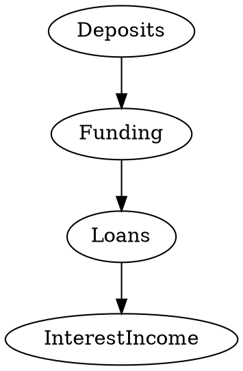

# Машиночитаемые визуальные источники и программная генерация графики для ИИ

## 1. Основная идея

Большую долю визуальных задач не обязательно отдавать генеративной модели изображений. Их можно строить детерминированно из машиночитаемых данных — так же, как `matplotlib` строит график из таблицы.

Это особенно полезно для аналитических и исследовательских задач, где важны:

- воспроизводимость;
- трассируемость к источникам;
- точность геометрии и данных;
- повторное использование;
- автоматизация;
- возможность программного контроля результата;
- отделение фактов и геометрии от визуального оформления.

Базовая цепочка может выглядеть так:

```text
данные / геометрия / визуальный asset
    ↓
машиночитаемая спецификация
    ↓
рендерер
    ↓
SVG / PNG / PDF / PPTX
```

Для аналитических материалов это часто надёжнее, чем генеративная графика.

---

# 2. Основные классы машиночитаемой визуальной информации

| Машиночитаемый источник | Что содержит | Во что можно преобразовать |
|---|---|---|
| CSV / Excel / Parquet | числа, категории | графики, heatmap, Sankey |
| GeoJSON / GeoPackage / GeoParquet | точки, линии, полигоны | географические карты |
| OSM PBF / vector tiles | дороги, здания, границы, объекты | подробные карты |
| SVG | векторные формы, пути, текст | иконки, инфографика, схемы |
| Icon JSON | SVG-path + название + metadata | автоматически подобранные иконки |
| Vega-Lite JSON | декларативное описание графика | SVG / PNG / HTML |
| Graphviz DOT | узлы и связи | оргструктуры, сети, causal maps |
| Mermaid / D2 | текстовое описание схемы | блок-схемы, архитектура |
| MapLibre Style JSON | правила отображения геоданных | стилизованные карты |
| PMTiles / MVT | упакованные тайлы | интерактивные и статические карты |
| фотографии + metadata/API | визуальный контекст | коллажи, оформительские элементы |

Особенно важный универсальный выходной формат — **SVG**.

SVG является кодом и может генерироваться программно. После этого его можно:

- отображать в браузере;
- вставлять в HTML;
- преобразовывать в PNG;
- конвертировать в PDF;
- использовать в презентациях;
- дополнительно редактировать программно.

Таким образом, одна из базовых цепочек:

```text
данные
→ спецификация визуализации
→ SVG
→ PNG / PDF / PPTX
```

---

# 3. Географические карты как программно строимый объект

Для создания карты мира или страны не требуется готовое изображение.

Достаточно иметь:

- полигоны стран или регионов;
- линии границ;
- координаты городов;
- идентификаторы территорий;
- при необходимости — дороги, реки, здания и другие объекты.

Пример абстрактного представления:

```text
Russia:
    Polygon(...)

China:
    Polygon(...)

Brazil:
    Polygon(...)
```

После этого Python или другой рендерер самостоятельно строит карту.

---

# 4. Natural Earth

Natural Earth — один из лучших базовых источников для презентационной и аналитической картографии.

Доступны масштабы:

- 1:10 млн;
- 1:50 млн;
- 1:110 млн.

Среди данных:

- страны;
- административные единицы первого уровня;
- города;
- дороги;
- железные дороги;
- береговые линии;
- реки;
- озёра;
- физическая география;
- другие картографические слои.

Основные форматы включают:

- Shapefile;
- GeoPackage;
- другие стандартные GIS-форматы.

Natural Earth распространяется как public domain.

Пример машинного сценария:

```text
показать страны БРИКС
→ загрузить полигоны стран
→ выбрать нужные ISO-коды
→ остальные страны сделать нейтральными
→ выбранные страны выделить
→ добавить подписи
→ экспортировать в SVG
```

## Политические границы

Для политической картографии важно явно фиксировать используемое представление границ.

Геометрия сама является содержательным утверждением.

Поэтому желательно хранить не просто:

```text
world_map.geojson
```

а, например:

```yaml
source: natural-earth
version: 5.1.1
layer: admin_0_countries
boundary_representation: default
source_semantics: de_facto
```

Для чувствительных и спорных территорий выбор версии карты и point-of-view должен быть явным и воспроизводимым.

---

# 5. geoBoundaries

geoBoundaries полезен для административной географии.

Он предоставляет:

- ADM0;
- ADM1;
- ADM2;
- более глубокие административные уровни для многих стран;
- HTTP API;
- GeoJSON;
- Shapefile;
- metadata по наборам.

Возможный сценарий:

```text
ISO-код страны
+
уровень ADM1
→
GeoJSON регионов
→
соединение с таблицей показателей
→
карта
```

Это особенно удобно для автоматических региональных карт:

> «Покажи регионы страны и раскрась их по значению показателя».

При использовании необходимо учитывать лицензию конкретного набора.

---

# 6. OpenStreetMap

OpenStreetMap даёт значительно более детальное описание физического мира.

Он содержит:

- дороги;
- железные дороги;
- аэропорты;
- здания;
- банки;
- магазины;
- больницы;
- предприятия;
- промышленные территории;
- реки;
- станции;
- улицы;
- административные границы;
- POI;
- тысячи других классов объектов.

Через Overpass API можно задавать структурированные географические запросы.

Например:

```text
получить все банковские отделения
внутри заданной территории
```

Для больших объёмов можно использовать:

- OSM dumps;
- региональные extracts;
- PBF-файлы.

Практический сценарий:

```text
отделения банков
+
города
+
дороги
+
железные дороги
+
промышленные зоны
+
региональная статистика
→
аналитическая карта присутствия
```

OSM распространяется под ODbL, поэтому требования к атрибуции и производным базам данных нужно учитывать отдельно.

---

# 7. Overture Maps

Overture Maps особенно интересен как источник, ориентированный на машинную обработку.

Основные темы данных:

```text
addresses
base
buildings
divisions
places
transportation
```

Схема данных формализована и пригодна для:

- программной валидации;
- обработки ИИ;
- генерации JSON Schema;
- типизированной работы через Pydantic;
- больших аналитических пайплайнов.

## GERS

Overture развивает Global Entity Reference System — GERS.

Это система устойчивых идентификаторов объектов реального мира.

Пример:

```text
GERS-ID объекта
        ↓
геометрия
        ↓
адрес
        ↓
организация / place
        ↓
наши данные
        ↓
визуализация
```

Это особенно интересно для связывания:

- зданий;
- организаций;
- адресов;
- транспортной инфраструктуры;
- сторонних статистических данных.

Overture распространяет большие наборы через современные аналитические форматы, включая Parquet.

Лицензирование необходимо проверять по конкретной теме и источникам внутри набора.

---

# 8. Основные географические форматы

## GeoJSON

Подходит для:

- небольших и средних наборов;
- обмена;
- прозрачности;
- ручного анализа;
- работы ИИ.

Преимущество — понятная JSON-структура.

## GeoPackage

Универсальный локальный GIS-контейнер.

Полезен для:

- нескольких слоёв;
- локального хранения;
- стандартных GIS-процессов.

## GeoParquet

Подходит для:

- больших массивов;
- аналитики;
- columnar storage;
- работы через Python, DuckDB, Spark и другие современные инструменты.

## TopoJSON

Хранит общую топологию.

Если соседние регионы имеют общую границу, она может храниться как одна общая дуга.

Полезно для:

- политических карт;
- административных карт;
- компактности;
- корректного упрощения геометрии.

## OSM PBF

Компактный формат больших наборов OpenStreetMap.

## MVT

Mapbox Vector Tiles.

Используется для доставки векторных тайлов.

## PMTiles

Формат, позволяющий хранить целую пирамиду тайлов в одном файле.

Клиент может загружать только необходимые части через HTTP Range Requests.

---

# 9. Машиночитаемые стили карт

Геометрию и оформление желательно хранить отдельно.

MapLibre использует **Style JSON**.

Отдельно существуют:

```text
геометрия
```

и:

```text
правила отображения
```

Стиль может задавать:

- источники;
- порядок слоёв;
- цвета;
- толщины линий;
- подписи;
- zoom;
- bearing;
- отображение разных типов объектов.

Это позволяет ИИ создавать не картинку, а воспроизводимую спецификацию.

Пример задачи:

> Сделай строгую аналитическую карту без лишней подложки, страны нейтральные, выбранные территории выделены, столицы подписаны.

ИИ может создать Style JSON, а рендерер выполнит остальное.

---

# 10. Иконки и пиктограммы

Машиночитаемые библиотеки иконок особенно полезны для автоматических презентаций.

Типичные категории:

- банк;
- деньги;
- депозит;
- кредит;
- предприятие;
- завод;
- фермер;
- трактор;
- строительство;
- ипотека;
- дом;
- риск;
- документ;
- человек;
- группа людей;
- сервер;
- база данных;
- график;
- API;
- транспорт;
- энергетика.

---

# 11. Iconify

Iconify — один из наиболее удобных агрегаторов иконок для программной работы.

Он объединяет множество открытых наборов в единый формат.

Иконка может быть представлена примерно так:

```json
{
  "prefix": "mdi",
  "icons": {
    "bank": {
      "body": "<path d='...'/>",
      "width": 24,
      "height": 24
    }
  }
}
```

ИИ может оперировать семантическими идентификаторами:

```text
mdi:bank
mdi:factory
mdi:tractor
mdi:home
mdi:chart-line
```

и получать SVG.

Это удобно для:

- слайдов;
- инфографики;
- схем;
- программной композиции;
- автоматической визуальной семантики.

Важно: лицензия зависит от исходного icon-set.

---

# 12. Material Symbols

Material Symbols дают:

- SVG;
- PNG;
- variable font;
- унифицированный визуальный язык;
- разные формы и веса.

Для корпоративных материалов сильная сторона — визуальная однородность.

Это снижает риск того, что презентация будет состоять из стилистически несовместимых иконок.

---

# 13. Simple Icons

Simple Icons ориентирован на бренды и компании.

Практически полезен для:

- логотипов технологических компаний;
- сервисов;
- брендов;
- платформ.

Формат SVG делает набор удобным для программной вставки в слайды и схемы.

При этом права на товарные знаки конкретных брендов необходимо учитывать отдельно.

---

# 14. Emoji как машиночитаемый визуальный слой

Например, Noto Emoji содержит:

- SVG;
- PNG;
- Unicode metadata;
- shortcodes;
- вспомогательные инструменты.

Преимущество — стабильная семантическая адресация через Unicode.

Для формальной аналитики применимость ограничена, но как вспомогательный слой это тоже полноценная machine-readable графика.

---

# 15. Генерация схем из текста

## Graphviz

Graphviz использует язык DOT.

Пример:



Graphviz автоматически рассчитывает положение узлов и связей.

Подходит для:

- архитектур;
- оргструктур;
- деревьев;
- финансовых потоков;
- причинно-следственных схем;
- network diagrams.

Выходные форматы включают SVG и изображения.

---

# 16. D2

D2 — современный декларативный язык схем.

ИИ пишет семантическое описание, а layout engine рассчитывает геометрию.

Подходит для:

- архитектуры;
- таблиц внутри схем;
- процессов;
- зависимостей;
- структур данных;
- сложных аналитических диаграмм.

---

# 17. Vega-Lite

Vega-Lite — декларативная грамматика визуализации.

Вместо процедурного рисования можно описать график JSON-спецификацией.

Пример:

```json
{
  "mark": "bar",
  "encoding": {
    "x": {"field": "bank"},
    "y": {"field": "loans"}
  }
}
```

Преимущества:

- машинная читаемость;
- простота генерации ИИ;
- воспроизводимость;
- отделение данных от визуального правила;
- возможность экспорта в SVG/PNG/HTML.

Altair является удобным Python-интерфейсом к Vega-Lite.

---

# 18. Python-стек для карт

Для статических аналитических карт базовый вариант:

```text
GeoPandas
+
Matplotlib
→
SVG / PNG
```

Пример пайплайна:

```text
financial_data.csv
        +
regions.geojson
        ↓
join по region_id
        ↓
GeoDataFrame
        ↓
style
        ↓
SVG / PNG
```

Альтернативы:

- Plotly;
- Folium;
- PyDeck;
- Cartopy;
- MapLibre;
- Kepler.gl;
- Deck.gl.

---

# 19. Машиночитаемый поиск фотографий и иллюстраций

Для фотографий и сложной графики можно использовать API-каталоги.

## Openverse

Openverse индексирует большие объёмы Creative Commons и public-domain медиа.

Можно искать:

- изображения;
- иллюстрации;
- фотографии;
- некоторые другие медиа.

Лицензию конкретного объекта необходимо проверять отдельно.

## Wikimedia Commons

Wikimedia Commons предоставляет API и структурированные metadata.

Это позволяет программно искать изображения по:

- содержанию;
- сущностям;
- категории;
- лицензии;
- типу файла.

Например:

```text
depicts: combine harvester
license: compatible
file_type: SVG
```

Это уже не генерация, а retrieval визуального материала.

---

# 20. Ограничения некоторых бесплатных библиотек

Не всякая бесплатная библиотека допускает автоматизированное массовое использование.

Некоторые проекты ограничивают:

- scraping;
- массовое скачивание;
- автоматическую индексацию;
- использование для AI/ML;
- создание производных библиотек.

Поэтому для системного AI-пайплайна лучше использовать источники, где:

- машинная загрузка явно поддерживается;
- лицензия прозрачна;
- metadata доступны;
- версия набора фиксируема.

---

# 21. Предлагаемый стек

## Карты низкой и средней детализации

**Natural Earth**

Для:

- стран;
- административных единиц;
- презентационных карт;
- базовой физической географии.

## Административные границы

**geoBoundaries**

При необходимости — официальные национальные наборы.

## Детальный физический мир

**Overture Maps + OpenStreetMap**

Для:

- дорог;
- зданий;
- POI;
- транспорта;
- организаций;
- инфраструктуры.

## Иконографика

**Iconify**

Основной машинный каталог.

**Material Symbols**

Единый визуальный язык.

**Simple Icons**

Бренды.

## Графики

**Vega-Lite / Altair / matplotlib**

## Схемы

**Graphviz / D2**

## Карты

**GeoPandas / MapLibre**

## Базовый формат результата

**SVG**

При необходимости:

```text
SVG
→
PNG
→
PDF
→
PPTX
```

---

# 22. Возможная архитектура собственного Visual Toolkit

Имеет смысл хранить не коллекцию случайных картинок, а машиночитаемый registry.

Пример:

```text
visual-kit/
├── registry/
│   ├── geographic-sources.yaml
│   ├── icon-sources.yaml
│   ├── diagram-engines.yaml
│   └── licenses.yaml
│
├── styles/
│   ├── maps/
│   │   ├── corporate-light.json
│   │   ├── choropleth.json
│   │   └── locator-map.json
│   ├── charts/
│   └── diagrams/
│
├── renderers/
│   ├── map.py
│   ├── chart.py
│   ├── diagram.py
│   ├── icons.py
│   └── svg.py
│
└── schemas/
    ├── map.schema.json
    ├── chart.schema.json
    └── infographic.schema.json
```

Пример спецификации карты:

```yaml
type: map

geometry:
  source: natural-earth
  version: 5.1.1
  layer: admin_0_countries

selection:
  iso3:
    - RUS
    - CHN
    - IND
    - BRA

projection: EqualEarth

labels:
  capitals: true

output:
  format: svg
  width: 1600
  height: 900
```

После этого renderer создаёт изображение.

Это можно рассматривать как **компиляцию визуального артефакта**.

---

# 23. Связь с принципами Tabularium

Визуальный слой желательно не смешивать с evidence-layer.

Для визуализации можно использовать отдельную цепочку происхождения:

```text
source
  ↓
machine-readable geometry / asset
  ↓
selection / transformation
  ↓
render specification
  ↓
rendered SVG / PNG
```

Например:

```text
Natural Earth 5.1.1
        ↓
Admin-0 polygons
        ↓
selected ISO3 + projection
        ↓
map-spec.yaml
        ↓
figure.svg
```

А если карта содержит аналитические данные:

```text
Tabularium observation
        ↓
join по ISO3 / region_id
        ↓
encoding rule
        ↓
map-spec.yaml
        ↓
rendered map
```

Таким образом, можно установить:

- откуда взялась цифра;
- откуда взялась геометрия;
- какую версию границ использовали;
- какой вариант политического представления применён;
- какую проекцию использовали;
- каким правилом показатель преобразован в цвет;
- каким программным средством выполнен рендер.

Это значительно повышает воспроизводимость аналитической графики.

---

# 24. Применение к банковской аналитике

Пример:

```text
данные банка
        ↓
география присутствия
        ↓
иконки отделений
        ↓
регионы
        ↓
данные по бизнесу / АПК
        ↓
карта
```

Другой пример:

```text
банк
├── корпоративный портфель
├── АПК
├── регионы присутствия
└── отделения

→ карта России
→ регионы по интенсивности
→ маркеры сети
→ показатели
→ легенда
```

Всё это можно строить программно без Photoshop и без генеративной модели изображений.

---

# 25. Три режима создания визуальных материалов

Полезно разделять три принципиально разные задачи.

| Режим | Когда использовать |
|---|---|
| Data → deterministic rendering | карты, графики, схемы, структуры, иконографика |
| Asset retrieval → composition | логотипы, пиктограммы, фотографии, готовые иллюстрации |
| Generative image | новые художественные сцены и иллюстрации |

Для аналитической инфраструктуры первые два режима обычно важнее третьего.

---

# 26. Рекомендуемый базовый набор

Перспективная комбинация:

```text
Natural Earth
+
geoBoundaries
+
Overture Maps
+
OpenStreetMap
+
Iconify
+
Material Symbols
+
Simple Icons
+
Vega-Lite
+
Graphviz
+
D2
+
SVG
+
Python
```

На базе такого стека ИИ может получать задачу:

> Сделай горизонтальную карту России для слайда: выдели регионы присутствия банка, поверх покажи крупнейшие центры АПК, справа вынеси четыре показателя и используй единый набор пиктограмм.

Вместо генерации картинки ИИ создаёт **машиноисполняемую спецификацию**, которая затем детерминированно преобразуется в SVG/PNG/PDF/PPTX.

---

# 27. Итог

Машиночитаемая визуальная инфраструктура уже существует и достаточно зрелая.

Наиболее перспективный подход — не собирать случайные изображения, а создавать слой, где отдельно существуют:

```text
данные
геометрия
иконки
стили
визуальные спецификации
рендереры
provenance
```

Такой подход позволяет ИИ не «рисовать по ощущениям», а **программно собирать проверяемые визуальные артефакты**.

Для аналитической, исследовательской и презентационной среды это потенциально один из самых сильных способов автоматизации визуальной работы.
