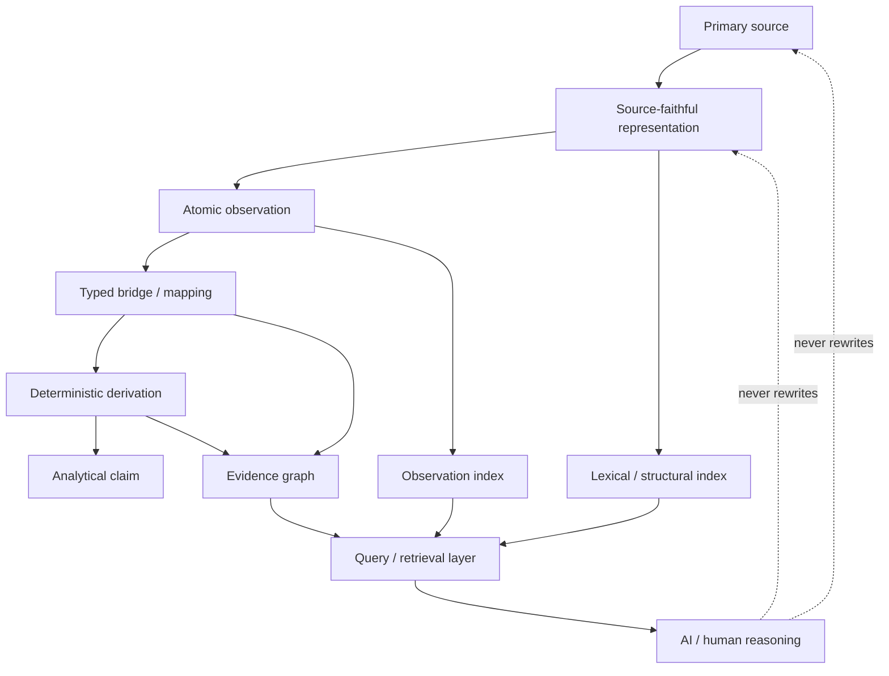
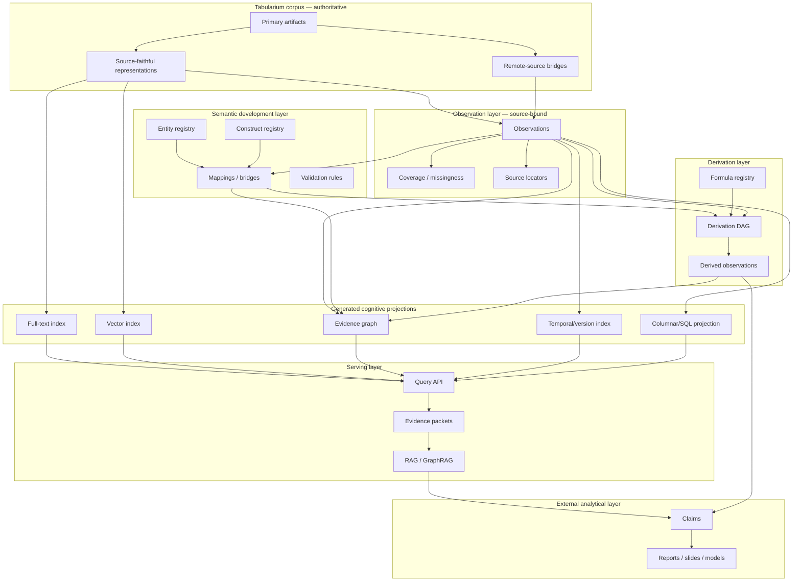
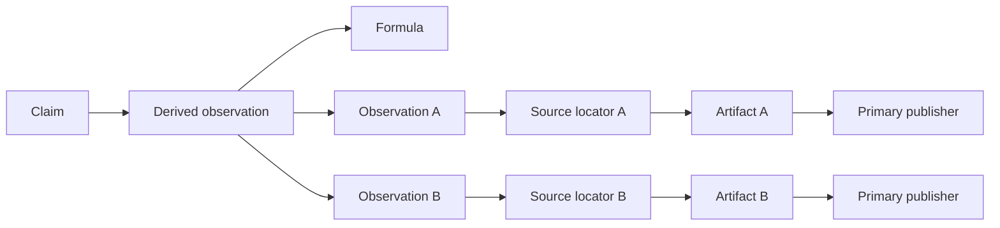

# Cognitive Database для Tabularium: от source-faithful корпуса к доказательной когнитивной инфраструктуре

**Статус:** исследование / development-layer, не изменение текущего контракта репозитория  
**Дата исследования:** 2026-09-23  
**Проект:** `ForestTiger-GH/tabularium`  
**Предлагаемое место при переносе в репозиторий:** `_mw/research/01-base-ideas/tabularium_cognitive_database_research.md`

---

## 0. Резюме в одном абзаце

Идея **cognitive database** для Tabularium перспективна, но только если трактовать её не как «умную БД, которая сама знает истину», а как **строго отделённый от корпуса вычислимый слой, который умеет находить, связывать, объяснять и трассировать знания обратно до первичного источника**. Сам Tabularium должен оставаться source-faithful evidence-layer: оригиналы, точные представления, опубликованные значения, структура публикаций, единицы, периоды, периметр и provenance. Поверх него можно построить **Cognitive Projection / Evidence Graph**: реестр сущностей и constructs, атомарные observations, связи между ними, мосты между методиками, derivation DAG, временные и версионные отношения, полнотекстовый и векторный индексы, графовый поиск, retrieval для ИИ и, отдельно, аналитические claims. Главный архитектурный тезис исследования: **когнитивность должна принадлежать проекции и запросу, а не первичному источнику**.

---

# 1. Что вообще такое «когнитивная база данных»

## 1.1. Термин не является единым устоявшимся классом СУБД

По состоянию на 2026 год `cognitive database` нельзя считать термином с таким же устоявшимся техническим смыслом, как relational database, graph database, vector database, temporal database или data warehouse. Под одним названием встречаются существенно разные идеи.

Это важно для Tabularium: нельзя просто сказать «сделаем cognitive database» и считать, что архитектурное решение уже определено. Сначала надо разложить термин на конкретные механизмы.

### Линия A — Cognitive Database как SQL + embeddings

В работах Bordawekar, Bandyopadhyay и Shmueli 2017–2019 годов Cognitive Database — это расширение реляционной БД семантической моделью. Табличные значения «текстифицируются», по ним обучается word embedding, а полученные векторы используются из SQL для семантического similarity, аналогий, кластеризации и других «cognitive intelligence queries». [S01][S02]

Это исторически интересная идея, потому что она заранее предвосхищает нынешний массовый паттерн:

```text
structured data
+ embedding model
+ semantic similarity
+ ordinary query engine
```

Но для Tabularium эта трактовка недостаточна: она хорошо отвечает на вопрос «как найти семантически похожее», но плохо отвечает на ключевой вопрос Tabularium — **почему конкретное число или утверждение считается допустимым и откуда оно произошло**.

### Линия B — AI4DB и DB4AI

Современная академическая литература чаще использует более ясное разделение: [S04]

- **AI4DB** — ИИ улучшает саму СУБД: оптимизатор, индексы, конфигурацию, планирование запросов, мониторинг;
- **DB4AI** — БД становится инфраструктурой для AI/ML: хранит признаки и модели, ускоряет inference, поддерживает vector search и декларативные AI-операции.

Для Tabularium AI4DB почти вторичен. Намного важнее DB4AI, но и его недостаточно: корпусу нужна не просто инфраструктура под LLM, а **доказательная семантика**.

### Линия C — Cognitive DB как Knowledge Fabric

В 2025 году Next Paradigm Foundation описала Cognitive DB как многослойную «knowledge fabric»: ingestion → intermediate representation → artifact store → embeddings → metadata → ontology → graph → retrieval/answer assembly → agents → governance. [S03]

Эта архитектурная трактовка уже значительно ближе к Tabularium, потому что делает first-class объектами:

- структуру документа;
- версии;
- metadata;
- provenance;
- ontology;
- graph relationships;
- hybrid retrieval;
- объяснимость.

Но её нельзя переносить буквально. White paper делает сильные заявления о `99–100% reliability`; это заявление автора архитектуры, а не общепринятая эмпирическая гарантия. Исследования GraphRAG показывают, что графовая организация помогает некоторым классам задач, особенно многопереходным и глобальным, но не гарантирует превосходство над обычным RAG во всех сценариях. [S20][S21]

### Линия D — Knowledge Graph + Retrieval + Agents

Практически современная «когнитивная БД» часто оказывается композицией уже известных классов систем:

```text
object/artifact storage
+ relational/columnar data
+ knowledge graph
+ full-text search
+ vector index
+ provenance/lineage
+ temporal/version model
+ rules / derivation engine
+ RAG / GraphRAG
+ agentic query layer
```

То есть новизна чаще находится **не в новом типе физического хранилища**, а в соединении нескольких видов представления данных в управляемую, трассируемую систему.

---

# 2. Почему тема особенно хорошо ложится на Tabularium

Текущий Tabularium уже решает самую неприятную часть задачи, которую многие «cognitive knowledge» проекты пытаются добавить постфактум: **верность первичному источнику**.

Действующий контракт репозитория уже требует:

- хранить первичные публичные источники;
- сохранять смысл и опубликованные значения;
- не добавлять в corpus analysis и derived calculations;
- нативно машиночитаемые данные сохранять в их исходных форматах;
- PDF переводить в полную source-faithful Markdown-транскрипцию;
- для high-volume источников использовать документированные remote-source bridges;
- различать disclosure suppression, source unavailability и retrieval failure;
- не смешивать данные разных методик и периметров без явного bridge.

Внутренний `_mw` дополнительно уже отделяет research/development от текущего product state. Существующее исследование `tabularium_ifrs_observation_architecture.md` фактически вводит будущий Observation Pack и прямо проводит цепочку:

```text
source
→ representation
→ observation
→ bridge
→ analytical claim
```

Поэтому Tabularium не нужно «становиться cognitive DB с нуля». У него уже есть более ценный фундамент: **эпистемическая дисциплина**, которой часто не хватает AI-first архитектурам.

---

# 3. Главное архитектурное решение

## 3.1. Не «Cognitive Database вместо Tabularium»

Плохая модель:

```text
PDF / XLSX / CSV
      ↓
LLM extraction
      ↓
knowledge graph
      ↓
"truth"
```

Здесь теряется главное: knowledge graph быстро начинает выглядеть авторитетнее исходного документа, хотя часть связей была извлечена моделью, часть нормализована, часть выведена, а часть просто предположена.

## 3.2. «Cognitive Projection над Tabularium»

Предлагаемая модель:



**Tabularium corpus остаётся authoritative evidence store.**  
**Cognitive Projection — это производная, пересобираемая система представлений.**

Это различие должно быть фундаментальным и технически проверяемым.

---

# 4. Что именно означает «когнитивность» для Tabularium

Для проекта полезно дать операционное определение.

> **Когнитивный слой Tabularium** — это воспроизводимая система индексов, семантических связей, provenance и derivation, которая позволяет машине переходить от вопроса к релевантным источникам и наблюдениям, строить допустимые связи между ними и возвращать результат вместе с доказательным маршрутом, не изменяя значения и смысл первичных публикаций.

Из этого определения следуют восемь способностей.

### 4.1. Идентификация

Система знает, что конкретный файл относится к определённому выпуску, источнику, юридическому лицу, группе, отчетному периоду, типу документа и версии.

### 4.2. Адресация

Любое observation можно вернуть не просто к «PDF банка», а к точному locator:

```text
artifact
→ page/sheet
→ section/note
→ table
→ row path
→ column path
→ cell/span
```

### 4.3. Семантическое различение

Система умеет не только сказать «оба показателя называются кредиты», но и сохранить различия:

```text
IFRS loans ≠ regulatory loans
bank standalone ≠ consolidated group
gross ≠ net
amortized cost ≠ all measurement categories
reported ≠ derived
period end ≠ average balance
```

### 4.4. Связывание

Она может хранить явные, типизированные отношения:

```text
same_legal_entity_as
member_of_group
reported_by
refers_to_period
exact_mapping
close_mapping
broader_than
narrower_than
derived_from
restates
supersedes
conflicts_with
supports
```

### 4.5. Воспроизводимое вычисление

Для производного показателя можно получить:

```text
result
→ formula version
→ input observations
→ input source locators
→ transformation steps
→ code/version hash
```

### 4.6. Поиск по разным пространствам

Один и тот же запрос может использовать:

- точное совпадение идентификаторов;
- full-text/BM25;
- фильтры по metadata;
- графовый обход;
- semantic/vector similarity;
- SQL по observations;
- temporal conditions;
- unit/perimeter compatibility constraints.

### 4.7. Выявление противоречий и неизвестности

Хорошая когнитивная система не должна «схлопывать» конфликт. Она должна уметь сказать:

```text
Source A says X
Source B says Y
mapping between A and B is not established
therefore equivalence = UNKNOWN
```

### 4.8. Evidence-first ответы ИИ

LLM должен получать не просто похожие chunks, а компактный пакет:

```text
question
→ candidate entities / constructs
→ observations
→ exact source locators
→ bridge relations
→ derivation paths
→ conflicts / gaps
→ source excerpts only where needed
```

---

# 5. Научные и инженерные идеи, которые полезно заимствовать

## 5.1. W3C PROV: provenance как отдельная модель

W3C PROV моделирует provenance через сущности (`Entity`), процессы (`Activity`) и агентов (`Agent`), а также отношения generation, use, derivation и attribution. [S07]

Для Tabularium это естественно переводится так:

```text
Entity:
  source artifact
  representation
  observation pack
  derived dataset
  claim packet

Activity:
  download
  transcription
  extraction
  mapping
  calculation
  validation

Agent:
  publisher
  extractor implementation
  human reviewer
  workflow
```

Главная ценность не в обязательном переходе на RDF, а в самом принципе:

> **происхождение объекта — это самостоятельные данные, а не комментарий в README.**

## 5.2. Nanopublications: assertion отдельно от provenance

Nanopublication делит маленькую единицу знания минимум на:

1. assertion;
2. provenance assertion;
3. publication information. [S16]

Для Tabularium эта идея почти идеально ложится на observation:

```text
OBSERVATION
  что опубликовано / какое значение наблюдается

OBSERVATION PROVENANCE
  где в источнике, кем и каким способом извлечено

OBSERVATION RECORD INFO
  когда создана запись Tabularium,
  какой schema version,
  какой extractor version,
  review status
```

Важно: **Tabularium observation — не «утверждение, что мир таков», а утверждение, что источник опубликовал конкретное значение в конкретном контексте.**

Это существенно сильнее обычного knowledge graph triple.

## 5.3. SKOS: разные силы семантического соответствия

SKOS явно различает `exactMatch`, `closeMatch`, `broadMatch`, `narrowMatch`, `relatedMatch`. [S09]

Это очень полезная модель для cross-source bridge.

Например:

```text
"Ипотечные жилищные кредиты" в раскрытии банка
    closeMatch
"Loans to individuals — mortgages" canonical construct
```

Но не обязательно `exactMatch`, если отличаются:

- gross/net;
- group/bank perimeter;
- product composition;
- accounting category;
- inclusion of accrued interest;
- securitization treatment;
- currency perimeter.

Ключевая идея: **mapping должен иметь тип силы, а не просто `mapped=true`.**

## 5.4. RDF Data Cube и XBRL: observation как многомерный факт

RDF Data Cube трактует статистическое наблюдение как value + dimensions + metadata. [S12]

XBRL идёт ещё ближе к финансовой отчетности: факт связан как минимум с concept, entity, period, unit и taxonomy-defined dimensions. Open Information Model определяет синтаксис-независимую модель XBRL report/fact и стандартные JSON/CSV-представления. [S13][S14]

Это подтверждает ключевой дизайн Tabularium:

```text
value alone is never an observation
```

Наблюдение — это минимум:

```text
construct / source concept
entity
period
perimeter
unit
value/status
dimensions
source locator
```

## 5.5. SHACL: схема не только как JSON Schema, но как семантические ограничения

SHACL позволяет валидировать RDF-графы по shapes. [S10]

Даже если Tabularium не будет использовать RDF в production, полезен сам паттерн двух уровней валидации:

```text
syntactic validation
    JSON Schema / field types

semantic validation
    cross-field invariants / graph shapes
```

Например:

```text
if period_kind = instant
then period_start MUST be null

if status = REPORTED
then source_locator MUST exist

if relation = DERIVED_FROM
then formula_id MUST exist

if mapping_strength = EXACT
then explicitly incompatible dimensions MUST NOT exist
```

## 5.6. Temporal databases: знать «когда истинно» и «когда мы это знали»

Классическая temporal database literature разделяет valid time и transaction time. [S17]

Для Tabularium этого даже недостаточно. Нужны как минимум три временные оси:

```text
1. reference/economic time
   дата или период, к которому относится наблюдение

2. publication time
   когда источник опубликовал конкретную версию

3. knowledge/ingestion time
   когда Tabularium получил/зафиксировал эту версию
```

Иногда нужен и четвёртый слой:

```text
4. supersedence time
   когда стало известно, что observation или mapping заменены
```

Это позволяет отвечать на вопросы:

- что банк сообщал на 30 июня 2026;
- что было публично известно на 15 августа 2026;
- когда Tabularium впервые зафиксировал значение;
- какая публикация позже restated comparative;
- что считалось canonical mapping на конкретную дату разработки.

## 5.7. Database provenance: не только «откуда», но и «как получено»

Работы по why/where/how provenance и provenance semirings показывают, что lineage результата запроса можно моделировать формально, вплоть до того, какие входные tuples участвовали и как комбинация входов породила выход. [S18]

Это особенно важно для количественного слоя Tabularium.

Вместо:

```text
ROE = 18.4%
source = calculations.xlsx
```

должно быть возможно:

```text
ROE_2026H1
  formula = annualized_profit / avg_equity
  formula_version = roe_proxy@2
  inputs:
    obs_profit_2026H1
    obs_equity_2025Y
    obs_equity_2026H1
  operations:
    avg(equity_start, equity_end)
    profit * 2
    divide
  result = ...
```

То есть **формула — это граф вычисления, а не текстовая сноска**.

---

# 6. Почему vector database сама по себе не является Cognitive Database

Векторные БД стали популярны из-за LLM и similarity search, но академические обзоры прямо отмечают фундаментальную проблему — semantic similarity по определению нечётка и требует специальных компромиссов по индексации и query processing. [S05]

Для Tabularium embeddings полезны, но только как **поисковый индекс**.

Они могут хорошо отвечать на:

```text
найди таблицы, похожие по смыслу на "средства физических лиц"
```

Но не должны сами решать:

```text
является ли показатель A экономически эквивалентным показателю B
```

или:

```text
можно ли сложить A и B
```

или:

```text
является ли отсутствие строки нулём
```

### Правило

```text
embedding similarity = retrieval evidence
embedding similarity ≠ semantic equivalence
embedding similarity ≠ accounting comparability
embedding similarity ≠ truth
```

---

# 7. Почему knowledge graph тоже не должен становиться источником истины

Knowledge graph literature охватывает schema, identity, context, extraction, refinement, embeddings и rules. [S06]

Но для Tabularium есть специфический риск: граф делает любую связь визуально «фактом».

Например:

```text
SBER --has_metric--> mortgage_loans
```

выглядит просто, но скрывает:

- отчет или группа;
- дату;
- валовую/чистую величину;
- метод оценки;
- валюту;
- источник;
- comparative/current;
- reported/derived;
- диапазон строк, вошедших в показатель.

Поэтому основной узел Tabularium graph должен быть не `entity → metric → value`, а **qualified observation**.

Лучше:

```text
Entity
  ↓ is_subject_of
Observation
  ↓ observes_construct
Construct

Observation
  ↓ has_period
Period
Observation
  ↓ has_unit
Unit
Observation
  ↓ has_perimeter
Perimeter
Observation
  ↓ reported_in
Artifact
Observation
  ↓ located_at
SourceLocator
```

---

# 8. Предлагаемая многографовая модель

Вместо одного гигантского «knowledge graph» лучше мыслить набором логических графов. Физически они могут храниться как JSONL/Parquet/SQL.

## 8.1. Source Graph

Описывает публикации и их физическую структуру.

Узлы:

```text
Publisher
PublicationSeries
Release
Artifact
Page / Sheet
Section / Note
Table
Row
Column
Cell / Span
```

Связи:

```text
published_by
issue_of
contains
follows
references
amends
supersedes
```

## 8.2. Observation Graph

Описывает атомарные наблюдения.

Узлы:

```text
Observation
SourceConcept
Period
Unit
Perimeter
DimensionValue
```

Ни один observation не должен существовать без provenance до источника, кроме специально обозначенных derived observations, у которых provenance ведёт к inputs и formula.

## 8.3. Entity Graph

Отдельно моделирует:

```text
legal entity
group
subsidiary
branch
business segment
geography
product hierarchy
regulatory perimeter
```

Это критически важно для банков, потому что:

```text
АО Банк
≠ банковская группа
≠ холдинг
≠ МСФО группа
≠ регуляторный банковский периметр
```

Связи должны быть временными и source-qualified.

## 8.4. Construct Graph

Хранит **понятия**, но не значения.

Пример:

```text
loan_book
retail_loans
mortgage_loans
consumer_loans
corporate_loans
customer_funds
retail_term_deposits
retail_current_accounts
```

Каждый construct должен иметь:

- definition;
- dimensional expectations;
- admissible units;
- stock/flow nature;
- gross/net axis;
- accounting/regulatory axis;
- perimeter rules;
- historical schema version.

## 8.5. Bridge Graph

Связывает source concepts и canonical constructs.

Типы связи:

```text
EXACT
CLOSE
BROADER
NARROWER
RELATED
COMPOSITE
CONDITIONAL
INCOMPATIBLE
UNKNOWN
```

Причём mapping имеет собственный provenance:

```text
mapping_id
from_concept
to_construct
valid_from
valid_to
conditions
rule_version
author/reviewer
basis
```

## 8.6. Derivation Graph

Отдельный DAG для вычислений.

Узлы:

```text
InputObservation
Formula
TransformationStep
DerivedObservation
```

Связи:

```text
uses
adds
subtracts
divides_by
averages
annualizes
converts_unit
filters
aggregates
```

## 8.7. Claim Graph

Claims — это уже не evidence-layer.

Примеры:

```text
"Банк ускорил рост розничного кредитования во 2К26"
"Доля срочных средств населения снизилась"
```

Claim graph должен жить **в аналитическом/consumer layer**, а не маскироваться под исходные наблюдения.

Связи:

```text
supported_by
contradicted_by
qualified_by
derived_from
requires_assumption
```

## 8.8. Retrieval Graph

Chunks, embeddings, community summaries и LLM-extracted relationships — это обслуживающий индекс.

Их свойства:

```text
rebuildable = true
authoritative = false
model_version = ...
embedding_model = ...
created_at = ...
```

Это одна из важнейших границ всей архитектуры.

---

# 9. RDF 1.2 и statement-level metadata

RDF 1.2 вводит triple terms/reification, позволяя описывать не только связь, но и конкретное утверждение о связи, причём сама quoted/reified proposition не обязана считаться asserted. В 2026 году спецификация RDF 1.2 находится на Recommendation track, а новые механизмы statement annotation уже формализованы в Candidate Recommendation/Working Draft документах. [S08]

Для Tabularium это концептуально очень сильная идея.

Можно иметь:

```text
Proposition:
  Bank A has_member Subsidiary B

Reifier 1:
  source = annual_report_2025
  valid_from = 2025-12-31
  extraction = reported

Reifier 2:
  source = disclosure_2026Q2
  valid_from = 2026-06-30
  status = superseded
```

То есть одна и та же абстрактная связь может иметь несколько конкретных provenance-bearing instances.

### Но

Не следует делать RDF 1.2 обязательной основой Tabularium прямо сейчас:

- стандарт ещё свежий;
- tooling менее зрелый, чем обычный JSON/SQL;
- Git-friendly debugging JSONL проще;
- текущему корпусу важнее устойчивый контракт observations, чем красивый ontology stack.

Рациональный путь: **спроектировать модель так, чтобы она экспортировалась в RDF/JSON-LD, но не зависела от RDF runtime.**

---

# 10. Временная модель: важнее, чем кажется

Для финансового корпуса `date` недостаточна.

## 10.1. Минимальные поля времени

```yaml
reference_period:
  kind: instant | duration
  start: 2026-01-01
  end: 2026-06-30

publication:
  issued_at: 2026-08-15
  source_version: "1"

ingestion:
  first_seen_at: 2026-08-15T13:41:22Z
  recorded_at: 2026-08-15T13:43:10Z

validity:
  known_valid_from: 2026-08-15T13:43:10Z
  known_valid_to: null
```

## 10.2. Restatement не должен перезаписывать старое observation

Пусть банк в FY2026 restates сравнительные данные за 2025 год.

Плохая модель:

```text
2025 value = 120
→ overwrite
2025 value = 117
```

Правильная:

```text
obs_A:
  period = 2025-12-31
  value = 120
  publication = FY2025

obs_B:
  period = 2025-12-31
  value = 117
  publication = FY2026
  relation = RESTATES obs_A
```

Оба observations истинно описывают то, **что было опубликовано соответствующим релизом**.

---

# 11. Идентичность: entity ≠ label

Одна из самых больших когнитивных ошибок — считать текстовое название сущностью.

Для Tabularium нужен устойчивый `entity_id`, независимый от display name.

Пример:

```yaml
entity_id: ru.credit_org.1481
entity_type: legal_entity
labels:
  - text: "АО \"Россельхозбанк\""
    valid_from: ...
  - text: "Россельхозбанк"
    alias: true
external_ids:
  cbr_reg_no: "3349"
  lei: ...
```

Для групп:

```yaml
entity_id: group.rshb.ifrs.2026
entity_type: reporting_group
membership:
  - entity_id: ...
    valid_from: ...
    valid_to: ...
    source_observation: ...
```

Группа должна быть временной конструкцией. Нельзя бессрочно приклеить дочернюю компанию к группе, если состав консолидации меняется.

---

# 12. Construct ≠ Observation: центральный принцип Cognitive Tabularium

## 12.1. Construct

Абстрактное понятие:

```text
retail_mortgage_loans
```

Оно может иметь:

- definition;
- expected dimensions;
- inclusion/exclusion rules;
- unit family;
- period type;
- mapping policy.

## 12.2. Observation

Конкретное опубликованное значение:

```text
7 123 456 млн руб.
```

с контекстом:

```text
entity = SBER Group
period = 2026-06-30
perimeter = IFRS consolidated
measurement = amortized cost
gross_net = gross
source = Note 12, row X, column Y
```

## 12.3. Binding

Binding отвечает:

```text
насколько конкретный source observation соответствует construct?
```

Это самостоятельная семантическая операция.

Следовательно:

```text
same label
≠ same construct

same construct
≠ comparable observations

comparable observations
≠ interchangeable observations
```

---

# 13. Status ontology: система должна понимать неизвестность

Tabularium уже принципиально различает missing, zero, UNKNOWN, false, not applicable и undisclosed. Cognitive layer должен формализовать это ещё жёстче.

Предлагаемый набор для значения:

```text
REPORTED
REPORTED_ZERO
REPORTED_NIL
NOT_APPLICABLE
UNDISCLOSED
SUPPRESSED
NOT_FOUND
SOURCE_UNAVAILABLE
RETRIEVAL_FAILED
EXTRACTION_UNCERTAIN
DERIVED
ADJUSTED
RESTATED
UNKNOWN
```

Причём некоторые состояния ортогональны и лучше хранить отдельными полями, например:

```yaml
value_origin: reported | derived | adjusted
availability_status: available | suppressed | unavailable | failed
semantic_status: mapped | unmapped | uncertain
review_status: machine | reviewed | verified
```

Это лучше одного гигантского enum, потому что разные оси не следует смешивать.

---

# 14. Пример атомарного observation object

Ниже — **иллюстративный**, не production schema.

```json
{
  "observation_id": "obs:sha256:...",
  "source_report_id": "report:...",

  "source": {
    "artifact_id": "artifact:...",
    "locator": {
      "page": 18,
      "note": "4",
      "table": "Кредиты и авансы клиентам",
      "row_path": ["Физические лица", "Жилищные кредиты"],
      "column_path": ["30 июня 2026", "Валовая балансовая стоимость"]
    },
    "reported_label": "Жилищные кредиты",
    "value_literal": "7 123 456",
    "unit_literal": "млн руб."
  },

  "fact": {
    "entity_id": "entity:...",
    "period_kind": "instant",
    "period_end": "2026-06-30",
    "numeric_value": 7123456,
    "unit_id": "unit:rub_million",
    "origin": "REPORTED"
  },

  "semantics": {
    "source_concept_id": "srcconcept:...",
    "perimeter_id": "perimeter:ifrs_group",
    "measurement_basis": "amortized_cost",
    "gross_net": "gross"
  },

  "record": {
    "extraction_method": "table-cell",
    "extractor_version": "...",
    "schema_version": "...",
    "recorded_at": "...",
    "review_status": "machine"
  }
}
```

Mapping к canonical construct хранится **отдельно**, чтобы позднее изменение mapping не переписывало observation.

---

# 15. Почему mapping надо отделить от observation

Если запись содержит:

```json
"metric_id": "LOAN.RETAIL.MORTGAGE"
```

и этот mapping позже признан ошибочным, возникает соблазн изменить observation.

Лучше:

```text
observation
    ↓
binding-v1
    ↓
construct
```

Позже:

```text
binding-v1 status = superseded
binding-v2 created
```

Само observation остаётся неизменным.

Это буквально превращает epistemic chain в данные.

---

# 16. Derivation как first-class object

Для Cognitive Tabularium формула должна быть машиночитаемым объектом.

Пример:

```json
{
  "derivation_id": "drv:roe_proxy:2026H1:...",
  "formula_id": "formula:roe_proxy:v2",
  "inputs": [
    "obs:net_profit_2026H1",
    "obs:equity_2025Y",
    "obs:equity_2026H1"
  ],
  "expression": {
    "op": "divide",
    "lhs": {
      "op": "multiply",
      "lhs": {"ref": "obs:net_profit_2026H1"},
      "rhs": 2
    },
    "rhs": {
      "op": "average",
      "args": [
        {"ref": "obs:equity_2025Y"},
        {"ref": "obs:equity_2026H1"}
      ]
    }
  },
  "comparability_checks": [
    "same_perimeter",
    "compatible_unit",
    "compatible_accounting_basis"
  ],
  "engine_version": "..."
}
```

### Почему AST лучше текстовой формулы

Строка:

```text
profit*2/avg_equity
```

читаема человеком, но хуже для:

- dependency traversal;
- automatic validation;
- substitution;
- unit checking;
- recalculation;
- formula diff;
- reproducibility.

AST/operation DAG превращает derivation в вычислимый provenance.

---

# 17. Что может дать Cognitive Tabularium именно банковскому анализу

## 17.1. IFRS ↔ RAS/CBR bridges

Система сможет хранить не только табличку соответствий, но и тип связи.

Пример:

```text
IFRS "Loans to customers"
   broader_than
canonical "customer loans"

CBR 0409101 account set A
   composite_mapping
canonical "corporate loans"

mapping compatibility:
   perimeter: different
   gross_net: different
   accrued_interest: conditional
```

Вопрос ИИ:

```text
Почему МСФО corporate loans банка не равны сумме счетов формы 101?
```

может возвращать не общий текст, а explicit bridge packet:

- какие observations сравниваются;
- где различается perimeter;
- что входит/не входит;
- какие правила aggregation использованы;
- какие компоненты остаются UNKNOWN.

## 17.2. Материнская/дочерняя структура

Вместо плоского `bank = group` можно задавать:

```text
reporting perimeter
→ includes legal entities
→ during validity interval
→ according to specific source
```

Это позволит строить запросы:

```text
какие дочерние организации входили в МСФО-группу банка на 2025-12-31,
но отсутствовали на 2026-06-30?
```

## 17.3. Сегменты

Segments могут быть source-native:

```text
Corporate Banking
Retail Banking
Treasury
Other
```

и canonical:

```text
corporate
retail
markets
other
```

Но mapping должен оставаться separate + versioned.

## 17.4. Restatement tracking

Можно автоматически показать:

```text
same economic period
+ same reported label
+ later publication
+ different value
= candidate restatement
```

Но final classification `RESTATEMENT` должна опираться на источник или формализованное правило, а не только на numeric diff.

## 17.5. Coverage matrix

Когнитивная база может отвечать:

```text
какие банки раскрывают ипотеку gross;
какие только net;
у кого есть Stage 1/2/3;
у кого нет breakdown;
где disclosure suppressed;
где показатель вообще не применим.
```

Это превращает missingness в анализируемый объект.

---

# 18. Cognitive retrieval: каким должен быть поиск

## 18.1. Не один retrieval, а каскад

Предлагаемый порядок:

```text
1. exact IDs / known routes
2. metadata filters
3. lexical search
4. observation/SQL filters
5. graph traversal
6. vector similarity
7. reranking
8. evidence assembly
```

Причина проста: если запрос содержит точный ИНН, форму, дату и код строки, embedding search не нужен как первая операция.

## 18.2. Hybrid retrieval

Пример вопроса:

```text
"Найди у банков раскрытия о брокерских счетах физлиц,
которые могли попасть в текущие счета"
```

Система может использовать:

- lexical: `брокерские`, `brokerage`, `client accounts`;
- semantic: близкие формулировки;
- graph: entity → report → note → customer funds;
- filters: period = 2026H1;
- bridge: reported concept → current accounts construct;
- rerank: точный источник > summary > AI-generated relation.

## 18.3. Evidence packet, а не chunk dump

На выход retrieval желательно собирать:

```yaml
query_intent: ...
resolved_entities: [...]
resolved_constructs: [...]
observations: [...]
source_locators: [...]
bridges: [...]
conflicts: [...]
unknowns: [...]
retrieved_text_spans: [...]
```

LLM получает компактную, структурированную доказательную среду.

---

# 19. GraphRAG: полезен, но только на правильном уровне

Microsoft GraphRAG строит entities, relationships, claims, communities и summaries из text units и применяет graph-based retrieval для local/global questions. [S19]

Для Tabularium есть две разные зоны применения.

## 19.1. Хорошая зона

Использовать GraphRAG как **discovery/index layer** для:

- поиска связей между документами;
- тематического discovery;
- выявления candidate entities;
- нахождения потенциальных cross-references;
- навигации по длинным текстовым публикациям;
- поиска глобальных тем в corpus.

## 19.2. Опасная зона

Не следует автоматически превращать LLM-extracted edge в canonical evidence.

Например:

```text
AI extracted:
"Company A acquired Company B"
```

должно быть:

```text
candidate_relation
model_generated = true
source_text_locator = ...
verification_status = unverified
```

а не:

```text
Company A --owns--> Company B
```

как безусловный факт.

### Правило

> **GraphRAG graph ≠ Evidence Graph.**

GraphRAG graph может помочь построить кандидатов для Evidence Graph, но переход должен быть явным.

---

# 20. Почему embeddings и LLM outputs должны быть disposable

Embeddings меняются при смене модели.

LLM-extracted entities меняются при смене:

- model;
- prompt;
- chunking;
- temperature;
- extraction schema;
- context window;
- preprocessing.

Следовательно:

```text
embedding vector
community summary
LLM entity description
LLM relation
```

не должны быть canonical source-of-truth.

Их идеальный статус:

```yaml
projection: true
rebuildable: true
source_commit: ...
model: ...
prompt_version: ...
created_at: ...
```

---

# 21. Логическая архитектура Cognitive Tabularium



---

# 22. Физическая архитектура: граф не обязан жить в graph database

Это принципиальный вывод.

Логический knowledge/evidence graph и физическая graph database — разные решения.

## Вариант A — RDF triple store

**Плюсы:**

- стандарты RDF/SPARQL;
- PROV-O, SKOS, DCAT, Data Cube;
- сильная interoperability;
- natural fit для linked data.

**Минусы:**

- выше порог входа;
- сложнее Git diff/debug;
- ontology engineering легко перерастает потребность;
- финансовые facts часто удобнее в columnar/relational форме.

## Вариант B — property graph

**Плюсы:**

- удобный graph traversal;
- понятные nodes/edges/properties;
- хорош для entity relationships и interactive exploration.

**Минусы:**

- меньше стандартизации provenance semantics;
- легко сделать «edge = truth»;
- numeric observation analytics может быть неудобна;
- возникает отдельная обязательная инфраструктура.

## Вариант C — relational/columnar core + generated graph projection

Например логически:

```text
JSONL in Git
→ validation
→ Parquet/DuckDB or PostgreSQL
→ generated nodes/edges
→ optional RDF / graph engine
```

**Плюсы:**

- прекрасно сочетается с Observation Pack;
- Git-readable canonical data;
- SQL удобен для финансовой аналитики;
- graph layer остаётся projection;
- можно заменить graph engine без миграции source model.

**Минусы:**

- нужна собственная build pipeline;
- часть graph semantics реализуется отдельно.

### Рекомендация

Для Tabularium разумнее начинать с **варианта C**.

> **Graph should be a view before it becomes a database.**

---

# 23. Предлагаемая система физических форматов

| Уровень | Канонический/рабочий формат | Роль |
|---|---|---|
| Primary artifact | исходный CSV/XLSX/XML/JSON/HTML; PDF→MD | source-faithful evidence |
| Release manifest | JSON/YAML | identity, source, version |
| Observations | JSONL | атомарные source-bound facts |
| Coverage | JSONL | disclosed/not disclosed/unknown |
| Entity registry | JSONL/YAML | stable identity |
| Construct registry | JSONL/YAML | semantic definitions |
| Mappings | JSONL | typed semantic bridges |
| Formula registry | JSON | deterministic expressions |
| Derivations | JSONL | dependency/provenance DAG |
| Analytical cache | Parquet | fast scans |
| Query DB | DuckDB/SQLite/PostgreSQL | runtime SQL |
| Evidence graph | generated nodes/edges / RDF export | graph traversal |
| Vector index | generated binary/index | semantic retrieval |
| Full-text index | generated | lexical retrieval |

Ни один binary/generated index не должен быть единственной копией семантически значимой информации.

---

# 24. Как использовать стандарты, не превращая проект в стандарт ради стандарта

## PROV-O

Использовать как **reference semantic model** для:

```text
wasDerivedFrom
wasGeneratedBy
used
wasAttributedTo
```

Необязательно немедленно хранить всё в RDF.

## SKOS

Использовать как inspiration для mapping strength:

```text
exact
close
broader
narrower
related
```

## DCAT 3

Полезен для catalog metadata, dataset series и versioning. [S11]

## RDF Data Cube

Полезен как reference model для статистических observations.

## XBRL OIM

Особенно важен для финансового domain model: fact + dimensions + entity + period + unit.

## SHACL

Полезен как образец semantic validation поверх простой field validation.

## OpenLineage

Полезен для pipeline/runtime lineage: job → inputs → outputs. [S15]

### Итог

Не нужно выбирать один стандарт и подчинять ему весь Tabularium. Лучше сделать **small internal core model**, а затем добавить deterministic adapters.

---

# 25. Cognitive Tabularium как «evidence-native» система

Обычная knowledge base пытается ответить:

```text
What is true?
```

Tabularium должен сначала отвечать:

```text
Who published what,
where,
for which entity,
for which period,
under which methodology,
in which unit,
with which perimeter,
and through which transformations did we reach this result?
```

И только потом:

```text
What analytical conclusion is supported?
```

Это делает проект не просто knowledge graph, а **evidence graph**.

---

# 26. Evidence path как основной продукт запроса

Для любого рассчитанного результата должна быть доступна трасса:



В идеале API может вернуть:

```json
{
  "result": 0.184,
  "evidence_path": [...],
  "formula": "formula:roe_proxy:v2",
  "source_artifacts": [...],
  "warnings": [
    "annualized_ytd_proxy",
    "average_equity_two_point"
  ]
}
```

---

# 27. Cognitive query classes, которые реально стоит поддержать

## Q1. Source lookup

```text
Где именно банк раскрыл 70,6 млрд брокерских счетов?
```

Результат:

```text
artifact → page/note/table/row/column → literal
```

## Q2. Observation lookup

```text
Какое значение средств физлиц банк сообщил на 30.06.2026?
```

Результат — source-native observations, без обязательной нормализации.

## Q3. Construct lookup

```text
Какие раскрытия потенциально соответствуют retail current accounts?
```

Результат — observations + mapping strengths.

## Q4. Comparability query

```text
Какие из найденных observations сопоставимы между банками?
```

Результат — compatibility matrix и причины исключения.

## Q5. Bridge query

```text
Как восстановить corporate loans IFRS через публичные формы Банка России?
```

Результат — candidate bridge, components, unresolved gaps.

## Q6. Derivation query

```text
Из чего получился ROE 18,4%?
```

Результат — formula DAG + inputs.

## Q7. Temporal query

```text
Что было известно на 1 августа 2026, а что появилось позже?
```

## Q8. Contradiction query

```text
Какие источники дают разные значения для, казалось бы, одного показателя?
```

Система не выбирает «правильное» автоматически, а показывает semantic differences.

## Q9. Coverage query

```text
Кто из банков раскрывает Stage 3 retail mortgages?
```

## Q10. Claim support query

```text
Какие исходные observations поддерживают тезис о росте стоимости фондирования?
```

Последний класс уже относится к analytical layer.

---

# 28. Уровни уверенности: что можно и нельзя автоматизировать

## Детерминированно

- hash/file identity;
- file path;
- publication date при наличии metadata;
- exact cell locator;
- numeric parsing по однозначному синтаксису;
- unit conversion по явному правилу;
- формулы;
- period arithmetic;
- schema validation;
- source-to-artifact lineage.

## Полудетерминированно

- table/section parsing;
- entity resolution;
- source concept extraction;
- taxonomy link;
- restatement candidate detection;
- document family classification.

## Семантически рискованно

- экономическая эквивалентность двух показателей;
- inference о составе показателя без раскрытия;
- interpretation of management intent;
- claims о причинах динамики;
- graph completion;
- automated conflict resolution.

### Архитектурное правило

Чем дальше операция от literal source extraction, тем сильнее должен быть provenance и слабее автоматическое право «переписать истину».

---

# 29. Confidence score не должен подменять epistemic status

Плохая модель:

```text
confidence = 0.92
```

и больше ничего.

0.92 чего именно?

Правильнее хранить причины:

```yaml
extraction:
  method: deterministic_table_parse
  review: verified

mapping:
  status: CLOSE
  rule: mapping-017
  limitations:
    - accrued_interest_scope_differs

comparability:
  perimeter: compatible
  unit: compatible
  measurement_basis: uncertain
```

Из такой структуры при желании можно потом вычислить score. Обратное невозможно.

---

# 30. Content-addressing и стабильные ID

Git уже даёт content-addressed историю на уровне blobs/commits. Cognitive layer может развить этот принцип.

## Artifact ID

Два идентификатора полезно разделить:

```text
logical_release_id
content_hash
```

Потому что издатель может по тому же URL заменить файл.

## Observation ID

Один возможный deterministic design:

```text
hash(
  artifact_content_hash
  + source_locator_canonical_json
  + value_literal
  + unit_literal
)
```

Тогда любое изменение исходной клетки создаёт новый observation ID.

## Mapping ID

```text
hash(
  source_concept_id
  + canonical_construct_id
  + conditions
  + mapping_rule_version
)
```

Это делает semantic revisions видимыми.

---

# 31. GitHub Actions как build system Cognitive Projection

GitHub отлично подходит для deterministic build.

Пример workflow:

```text
on corpus change
    ↓
validate source manifests
    ↓
validate observation JSONL
    ↓
check locators
    ↓
check entity/construct references
    ↓
run mapping constraints
    ↓
recalculate derivations
    ↓
build Parquet/DuckDB
    ↓
build graph projection
    ↓
build FTS/vector indexes
    ↓
run benchmark/evals
    ↓
publish generated artifact / release asset
```

### Очень важное правило

Workflow **не должен автоматически редактировать source-faithful corpus в ответ на AI inference**.

Он может:

- открыть issue;
- сформировать candidate patch;
- создать review artifact;
- провалить validation;
- пересобрать projections.

Но evidence-layer должен меняться только через понятный repository workflow.

---

# 32. Где физически держать Cognitive Projection

С учётом текущего `AGENTS.md` есть четыре сценария.

## Сценарий 1 — всё внутри `russia/`

**Не рекомендовано.**

Причина: текущий контракт прямо исключает analysis, derived calculations и transformed conclusions.

## Сценарий 2 — внутри `_mw/`

Хорошо для:

- schema research;
- prototypes;
- registries в разработке;
- test datasets;
- benchmark suites.

Плохо как публичный serving layer: `_mw` явно development workspace.

## Сценарий 3 — generated assets GitHub Actions / Releases

Очень хороший промежуточный вариант.

Корпус остаётся чистым, а build выдаёт:

```text
tabularium.duckdb
tabularium.parquet.zip
evidence-graph.jsonl
search-index...
```

Каждый artifact привязан к commit SHA.

## Сценарий 4 — отдельный companion repository/service

При зрелости архитектуры возможно:

```text
ForestTiger-GH/tabularium
    source corpus

ForestTiger-GH/tabularium-index
    generated indexes / serving

ForestTiger-GH/analytics
    claims / analysis
```

Это наиболее чистое долгосрочное разделение ответственности.

### Предпочтительный путь

```text
prototype in _mw
→ generated CI artifacts
→ only then decide whether companion repo is justified
```

Без преждевременного создания инфраструктуры.

---

# 33. Минимальный viable cognitive layer

Не надо сразу строить Neo4j + vector DB + ontology server + agent framework.

Первый полезный MVP может состоять всего из пяти вещей.

## 33.1. Stable IDs

```text
source_id
release_id
artifact_id
entity_id
observation_id
construct_id
mapping_id
formula_id
```

## 33.2. Observation Pack

```text
manifest.json
observations.jsonl
coverage.jsonl
```

## 33.3. Registry

```text
entities.jsonl
constructs.jsonl
mappings.jsonl
```

## 33.4. Generated query DB

```text
DuckDB / SQLite
```

## 33.5. Evidence resolver

Команда/API:

```text
resolve observation_id
```

возвращает source locator и artifact.

Уже это даст больше реальной «когнитивности», чем просто vector DB.

---

# 34. Что добавить вторым этапом

После того как observation identity стабилизирована:

```text
full-text index
hybrid search
formula DAG
version/restatement graph
entity hierarchy
semantic mapping graph
```

Только затем:

```text
embeddings
GraphRAG
agentic query planning
```

Порядок принципиален. Иначе AI слой будет пытаться компенсировать отсутствие строгой структуры статистическими догадками.

---

# 35. Что добавить третьим этапом

## Machine-readable evidence packets

Стандартный ответ API:

```json
{
  "answer_object": {...},
  "evidence": [...],
  "derivations": [...],
  "semantic_bridges": [...],
  "warnings": [...],
  "unknowns": [...]
}
```

## Query planner

Планировщик выбирает инструменты:

```text
known exact entity/date/form?
    → SQL/graph exact first

textual narrative query?
    → FTS + vector

multi-hop entity relation?
    → graph

calculated metric?
    → formula registry
```

## Claim compiler

Аналитическая система получает пакет доказательств и формирует claim, сохраняя связь назад.

---

# 36. Какие AI-роли здесь действительно полезны

## Extractor

Извлекает candidate observations из одной публикации.

## Mapper

Предлагает candidate mapping source concept → canonical construct.

## Resolver

Предлагает entity identity links.

## Contradiction detector

Ищет похожие observations с различиями.

## Coverage auditor

Ищет ожидаемые, но не найденные раскрытия.

## Retrieval planner

Выбирает query path.

## Evidence assembler

Собирает компактный пакет под вопрос.

## Reviewer assistant

Объясняет, почему mapping подозрительный.

### Но не «Oracle»

ИИ не должен иметь привилегированную операцию:

```text
set_truth(...)
```

---

# 37. Human-in-the-loop: где он нужен

Не на каждой цифре.

Ручной review надо направлять на самые семантически дорогие операции:

```text
entity merge
EXACT mapping
cross-methodology bridge
formula definition
conflict resolution
restatement interpretation
new source class contract
```

Простую табличную транскрипцию разумно проверять автоматическими validators + sampling.

---

# 38. Cognitive database и «память» ИИ

Современные agent memory systems часто используют:

- vector memory;
- temporal facts;
- entity graph;
- episodic history.

Tabularium может быть значительно строже.

ИИ-память не должна хранить:

```text
"У банка X ипотека = 5 трлн"
```

как свободное воспоминание.

Лучше:

```text
memory pointer → observation_id
```

А value всегда резолвится из текущей evidence projection.

Это снижает semantic drift между разговорами и версиями данных.

---

# 39. Разделение «knowledge» и «evidence»

Предлагается четыре класса информации:

## Evidence

То, что можно вернуть к первичному источнику.

## Semantic metadata

То, как Tabularium классифицирует evidence.

## Derived knowledge

То, что детерминированно вычислено.

## Analytical knowledge

Интерпретации, причинные объяснения, conclusions.

Они не должны смешиваться в одном статусе `fact`.

---

# 40. Нужна ли ontology?

Да, но маленькая и эволюционная.

## Плохой путь

Сначала спроектировать универсальную ontology для всех финансов, статистики, корпораций, рынков и макроэкономики.

Результат почти гарантированно станет speculative architecture.

## Хороший путь

Онтология растёт из реальных источников.

Например, банковский slice сначала требует:

```text
Entity
ReportingPerimeter
Publication
Observation
Period
Unit
LoanConstruct
FundingConstruct
RiskStage
AccountingMeasurement
Mapping
Derivation
```

Если потом появляется Росстат, добавляются реально необходимые классы статистической публикации, а не заранее придуманный «UniversalEconomicThing».

Это полностью соответствует текущему принципу Tabularium: физическая архитектура следует устойчивым классам первичных публикаций.

---

# 41. Source ontology и canonical ontology должны быть разными

Очень важно не «исправлять» источник canonical taxonomy.

Нужно хранить два мира.

## Source vocabulary

```text
"Средства клиентов"
"Средства физических лиц"
"Ипотечное кредитование"
"Loans and advances to customers"
```

## Canonical constructs

```text
customer_funding
retail_funding
mortgage_loans
```

И между ними bridge.

Именно bridge — место интерпретации.

---

# 42. Как представлять многомерные таблицы

Плоский `metric/value` недостаточен.

Лучше dimension bag:

```json
{
  "construct": "loan_exposure",
  "dimensions": {
    "counterparty_sector": "retail",
    "product": "mortgage",
    "risk_stage": "stage_3",
    "gross_net": "gross",
    "measurement_basis": "amortized_cost",
    "currency_scope": "all"
  },
  "value": 123
}
```

Но source-native labels должны сохраняться отдельно.

---

# 43. Как моделировать UNKNOWN

UNKNOWN — не value, а отсутствие достаточного знания по определённому вопросу.

Пример:

```yaml
question:
  does_value_include_accrued_interest: true
answer:
  state: UNKNOWN
basis:
  - source does not specify
```

Это позволяет машине понимать **границы знания**, а не просто иметь null.

---

# 44. Missingness как first-class observation about coverage

`coverage.jsonl` из существующей идеи Observation Pack чрезвычайно важен.

Например:

```json
{
  "report_id": "...",
  "construct_candidate": "retail_current_accounts",
  "coverage_status": "NOT_DISCLOSED_SEPARATELY",
  "basis": {
    "reviewed_sections": ["note-12", "note-24"]
  }
}
```

Это принципиально отличается от:

```text
value = 0
```

и от:

```text
we forgot to extract it
```

---

# 45. Contradiction preservation

Cognitive layer должен уметь хранить конфликт без немедленного resolution.

```text
obs_A --potentially_same_construct--> X
obs_B --potentially_same_construct--> X
obs_A.value != obs_B.value
```

Затем:

```text
difference_explained_by:
  perimeter
  date
  gross_net
  restatement
  rounding
  UNKNOWN
```

Если причина UNKNOWN, система должна это оставить.

---

# 46. Semantic bridge должен быть executable

Хороший bridge — это не текст:

```text
"примерно соответствует"
```

а контракт:

```yaml
bridge_id: ...
source_family: cbr_0409101
target_construct: corporate_loans
inputs:
  - account_set: ...
filters:
  residency: ...
  currency: ...
aggregation: sum
exclusions:
  - accrued_interest_if_separate
conditions:
  date_from: ...
  date_to: ...
limitations:
  - standalone_bank_not_ifrs_group
result_status: derived
```

Тогда bridge можно:

- тестировать;
- версионировать;
- применять к истории;
- diff-ить;
- объяснять ИИ.

---

# 47. Автоматическая проверка semantic invariants

Примеры validators:

```text
stock observation must have instant period
flow observation must have duration period

currency amount must have unit

reported observation must resolve to source locator

derived observation must resolve to formula + inputs

EXACT mapping must satisfy declared dimension compatibility

observation with SUPPRESSED status must not have numeric_value

REPORTED_ZERO must have numeric_value == 0

UNKNOWN must not silently coerce to false
```

Это один из самых эффективных способов сделать «когнитивную» систему надёжнее: не просить LLM быть умнее, а уменьшать пространство допустимых ошибок.

---

# 48. Evaluation: как измерять качество Cognitive Tabularium

Нельзя измерять одним `accuracy`.

## Source fidelity

```text
literal accuracy
unit accuracy
locator accuracy
structure preservation
```

## Observation quality

```text
entity accuracy
period accuracy
perimeter accuracy
status accuracy
```

## Mapping quality

```text
precision of EXACT mappings
precision/recall of candidate mappings
false-equivalence rate
```

## Derivation quality

```text
reproducibility rate
input completeness
formula version reproducibility
unit consistency
```

## Retrieval quality

```text
source recall@k
observation recall@k
citation precision
unsupported-answer rate
```

## Temporal quality

```text
as-of correctness
restatement preservation
no silent overwrite
```

## Epistemic quality

```text
missing→zero error rate
UNKNOWN→false error rate
reported→derived confusion rate
perimeter-confusion rate
```

Последние метрики для Tabularium, вероятно, важнее стандартных RAG benchmark scores.

---

# 49. Benchmark suite для Tabularium

Стоит создать свой небольшой gold set.

Примеры benchmark questions:

```text
1. Найди exact source cell для показателя X.
2. Отличи group от standalone bank.
3. Выбери только gross observations.
4. Не смешивай comparative restatement с original publication.
5. Верни UNKNOWN, если состав показателя не раскрыт.
6. Объясни формулу derived metric.
7. Найди две публикации, конфликтующие по value.
8. Определи, что conflict объясняется unit scaling.
9. Не сопоставляй closeMatch как exactMatch.
10. Найди все source observations, поддерживающие claim.
```

Такая eval suite будет гораздо ценнее общего утверждения «GraphRAG точнее».

---

# 50. Что Cognitive Tabularium может дать будущему ИИ

Если архитектура выполнена правильно, агент сможет получать не document dump, а **машиночитаемую карту доказательств**.

Например:

```text
User:
"Почему у МКБ депозиты физлиц отличаются от peers?"
```

Система сначала уточняет машинно, не у пользователя:

```text
construct = retail_term_deposits?
current_accounts excluded?
savings accounts classification?
IFRS consolidated or standalone?
period = 2026-06-30?
```

Затем evidence resolver возвращает:

```text
МКБ source observation A
mapping = CLOSE
limitation = savings accounts excluded
peer observations B,C,D
peer mappings = EXACT/CLOSE
```

LLM уже пишет объяснение, явно говоря, что различие частично связано с disclosure perimeter.

Это качественно другой режим работы, чем «поискать похожие куски текста».

---

# 51. Связь с будущей глобальной моделью рынка

Tabularium может стать evidence substrate для более широкой модели:

```text
companies
financial observations
securities
investor balances
macro data
market prices
weather/agriculture
policy releases
news
```

Но важно не переносить всю эту аналитическую модель в physical corpus.

Tabularium хранит:

```text
sources + observations + traceable bridges
```

А market model строит:

```text
states + relations + scenarios + forecasts + claims
```

Cognitive Projection становится интерфейсом между ними.

---

# 52. Что делать с внешним знанием

Academic Cognitive Database позволяла использовать external corpora вроде Wikipedia. Для Tabularium это опасная зона.

Правило должно быть таким:

```text
external knowledge can assist retrieval/classification
but cannot silently enrich a primary-source observation
```

Если внешняя база помогает entity resolution:

```text
candidate same entity based on external registry
```

это должно иметь свой provenance.

Нельзя:

```text
source did not say subsidiary X is included
→ external web says it belongs to group
→ silently mark IFRS perimeter includes X
```

---

# 53. Лицензирование и provenance generated metadata

Корневой NOTICE Tabularium уже различает собственные contributions и third-party source materials.

Cognitive layer добавляет ещё один тип артефактов:

```text
source-derived structured metadata
```

Для каждого generated object желательно знать:

```text
source rights status
transformation type
Tabularium contribution status
whether content reproduces source wording
```

Особенно это важно для:

- длинных source excerpts;
- OCR/transcription;
- tables;
- generated summaries;
- reusable exports.

---

# 54. Какие идеи из «Cognitive DB» white paper не стоит принимать буквально

## «99–100% reliability»

Не архитектурная гарантия. Надёжность — property конкретного pipeline + corpus + task + eval.

## «GraphRAG by default»

Для Tabularium exact structured retrieval часто лучше graph/semantic retrieval.

## «more data = stronger reasoning»

Больше данных без identity, versioning и semantic boundaries часто ухудшает retrieval.

## «knowledge graph = coherent meaning»

Граф лишь кодирует отношения; ошибочный mapping становится очень убедительно выглядящей ошибкой.

## «agentic action» как естественное продолжение

Для публичного evidence corpus query/explanation намного важнее автономных действий.

---

# 55. Какие идеи, наоборот, стоит взять почти полностью

- provenance и versioning first-class;
- canonical intermediate representations;
- preservation of document structure;
- metadata-rich retrieval;
- hybrid retrieval;
- explicit ontology layer;
- graph links между сущностями и документами;
- end-to-end observability;
- eval suite;
- modular replaceable components;
- separation of artifacts and generated indexes.

---

# 56. Антипаттерны, которых Tabularium должен избежать

## 56.1. Vector-first architecture

```text
dump docs → embeddings → chat
```

Быстро, но недостаточно для доказательного корпуса.

## 56.2. One universal ontology

Приведёт к преждевременной универсализации.

## 56.3. One canonical value

Когда источники различаются, «лучшее значение» уничтожает evidence.

## 56.4. Overwrite on correction

История публикации исчезает.

## 56.5. Edge without provenance

Связь `A → B` без объяснения происхождения — потенциальная semantic laundering.

## 56.6. LLM summary as evidence

Summary может быть helpful index, но не source.

## 56.7. `null` для всего

Нельзя смешивать unknown, undisclosed, not applicable, retrieval failed.

## 56.8. Confidence without semantics

`0.97` не заменяет тип mapping и limitations.

## 56.9. Derived value next to reported value without status

Одна из самых опасных ошибок для финансовой аналитики.

## 56.10. Entity identity by name string

Создаёт тихие ошибки при переименованиях, группах и дочерних структурах.

---

# 57. Предлагаемая терминология для самого проекта

Я бы **не переименовывал Tabularium в Cognitive Database**.

Термин слишком широк и местами маркетингов.

Лучше использовать:

```text
Tabularium
  = source-faithful corpus

Tabularium Observation Layer
  = source-bound atomic observations

Tabularium Evidence Graph
  = provenance-preserving semantic graph

Tabularium Cognitive Projection
  = generated search/graph/vector/query layer

Analytical Layer
  = derivations and claims outside primary corpus
```

### Почему «Evidence Graph» сильнее «Knowledge Graph»

`knowledge graph` подразумевает набор фактов о мире.

`evidence graph` подчёркивает:

- кто это сообщил;
- когда;
- где;
- в каком контексте;
- как связано с другими наблюдениями;
- какие операции были выполнены.

Это точнее соответствует миссии Tabularium.

---

# 58. Предлагаемый roadmap

## Phase 0 — Formal research

**Сейчас.**

- зафиксировать terminology;
- сравнить standards;
- определить invariants;
- не менять corpus contract.

Выход:

```text
this research document
```

## Phase 1 — Observation identity pilot

Выбрать один узкий corpus slice:

```text
IFRS + CBR public bank reporting
```

Сделать:

```text
manifest schema
observation schema
coverage schema
stable IDs
source locators
```

## Phase 2 — Registry pilot

```text
entities
constructs
units
periods
perimeters
mappings
```

Не более того, что реально нужно пилоту.

## Phase 3 — Deterministic build

GitHub Actions:

```text
validate
build DuckDB/Parquet
resolve provenance
run tests
```

## Phase 4 — Evidence Graph projection

Сгенерировать nodes/edges из уже валидных объектов.

Не вводить graph-native authoring.

## Phase 5 — Hybrid retrieval

Добавить:

```text
FTS
metadata filters
vector candidates
graph traversal
```

## Phase 6 — Derivation DAG

Формализовать банковский quantitative layer.

## Phase 7 — Evidence-aware RAG

LLM получает only resolved evidence packets.

## Phase 8 — Benchmark and hardening

Ввести corpus-specific eval suite.

## Phase 9 — Decision on serving architecture

Только здесь решать:

```text
stay generated artifacts
vs
companion repo
vs
hosted service
```

---

# 59. Практический pilot, который я бы выбрал первым

Лучший первый пилот — тот, где уже есть максимальная боль и максимальная отдача:

> **МСФО крупных банков + формы Банка России + entity/perimeter graph + loans/funding constructs.**

Почему:

- много регулярных данных;
- разные методики;
- очевидная потребность IFRS↔RAS bridges;
- есть группы/дочки;
- много dimensional disclosures;
- есть reported и derived metrics;
- легко тестировать на текущих аналитических задачах;
- ошибки comparability хорошо заметны.

### Минимальный набор constructs пилота

```text
assets
equity
net_profit
customer_loans
corporate_loans
retail_loans
mortgage_loans
consumer_loans
auto_loans
customer_funds
corporate_funds
retail_funds
retail_term_deposits
retail_current_accounts
cost_of_risk
stage_1
stage_2
stage_3
```

Не пытаться сразу охватить всё банковское пространство.

---

# 60. Пример end-to-end маршрута на банковском показателе

Предположим, в МСФО есть строка:

```text
"Ипотечные кредиты" = 7 123 млрд руб.
```

## Step 1 — Source

PDF/HTML/XLSX издателя.

## Step 2 — Representation

Полная Markdown-транскрипция или native XLSX.

## Step 3 — Observation

```text
value_literal = 7 123
unit_literal = млрд руб.
period = 2026-06-30
entity = IFRS group
reported_label = Ипотечные кредиты
```

## Step 4 — Source semantics

```text
measurement_basis = amortized cost
gross_net = gross
```

только если это явно следует из таблицы/контекста.

## Step 5 — Binding

```text
source_concept
  CLOSE/EXACT?
canonical mortgage_loans
```

с conditions.

## Step 6 — Comparable view

Система отбирает только observations, удовлетворяющие заданной comparability policy.

## Step 7 — Derived metric

Например:

```text
mortgage_share = mortgage_loans / retail_loans
```

## Step 8 — Claim

```text
"Ипотека составляет X% розничного портфеля"
```

Claim отдельно связан с derived observation.

### Ни один шаг не должен исчезнуть.

---

# 61. Как Cognitive Projection поможет автоматическому анализу презентаций

Для слайда система сможет отдавать не просто число, а готовый evidence bundle:

```yaml
claim: "Рост текущих счетов физлиц ускорился"
metrics:
  - current_accounts_2026Q2
  - current_accounts_2026Q1
comparability:
  status: compatible
source_evidence:
  - bank: ...
    observation_id: ...
    locator: ...
limitations:
  - brokerage_accounts_included
```

Это почти автоматически превращается в:

- slide footnote;
- methodological note;
- source appendix;
- QA checklist.

---

# 62. Возможность «обратного вопроса» к базе

Настоящая когнитивная ценность — не только answers, но и **questions generated from gaps**.

Система может обнаружить:

```text
construct expected
+ peers disclose
+ entity report exists
+ no observation found
```

и сформировать:

```text
GAP: retail_current_accounts unresolved for Bank X 2026H1
```

Далее workflow:

```text
search source again
→ inspect note
→ mark NOT_DISCLOSED_SEPARATELY
or
→ add observation
```

Это превращает corpus maintenance в активный quality process.

---

# 63. Связь с FAIR

FAIR principles требуют findability, accessibility, interoperability и reusability, включая machine-readable metadata и provenance. [S22]

Tabularium уже движется в этом направлении, но Cognitive Projection может усилить:

- persistent identities;
- richer metadata;
- machine-resolvable provenance;
- interoperable semantic mappings;
- explicit versioning;
- programmatic query surfaces.

Но FAIR не требует превращать всё в RDF. Главное — machine actionability и устойчивые identifiers/metadata.

---

# 64. Что здесь действительно новое для Tabularium

Не embeddings.

Не graph database.

Не RAG.

Наиболее сильная новая идея — **сделать каждый epistemic transition самостоятельным адресуемым объектом**.

То есть не просто:

```text
source → result
```

а:

```text
source
  ↓ representation activity
representation
  ↓ extraction activity
observation
  ↓ semantic mapping activity
canonical binding
  ↓ derivation activity
derived observation
  ↓ analytical synthesis
claim
```

Каждая стрелка имеет:

```text
id
method
version
inputs
outputs
agent
status
limitations
```

Вот это и есть настоящая «когнитивная БД» в духе Tabularium.

---

# 65. Отношение к текущему контракту репозитория

Исследование **не требует сейчас менять `README.md` или `AGENTS.md`**.

Наоборот, текущий контракт полезно сохранить как boundary:

```text
russia/
  primary corpus

_mw/
  research/development
```

Observation layer и cognitive projection пока должны оставаться development concepts, пока:

1. не появится реальный production schema;
2. не будет пилота на источниках;
3. не будут определены ownership и lifecycle;
4. не станет ясно, какие generated artifacts действительно нужны пользователям.

Это соответствует собственному правилу Tabularium: **не создавать пустую инфраструктуру заранее**.

---

# 66. Decision matrix технологий

| Технология | Роль для Tabularium | Статус |
|---|---|---|
| Git + source files | authoritative corpus | обязательный фундамент |
| JSONL | observations/mappings | сильный кандидат |
| JSON Schema | structural validation | сильный кандидат |
| DuckDB | локальные analytical/query projections | очень полезно |
| Parquet | generated analytical cache | полезно |
| SQLite | лёгкий portable index | полезно |
| PostgreSQL | hosted serving | позже, при необходимости |
| RDF/JSON-LD | interoperability export | полезно позже |
| SPARQL store | native semantic serving | не нужен на старте |
| Property graph DB | graph exploration | не нужен на старте |
| Full-text index | exact/lexical retrieval | нужен рано |
| Vector index | semantic candidate retrieval | нужен после metadata/IDs |
| GraphRAG | complex/global retrieval | экспериментально после evidence graph |
| LLM extraction | candidate generation | полезно с validation |
| Agents | workflow orchestration | поздний слой |

---

# 67. Мой рекомендуемый target state

```text
                    ┌──────────────────────────────┐
                    │      ANALYTICAL SYSTEMS      │
                    │ claims / models / reports    │
                    └──────────────▲───────────────┘
                                   │ evidence packets
                    ┌──────────────┴───────────────┐
                    │   COGNITIVE QUERY LAYER      │
                    │ hybrid search / RAG / graph  │
                    └──────────────▲───────────────┘
                                   │
                    ┌──────────────┴───────────────┐
                    │   GENERATED PROJECTIONS      │
                    │ SQL / graph / FTS / vectors  │
                    └──────────────▲───────────────┘
                                   │ deterministic build
          ┌────────────────────────┼────────────────────────┐
          │                        │                        │
┌─────────┴────────┐     ┌─────────┴────────┐     ┌─────────┴────────┐
│ OBSERVATIONS     │     │ SEMANTIC BRIDGES │     │ DERIVATIONS      │
│ source-bound     │     │ typed/versioned  │     │ formulas + DAG   │
└─────────▲────────┘     └─────────▲────────┘     └─────────▲────────┘
          │                        │                        │
          └────────────────────────┼────────────────────────┘
                                   │
                    ┌──────────────┴───────────────┐
                    │        TABULARIUM CORPUS      │
                    │ primary/source-faithful only │
                    └──────────────────────────────┘
```

Главная особенность: **нижние слои не зависят от верхних**.

Можно удалить vector index, graph DB или RAG целиком — и evidence не исчезнет.

---

# 68. Ответ на главный вопрос: стоит ли Tabularium двигать в эту сторону?

**Да — но не превращать сам корпус в Cognitive Database.**

Лучшее развитие — сделать Tabularium **evidence-native substrate для когнитивной системы**.

Ценность здесь очень высокая, потому что проект уже обладает тем, чего обычно нет у корпоративных RAG/knowledge-fabric систем:

- первичные источники;
- source fidelity;
- явное различение reported/derived;
- внимание к missingness;
- version sensitivity;
- принцип конструкта и наблюдения;
- bridges как отдельная семантическая операция.

Если добавить:

```text
stable identity
atomic observations
typed mappings
entity/perimeter graph
derivation provenance
hybrid indexes
machine-resolvable evidence paths
```

то Tabularium станет не просто архивом документов и таблиц, а **машиночитаемой доказательной памятью**, из которой ИИ может безопасно извлекать знание без повторного поиска и без разрыва связи с первоисточником.

---

# 69. Самая важная формула проекта

```text
COGNITION ≠ SOURCE

COGNITION =
  SOURCE
  + ADDRESSABILITY
  + IDENTITY
  + SEMANTIC LINKS
  + PROVENANCE
  + TEMPORALITY
  + DERIVATION
  + RETRIEVAL
  + VALIDATION
```

И ещё важнее:

```text
AI-generated relation
≠ source observation

semantic similarity
≠ exact mapping

reproducible derivation
≠ valid economic interpretation

knowledge graph edge
≠ truth without provenance
```

---

# 70. Предлагаемый следующий исследовательский шаг

Не выбирать graph database.

Не выбирать vector database.

Не строить ontology server.

Следующий полезный шаг:

> **спроектировать минимальный формальный контракт `Observation + Entity + Construct + Mapping + Derivation + SourceLocator`, взять 2–3 реальных банковских выпуска и проверить, может ли из него детерминированно собраться Evidence Graph и DuckDB без потери исходной семантики.**

Если этот эксперимент проходит, все последующие «когнитивные» технологии становятся сменными адаптерами.

Если не проходит — никакой GraphRAG проблему не исправит.

---

# Приложение A. Предлагаемый минимальный словарь объектов

```text
Source
PublicationSeries
Release
Artifact
Representation
SourceLocator
Entity
ReportingPerimeter
SourceConcept
Construct
Period
Unit
Dimension
Observation
CoverageAssertion
Mapping
Formula
Derivation
DerivedObservation
Claim
EvidenceLink
Activity
Agent
Version
ValidationResult
RetrievalProjection
```

---

# Приложение B. Предлагаемый минимальный словарь отношений

```text
publishedBy
issueOf
contains
representedBy
locatedAt
reportsAbout
observesConcept
bindsToConstruct
hasPeriod
hasUnit
hasPerimeter
hasDimension
memberOf
controlledBy
exactMatch
closeMatch
broaderMatch
narrowerMatch
relatedMatch
incompatibleWith
wasDerivedFrom
wasGeneratedBy
uses
restates
supersedes
supports
contradicts
qualifies
references
```

---

# Приложение C. Набор жёстких invariants

1. Source artifact никогда не переписывается производным результатом.
2. Observation не существует без source provenance, кроме явно `DERIVED`.
3. `DERIVED` всегда имеет formula + inputs.
4. Mapping не изменяет source observation.
5. Missing не превращается в zero.
6. UNKNOWN не превращается в false.
7. NOT_APPLICABLE не превращается в missing.
8. Restatement не удаляет предшествующее observation.
9. Entity membership имеет временной и source context.
10. GraphRAG/embedding outputs не являются authoritative.
11. Claim не хранится как reported fact.
12. Exact mapping требует явной проверки совместимости dimensions.
13. Любая normalization должна быть отдельной операцией.
14. Любой unit conversion должен быть traceable.
15. Любой derived output должен разрешаться до исходных observations.
16. Любое observation должно разрешаться до source locator.
17. Любой source locator должен разрешаться до artifact/version.
18. Generated projection должна быть rebuildable из canonical objects.
19. Неизвестная методика остаётся неизвестной.
20. Успешно воспроизведённая формула не подтверждает экономическую корректность интерпретации.

---

# Приложение D. Source priority для когнитивного ответа

При построении evidence packet можно использовать такую **процессную**, а не экономическую иерархию:

```text
1. exact source observation
2. exact source representation span
3. deterministic bridge/derivation
4. validated semantic mapping
5. lexical/metadata retrieval candidate
6. graph-derived candidate
7. vector similarity candidate
8. LLM-generated candidate
```

Чем ниже уровень, тем меньше у него право участвовать в финальном утверждении без дополнительной проверки.

---

# Приложение E. Источники и литература

## Cognitive Database / AI + DB

**[S01]** Bordawekar, R.; Bandyopadhyay, B.; Shmueli, O. *Cognitive Database: A Step towards Endowing Relational Databases with Artificial Intelligence Capabilities* (2017).  
https://arxiv.org/abs/1712.07199

**[S02]** Bordawekar, R.; Shmueli, O. *Exploiting Latent Information in Relational Databases via Word Embedding and Application to Degrees of Disclosure*, CIDR 2019; а также ICLR 2018 workshop paper.  
https://vldb.org/cidrdb/2019/exploiting-latent-information-in-relational-databases-via-word-embedding-and-application-to-degrees-of-disclosure.html  
https://openreview.net/pdf/28be569805d50c49906a134da25db2af73496719.pdf

**[S03]** Next Paradigm Foundation. *Cognitive DB: Technical White Paper — Engineering the Knowledge Fabric* (2025). Использовано как пример современной архитектурной трактовки, а не как независимый стандарт или источник гарантий качества.  
https://nextparadigm.capital/papers/cognitivedb-technical-paper

**[S04]** Zhou, X.; Chai, C.; Li, G.; Sun, J. *Database Meets Artificial Intelligence: A Survey*; Li, G.; Zhou, X.; Cao, L. *AI Meets Database: AI4DB and DB4AI*.  
https://doi.org/10.1109/TKDE.2020.2994641  
https://doi.org/10.1145/3448016.3457542

## Vector databases / knowledge graphs / retrieval

**[S05]** Pan, J. J.; Wang, J.; Li, G. *Survey of Vector Database Management Systems*. VLDB Journal 33, 2024.  
https://doi.org/10.1007/s00778-024-00864-x

**[S06]** Hogan, A. et al. *Knowledge Graphs*. ACM Computing Surveys 54(4), 2021.  
https://doi.org/10.1145/3447772  
https://arxiv.org/abs/2003.02320

**[S19]** Microsoft GraphRAG documentation and project.  
https://microsoft.github.io/graphrag/  
https://www.microsoft.com/en-us/research/project/graphrag/

**[S20]** Xiang, Z. et al. *When to use Graphs in RAG: A Comprehensive Analysis for Graph Retrieval-Augmented Generation* (2025).  
https://arxiv.org/abs/2506.05690

**[S21]** Microsoft Research. *BenchmarkQED: Automated benchmarking of RAG systems* (2025).  
https://www.microsoft.com/en-us/research/blog/benchmarkqed-automated-benchmarking-of-rag-systems/

## Provenance / semantics / linked data

**[S07]** W3C PROV family: *PROV Model Primer* и *PROV Overview*.  
https://www.w3.org/TR/prov-primer/  
https://www.w3.org/TR/prov-overview/

**[S08]** W3C. *RDF 1.2 Concepts and Abstract Data Model*; *RDF 1.2 Schema*. Состояние на 2026 год: новые механизмы triple terms/reification проходят Recommendation-track публикации.  
https://www.w3.org/TR/rdf12-concepts/  
https://www.w3.org/TR/rdf12-schema/

**[S09]** W3C. *SKOS Simple Knowledge Organization System Reference / Primer*.  
https://www.w3.org/TR/skos-reference  
https://www.w3.org/TR/skos-primer

**[S10]** W3C. *Shapes Constraint Language (SHACL)*, Recommendation 2017; SHACL 1.2 Core Working Draft 2026.  
https://www.w3.org/TR/shacl/  
https://www.w3.org/TR/shacl12-core/

**[S11]** W3C. *Data Catalog Vocabulary (DCAT) — Version 3*.  
https://www.w3.org/TR/vocab-dcat-3/

**[S12]** W3C. *The RDF Data Cube Vocabulary*.  
https://www.w3.org/TR/vocab-data-cube/

**[S15]** OpenLineage specification/documentation.  
https://openlineage.io/docs/spec/

**[S16]** Nanopublication guidelines and overview; Kuhn et al. ecosystem work.  
https://nanopub.net/  
https://nanopub.net/guidelines/working_draft/  
https://pmc.ncbi.nlm.nih.gov/articles/PMC7959622/

**[S17]** Jensen, C. S.; Snodgrass, R. T. *Semantics of time-varying information*. Information Systems 21(4), 1996.  
https://doi.org/10.1016/0306-4379(96)00017-8

**[S18]** Green, T. J.; Karvounarakis, G.; Tannen, V. *Provenance Semirings*. PODS 2007.  
https://doi.org/10.1145/1265530.1265535  
https://www.cs.ucdavis.edu/~green/papers/pods07.pdf

## Financial/statistical machine-readable models

**[S13]** XBRL International. *Open Information Model 1.0* и xBRL-CSV/xBRL-JSON work products.  
https://specifications.xbrl.org/work-product-index-open-information-model-open-information-model.html

**[S14]** XBRL International. *XBRL Standard / XBRL Essentials*.  
https://specifications.xbrl.org/  
https://specifications.xbrl.org/xbrl-essentials.html

## FAIR

**[S22]** GO FAIR Foundation. *FAIR Guiding Principles*.  
https://www.gofair.foundation/fair-principles

---

# Приложение F. Текущие Tabularium-материалы, использованные при наложении концепции

Исследование сверялось с текущим состоянием `main` репозитория `ForestTiger-GH/tabularium` на 2026-09-23, в частности:

- `README.md` — текущий scope корпуса;
- `AGENTS.md` — действующие core rules;
- `russia/README.md`;
- `russia/corporate-disclosures/financial-reporting/README.md`;
- `russia/corporate-disclosures/financial-reporting/ras-banks/README.md` — модель Bank of Russia remote-source bridges;
- `_mw/README.md` и `_mw/research/README.md` — граница development-layer;
- `_mw/research/01-base-ideas/tabularium_ifrs_observation_architecture.md` — Observation Pack и цепочка source → representation → observation → bridge → claim;
- `_mw/research/01-base-ideas/tabularium_banking_quantitative_layer.md` — формулы, mapping versioning и различение статусов.

Репозиторий:  
https://github.com/ForestTiger-GH/tabularium

---

# Финальный тезис

**Для Tabularium “когнитивная база данных” имеет смысл не как ещё одна база, а как способ сделать доказательства вычислимыми.**

Корпус должен оставаться консервативным.  
Наблюдения — атомарными.  
Семантические мосты — явными.  
Вычисления — воспроизводимыми.  
Неизвестность — сохранённой.  
Граф — производным.  
Embeddings — индексом.  
ИИ — потребителем и помощником, но не источником истины.

Если эту границу сохранить, Cognitive Tabularium может стать очень сильной архитектурой: не «чатом над документами», а **машиночитаемой средой доказательств, где любой ответ разрешается назад до того, что именно опубликовал первичный источник**.
